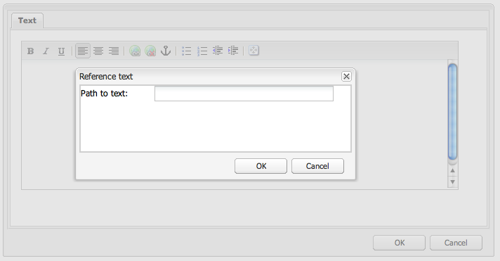
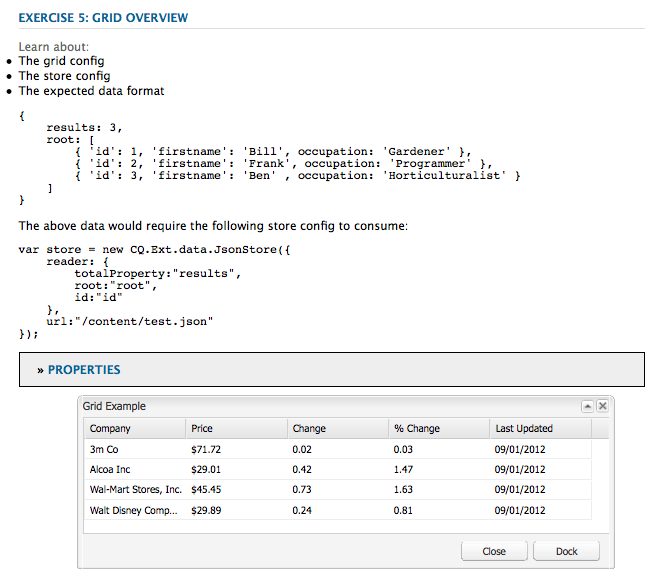

# Widgets gebruiken en uitbreiden (klassieke UI){#using-and-extending-widgets-classic-ui}

>[!NOTE]
>
>Deze pagina beschrijft het gebruik van widgets in de klassieke gebruikersinterface, die in AEM 6.4 is afgekeurd.
>
>De Adobe adviseert dat u moderne, [ aanraking-toegelaten UI ](/help/sites-developing/touch-ui-concepts.md) gebruikt die op [ Koraal UI ](/help/sites-developing/touch-ui-concepts.md#coral-ui) wordt gebaseerd en [ graniet UI ](/help/sites-developing/touch-ui-concepts.md#granite-ui-foundation-components).

De (AEM) Web-based interface van Adobe Experience Manager gebruikt AJAX en andere moderne browser technologieën om het uitgeven WYSIWYG en het formatteren van inhoud door auteurs direct op de Web-pagina toe te laten.

AEM gebruikt [ ExtJS ](https://www.sencha.com/) widget bibliotheek, die de hoogst gepolijst gebruikersinterfaceelementen verstrekt die over alle belangrijkste browsers werken en de verwezenlijking van Desktop-rang ervaringen UI toestaan.

Deze widgets zijn opgenomen in AEM en kunnen, naast het gebruik door AEM zelf, worden gebruikt door elke website die met AEM is gemaakt.

Voor een volledige verwijzing van alle beschikbare widgets in AEM, zie de [ widget API documentatie ](https://developer.adobe.com/experience-manager/reference-materials/6-5/widgets-api/index.html) of de [ lijst van bestaande xtypes ](/help/sites-developing/xtypes.md). Bovendien zijn vele voorbeelden die tonen hoe te om het kader te gebruiken ExtJS beschikbaar op de [ Sencha ](https://examples.sencha.com/extjs/7.6.0/) plaats, de eigenaar van het kader.

Deze pagina biedt inzicht in het gebruik en uitbreiden van widgets. Het beschrijft eerst hoe te [ cliënt-zijcode in een pagina ](#including-the-client-sided-code-in-a-page) omvatten. Vervolgens worden enkele voorbeeldcomponenten beschreven die zijn gemaakt om een aantal basistoepassingen en -extensies te illustreren. Die componenten zijn beschikbaar in **Gebruikend ExtJS Widgets** pakket op **het Aandeel van het Pakket**.

Het pakket bevat voorbeelden van:

* [ Basisdialogen ](#basic-dialogs) die met uit-van-de-doos widgets worden gebouwd.
* [ Dynamische dialogen ](#dynamic-dialogs) die met uit-van-de-doos widgets en aangepaste logica van JavaScript worden gebouwd.
* Dialogen die op [ worden gebaseerd douane widgets ](#custom-widgets).
* A [ boompaneel ](#tree-overview) tonend een boom JCR onder een bepaalde weg.
* A [ netpaneel ](#grid-overview) tonend gegevens in een in tabelvorm formaat.

>[!NOTE]
>
>De klassieke UI van Adobe Experience Manager wordt voortgebouwd op [ ExtJS 3.4.0 ](https://extjs.cachefly.net/ext-3.4.0/docs/).

## De code aan de clientzijde opnemen in een pagina {#including-the-client-sided-code-in-a-page}

JavaScript aan clientzijde en stijlbladcode moeten in een clientbibliotheek worden geplaatst.

Een clientbibliotheek maken:

1. Maak een knooppunt onder `/apps/<project>` met de volgende eigenschappen:

   * name=&quot;clientlib&quot;
   * jcr:mixinTypes=&quot;[ mengeling:lockable ]&quot;
   * jcr:primaryType=&quot;cq:ClientLibraryFolder&quot;
   * sling:resourceType=&quot;widgets/clientlib&quot;
   * categorieën=&quot;[ &lt;category-name> ]&quot;
   * gebiedsdelen=&quot;[ cq.widgets ]&quot;

   `Note: <category-name> is the name of the custom library (for example, "cq.extjstraining") and is used to include the library on the page.`

1. Onder `clientlib` maakt u de mappen `css` en `js` (nt:folder).

1. Maak onder `clientlib` de bestanden `css.txt` en `js.txt` (nt:files). Deze .txt-bestanden bevatten de bestanden die in de bibliotheek zijn opgenomen.

1. Bewerken `js.txt`: moet beginnen met &#39; `#base=js`&#39; gevolgd door de lijst met bestanden die worden samengevoegd door de CQ-clientbibliotheekservice, bijvoorbeeld:

   ```
   #base=js
    components.js
    exercises.js
    CustomWidget.js
    CustomBrowseField.js
    InsertTextPlugin.js
   ```

1. Bewerken `css.txt`: moet beginnen met &#39; `#base=css`&#39; gevolgd door de lijst met bestanden die worden samengevoegd door de CQ-clientbibliotheekservice, bijvoorbeeld:

   ```
   #base=css
    components.css
   ```

1. Plaats onder de map `js` de JavaScript-bestanden die bij de bibliotheek horen.

1. Plaats onder de map `css` de `.css` -bestanden en de bronnen die door de CSS-bestanden worden gebruikt (bijvoorbeeld `my_icon.png` ).

>[!NOTE]
>
>De afhandeling van de hierboven beschreven stijlpagina&#39;s is optioneel.

De clientbibliotheek opnemen in de jsp voor de paginacomponent:

* om zowel JavaScript-code als stijlpagina&#39;s op te nemen:
  `<ui:includeClientLib categories="<category-name1>, <category-name2>, ..."/>`
waarbij `<category-nameX>` de naam van de bibliotheek aan de clientzijde is.

* alleen JavaScript-code opnemen:
  `<ui:includeClientLib js="<category-name>"/>`

Zie de beschrijving van de [&lt;ui:includeClientLib>](/help/sites-developing/taglib.md#lt-ui-includeclientlib) tag&lt;/ui:includeClientLib> voor meer informatie.

Soms is een clientbibliotheek alleen beschikbaar in de auteursmodus en moet deze worden uitgesloten in de publicatiemodus. Dit kan als volgt worden bereikt:

```xml
    if (WCMMode.fromRequest(request) != WCMMode.DISABLED) {
        %><ui:includeClientLib categories="cq.collab.blog"/><%
    }
```

### Aan de slag met de voorbeelden {#getting-started-with-the-samples}

Om de leerprogramma&#39;s op deze pagina te volgen, installeer het pakket **Gebruikend Widgets ExtJS** in een lokale AEM instantie en creeer een steekproefpagina waarin de componenten inbegrepen zijn. Ga als volgt te werk om dit te doen:

1. In uw AEM instantie, download het pakket riep **Gebruikend Widgets ExtJS (v01)** van het Aandeel van het Pakket en installeer het pakket. Het maakt het project `extjstraining` below `/apps` in de gegevensopslagruimte.
1. Neem de clientbibliotheek met de scripts (js) en de stijlpagina (css) op in de koptag van de pagina Geometrixx. U gaat de steekproefcomponenten in een nieuwe pagina van de **Geometrixx** tak omvatten:
in **CRXDE Lite** open het dossier `/apps/geometrixx/components/page/headlibs.jsp` en voeg de `cq.extjstraining` categorie aan de bestaande `<ui:includeClientLib>` markering als volgt toe:
   `%><ui:includeClientLib categories="apps.geometrixx-main, cq.extjstraining"/><%`
1. Creeer een pagina in de **Geometrixx** vertakking hieronder `/content/geometrixx/en/products` en roep het **Gebruikend Widgets ExtJS**.
1. Ga op ontwerpwijze en voeg alle componenten van de groep toe geroepen **Gebruikend Widgets ExtJS** aan het ontwerp van Geometrixx
1. Ga terug op geef wijze uit: de componenten van de groep **Gebruikend Widgets ExtJS** zijn beschikbaar in de Sidekick.

>[!NOTE]
>
>De voorbeelden op deze pagina zijn gebaseerd op de inhoud van het Geometrixx-voorbeeld, die niet meer wordt verzonden met AEM, en die is vervangen door We.Retail. Zie de [ Implementatie van de Verwijzing Wij.Retail ](/help/sites-developing/we-retail.md#we-retail-geometrixx) voor hoe te om Geometrixx te downloaden en te installeren.

### Standaarddialoogvensters {#basic-dialogs}

Dialoogvensters worden doorgaans gebruikt om inhoud te bewerken, maar kunnen ook informatie weergeven. Een gemakkelijke manier om een volledig dialoogvenster weer te geven, is om toegang te krijgen tot de representatie in json-indeling. U doet dit door de browser op te vragen:

`https://localhost:4502/<path-to-dialog>.-1.json`

De eerste component van **Gebruikend Widgets ExtJS** groep in de Sidekick wordt genoemd **1. De Grondbeginselen van de dialoog** en omvat vier basisdialogen die met uit-van-de-doos widgets en zonder aangepaste logica van JavaScript worden gebouwd. De dialoogvensters worden onder `/apps/extjstraining/components/dialogbasics` opgeslagen. De basisdialoogvensters zijn:

* het dialoogvenster Volledig ( `full` node): het geeft een venster weer met drie tabbladen, elk met twee tekstvelden.
* het dialoogvenster Eén deelvenster ( `singlepanel` node): het geeft een venster weer met één tab die twee tekstvelden heeft.
* het dialoogvenster Meerdere deelvensters ( `multipanel` node): de weergave ervan is gelijk aan het dialoogvenster Volledig, maar het wordt anders samengesteld.
* het dialoogvenster Ontwerpen ( `design` node): er wordt een venster met twee tabbladen weergegeven. De eerste tab heeft een tekstveld, een vervolgkeuzemenu en een inklapbaar tekstgebied. Het tweede tabblad bevat een veldset met vier tekstvelden en een set opvouwbare velden met twee tekstvelden.

Omvat **1. De component van de dialoog Grondbeginselen** in de steekproefpagina:

1. Voeg **1 toe. De componenten van de dialoog Grondbeginselen** aan de steekproefpagina van **Gebruikend Widgets ExtJS** lusje in de **Sidekick**.
1. De component toont een titel, wat tekst, en a **EIGENSCHAPPEN** verbinding. Als u de koppeling selecteert, worden de eigenschappen van de alinea weergegeven die in de opslagplaats zijn opgeslagen. Selecteer nogmaals de koppeling om de eigenschappen te verbergen.

De component wordt als volgt weergegeven:


#### Voorbeeld 1: Volledig dialoogvenster {#example-full-dialog}

Het **Volledige** dialoog toont een venster met drie lusjes, elk lusje die twee tekstgebieden hebben. Het is de standaarddialoog van de **component van de Grondbeginselen van de Dialoog**. De kenmerken zijn:

* Wordt gedefinieerd door een knooppunt: knooppunttype = `cq:Dialog`, xtype = ` [dialog](/help/sites-developing/xtypes.md#dialog)` .
* Geeft drie tabbladen weer (knooppunttype = `cq:Panel`).
* Elke tab heeft twee tekstvelden (knooppunttype = `cq:Widget` , xtype = ` [textfield](/help/sites-developing/xtypes.md#textfield)` ).
* Wordt gedefinieerd door het knooppunt:
  `/apps/extjstraining/components/dialogbasics/full`
* Wordt in JSON-indeling weergegeven door het volgende aan te vragen:
  `https://localhost:4502/apps/extjstraining/components/dialogbasics/full.-1.json`

Het dialoogvenster wordt als volgt weergegeven:


#### Voorbeeld 2: Dialoogvenster Eén venster {#example-single-panel-dialog}

Het **Enige Comité** dialoog toont een venster met één lusje dat twee tekstgebieden heeft. De kenmerken zijn:

* Hiermee wordt één tab weergegeven (knooppunttype = `cq:Dialog` , xtype = ` [panel](/help/sites-developing/xtypes.md#panel)` )
* De tab heeft twee tekstvelden (knooppunttype = `cq:Widget` , xtype = ` [textfield](/help/sites-developing/xtypes.md#textfield)` )
* Wordt gedefinieerd door het knooppunt:
  `/apps/extjstraining/components/dialogbasics/singlepanel`
* Wordt in json-indeling weergegeven door het volgende aan te vragen:
  `https://localhost:4502/apps/extjstraining/components/dialogbasics/singlepanel.-1.json`
* Één voordeel over de **Volledige Dialoog** is dat minder configuratie nodig is.
* Aanbevolen gebruik: voor eenvoudige dialoogvensters die informatie weergeven of slechts een paar velden bevatten.

Het dialoogvenster Eén deelvenster gebruiken:

1. Vervang de dialoog van de **component van de Grondbeginselen van de Dialoog** met de **Enige dialoog van het Comité**:
   1. In **CRXDE Lite**, schrap de knoop: `/apps/extjstraining/components/dialogbasics/dialog`
   1. Klik **sparen allen** om de veranderingen te bewaren.
   1. Kopieer het knooppunt: `/apps/extjstraining/components/dialogbasics/singlepanel`
   1. Plak het gekopieerde knooppunt hieronder: `/apps/extjstraining/components/dialogbasics`
   1. Selecteer het knooppunt: `/apps/extjstraining/components/dialogbasics/Copy of singlepanel` en wijzig de naam ervan in `dialog` .
1. Bewerk de component: het dialoogvenster wordt als volgt weergegeven:


#### Voorbeeld 3: Dialoogvenster Meerdere deelvensters {#example-multi-panel-dialog}

Het **MultiPanel** dialoog heeft de zelfde vertoning zoals de **Volledige** dialoog maar het wordt verschillend gebouwd. De kenmerken zijn:

* Wordt gedefinieerd door een knooppunt (knooppunttype = `cq:Dialog`, xtype = ` [tabpanel](/help/sites-developing/xtypes.md#tabpanel)`).
* Geeft drie tabbladen weer (type knooppunt = `cq:Panel`).
* Elk tabblad heeft twee tekstvelden (type knooppunt = `cq:Widget`, xtype = ` [textfield](/help/sites-developing/xtypes.md#textfield)`).
* Wordt gedefinieerd door het knooppunt:
  `/apps/extjstraining/components/dialogbasics/multipanel`
* Wordt in json-indeling weergegeven door het volgende aan te vragen:
  `https://localhost:4502/apps/extjstraining/components/dialogbasics/multipanel.-1.json`
* Één voordeel over de **Volledige Dialoog** is dat het een vereenvoudigde structuur heeft.
* Aanbevolen gebruik: voor dialoogvensters met meerdere tabbladen.

Het dialoogvenster Meerdere deelvensters gebruiken:

1. Vervang de dialoog van de **component van de Grondbeginselen van de Dialoog** met de **MultiPanel** dialoog:
volg de stappen die voor [ worden beschreven Voorbeeld 2: Enige Dialoog van het Comité ](#example-single-panel-dialog)
1. Bewerk de component: het dialoogvenster wordt als volgt weergegeven:


#### Voorbeeld 4: Rich Dialog {#example-rich-dialog}

Het **rijke** dialoog toont een venster met twee lusjes. De eerste tab heeft een tekstveld, een vervolgkeuzemenu en een inklapbaar tekstgebied. Het tweede tabblad bevat een veldset met vier tekstvelden en een set opvouwbare velden met twee tekstvelden. De kenmerken zijn:

* Wordt gedefinieerd door een knooppunt (knooppunttype = `cq:Dialog`, xtype = ` [dialog](/help/sites-developing/xtypes.md#dialog)`).
* Geeft twee tabbladen weer (knooppunttype = `cq:Panel`).
* Het eerste tabblad heeft een ` [dialogfieldset](/help/sites-developing/xtypes.md#dialogfieldset)` -widget met een ` [textfield](/help/sites-developing/xtypes.md#textfield)` - en ` [selection](/help/sites-developing/xtypes.md#selection)` -widget met drie opties en een inklapbaar ` [dialogfieldset](/help/sites-developing/xtypes.md#dialogfieldset)` met een ` [textarea](/help/sites-developing/xtypes.md#textarea)` -widget.
* Het tweede tabblad heeft een ` [dialogfieldset](/help/sites-developing/xtypes.md#dialogfieldset)` -widget met vier ` [textfield](/help/sites-developing/xtypes.md#textfield)` -widgets en een inklapbaar `dialogfieldset` met twee ` [textfield](/help/sites-developing/xtypes.md#textfield)` -widgets.
* Wordt gedefinieerd door het knooppunt:
  `/apps/extjstraining/components/dialogbasics/rich`
* Wordt in json-indeling weergegeven door het volgende aan te vragen:
  `https://localhost:4502/apps/extjstraining/components/dialogbasics/rich.-1.json`

Om de **Rijke** dialoog te gebruiken:

1. Vervang de dialoog van de **component van de Grondbeginselen van de Dialoog** met de **Rijke** dialoog:
volg de stappen die voor [ worden beschreven Voorbeeld 2: Enige Dialoog van het Comité ](#example-single-panel-dialog)
1. Bewerk de component: het dialoogvenster wordt als volgt weergegeven:

 

### Dynamische dialoogvensters {#dynamic-dialogs}

De tweede component van **Gebruikend Widgets ExtJS** groep in de Sidekick wordt genoemd **2. De dynamische Dialogen** en omvat drie dynamische dialogen die met uit-van-de-doos widgets en **met aangepaste logica van JavaScript** worden gebouwd. De dialoogvensters worden onder `/apps/extjstraining/components/dynamicdialogs` opgeslagen. De dynamische dialoogvensters zijn:

* het dialoogvenster Tabs wisselen ( `switchtabs` node): er wordt een venster met twee tabbladen weergegeven. Het eerste tabblad bevat een keuzerondje met drie opties: wanneer een optie is geselecteerd, wordt een tabblad weergegeven dat betrekking heeft op de optie. Het tweede tabblad bevat twee tekstvelden.
* het willekeurige dialoogvenster ( `arbitrary` node): het geeft een venster weer met één tab. Het tabblad bevat een veld voor het neerzetten of uploaden van een element en een veld dat informatie weergeeft over de pagina die het element bevat en over het element als ernaar wordt verwezen.
* het dialoogvenster Velden in-/uitschakelen ( `togglefield` node): er wordt een venster met één tab weergegeven. De tab heeft een selectievakje: als deze is ingeschakeld, wordt een veldset met twee tekstvelden weergegeven.

Om **2 te omvatten. Dynamische Dialoga** component op de steekproefpagina:

1. Voeg **2 toe. De dynamische componenten van Dialogen** aan de steekproefpagina van **Gebruikend Widgets ExtJS** lusje in de **Sidekick**.
1. De component toont een titel, wat tekst, en a **EIGENSCHAPPEN** verbinding. Als u de koppeling selecteert, worden de eigenschappen van de alinea weergegeven die in de opslagplaats zijn opgeslagen. Selecteer nogmaals de koppeling om de eigenschappen te verbergen.

De component wordt als volgt weergegeven:


#### Voorbeeld 1: dialoogvenster Tabs wisselen {#example-switch-tabs-dialog}

De **dialoog van de Schakelaar van Lusjes** toont een venster met twee lusjes. Het eerste tabblad bevat een keuzerondje met drie opties: wanneer een optie is geselecteerd, wordt een tabblad weergegeven dat betrekking heeft op de optie. Het tweede tabblad bevat twee tekstvelden.

De belangrijkste kenmerken zijn:

* Wordt gedefinieerd door een knooppunt (knooppunttype = `cq:Dialog`, xtype = ` [dialog](/help/sites-developing/xtypes.md#dialog)`).
* Hiermee geeft u twee tabbladen weer (knooppunttype = `cq:Panel`): één selectietabblad, het tweede tabblad is afhankelijk van de selectie op het eerste tabblad (drie opties).
* Heeft drie optionele tabbladen (knooppunttype = `cq:Panel`), elk heeft twee tekstvelden (knooppunttype = `cq:Widget` , xtype = ` [textfield](/help/sites-developing/xtypes.md#textfield)` ). Er wordt slechts één optioneel tabblad tegelijk weergegeven.
* Wordt gedefinieerd door het knooppunt `switchtabs` op:
  `/apps/extjstraining/components/dynamicdialogs/switchtabs`
* Wordt in json-indeling weergegeven door het volgende aan te vragen:
  `https://localhost:4502/apps/extjstraining/components/dynamicdialogs/switchtabs.-1.json`

De logica wordt als volgt geïmplementeerd via gebeurtenislisteners en JavaScript-code:

* Het dialoogknooppunt heeft een listener &quot; `beforeshow`&quot; die alle optionele tabbladen verbergt voordat het dialoogvenster wordt weergegeven:
  `beforeshow="function(dialog){Ejst.x2.manageTabs(dialog.items.get(0));}"`
  `dialog.items.get(0)` haalt `tabpanel` op die het selectievenster en de drie optionele deelvensters bevat.
* Het object `Ejst.x2` wordt gedefinieerd in het bestand `exercises.js` op:
  `/apps/extjstraining/clientlib/js/exercises.js`
* Aangezien de waarde van `index` -1 in de methode `Ejst.x2.manageTabs()` gelijk is, worden alle optionele tabbladen verborgen (deze loopt van 1 naar 3).
* Het selectietabblad heeft twee listeners: een tab die het geselecteerde tabblad weergeeft wanneer het dialoogvenster wordt geladen (&quot; `loadcontent`&quot;-gebeurtenis) en een tab die het geselecteerde tabblad weergeeft wanneer de selectie wordt gewijzigd (&quot; `selectionchanged`&quot;-gebeurtenis):
  `loadcontent="function(field,rec,path){Ejst.x2.showTab(field);}"`
  `selectionchanged="function(field,value){Ejst.x2.showTab(field);}"`
* Voor de methode `Ejst.x2.showTab()` ,
  `field.findParentByType('tabpanel')` krijgt `tabpanel` die alle tabbladen bevat ( `field` vertegenwoordigt de selectiewidget)
  `field.getValue()` haalt de waarde van de selectie op, bijvoorbeeld tab2
  `Ejst.x2.manageTabs()` geeft de geselecteerde tab weer.
* Elk optioneel tabblad bevat een listener die het tabblad van de gebeurtenis &quot; `render`&quot; verbergt:
  `render="function(tab){Ejst.x2.hideTab(tab);}"`
* Voor de methode `Ejst.x2.hideTab()` ,
  `tabPanel` is dat `tabpanel` alle tabbladen bevat
  `index` is de index van het optionele tabblad
  `tabPanel.hideTabStripItem(index)` Verbergt het tabblad

Het wordt als volgt weergegeven:


#### Voorbeeld 2: Willekeurig dialoogvenster {#example-arbitrary-dialog}

In een dialoogvenster wordt vaak de inhoud van de onderliggende component weergegeven. Het hier beschreven dialoogvenster, genoemd **Willekeurige** dialoog, trekt inhoud van een verschillende component.

Het **Willekeurige** dialoog toont een venster met één tabel. Het tabblad heeft twee velden: een veld voor het neerzetten of uploaden van een element en een veld dat informatie bevat over de pagina die het element bevat en over het element als er naar wordt verwezen.

De belangrijkste kenmerken zijn:

* Wordt gedefinieerd door een knooppunt (knooppunttype = `cq:Dialog`, xtype = ` [dialog](/help/sites-developing/xtypes.md#dialog)`).
* Hiermee wordt één `tabpanel` -widget (knooppunttype = `cq:Widget` , xtype = ` [tabpanel](/help/sites-developing/xtypes.md#tabpanel)` ) weergegeven met één deelvenster (knooppunttype = `cq:Panel`)
* Het deelvenster heeft een widget smartfile (knooppunttype = `cq:Widget` , xtype = ` [smartfile](/help/sites-developing/xtypes.md#smartfile)` ) en een widget ownerdraw (knooppunttype = `cq:Widget` , xtype = ` [ownerdraw](/help/sites-developing/xtypes.md#ownerdraw)` )
* Wordt gedefinieerd door het knooppunt `arbitrary` op:
  `/apps/extjstraining/components/dynamicdialogs/arbitrary`
* Wordt in json-indeling weergegeven door het volgende aan te vragen:
  `https://localhost:4502/apps/extjstraining/components/dynamicdialogs/arbitrary.-1.json`

De logica wordt als volgt geïmplementeerd via gebeurtenislisteners en JavaScript-code:

* De `ownerdraw` -widget heeft een listener &quot; `loadcontent`&quot; die informatie weergeeft over de pagina die de component bevat. Dit is het element waarnaar wordt verwezen door de widget voor het smartbestand wanneer de inhoud wordt geladen:
  `loadcontent="function(field,rec,path){Ejst.x2.showInfo(field,rec,path);}"`
  `field` wordt ingesteld met het `ownerdraw` -object
  `path` wordt ingesteld met het inhoudspad van de component (bijvoorbeeld `/content/geometrixx/en/products/triangle/ui-tutorial/jcr:content/par/dynamicdialogs` )
* Het object `Ejst.x2` wordt gedefinieerd in het bestand `exercises.js` op:
  `/apps/extjstraining/clientlib/js/exercises.js`
* Voor de methode `Ejst.x2.showInfo()` ,
  `pagePath` het pad is van de pagina die de component bevat;
  `pageInfo` vertegenwoordigt de pagina-eigenschappen in json-indeling;
  `reference` het pad is van het element waarnaar wordt verwezen;
  `metadata` vertegenwoordigt de meta-gegevens van het element in json formaat;
  `ownerdraw.getEl().update(html);` geeft de gemaakte html weer in het dialoogvenster

Om de **Willekeurige** dialoog te gebruiken:

1. Vervang het dialoogvenster van de **component dynamisch dialoogvenster** door het **dialoogvenster Willekeurig** :
Voer de stappen uit die worden beschreven in het [dialoogvenster Voorbeeld 2: Eén deelvenster](#example-single-panel-dialog)
1. Bewerk de component: het dialoogvenster wordt als volgt weergegeven:


#### Voorbeeld 3: Dialoogvenster Velden in-/uitschakelen {#example-toggle-fields-dialog}

Het **de dialoogvakje van de Gebieden van de knevel** toont een venster met één tabel. Het tabblad heeft een selectievakje: als het is ingeschakeld, wordt een veldset met twee tekstvelden weergegeven.

De belangrijkste kenmerken zijn:

* Wordt gedefinieerd door een knooppunt (type knooppunt = `cq:Dialog`, xtype = ` [dialog](/help/sites-developing/xtypes.md#dialog)`).
* Hiermee geeft u één `tabpanel` widget (type knooppunt = `cq:Widget`, xtype = ` [tabpanel](/help/sites-developing/xtypes.md#textpanel)`) weer met één deelvenster (type knooppunt = `cq:Panel`).
* Het deelvenster heeft een widget voor selectie/selectievakje (type knooppunt = `cq:Widget`, xtype = ` [selection](/help/sites-developing/xtypes.md#selection)`, type = ` [checkbox](/help/sites-developing/xtypes.md#checkbox)`) en een inklapbare widget voor dialoogvenstervelden (type knooppunt = `cq:Widget`, xtype = ` [dialogfieldset](/help/sites-developing/xtypes.md#dialogfieldset)`) die standaard is verborgen, met twee tekstveldwidgets (type knooppunt = `cq:Widget`, xtype = ` [textfield](/help/sites-developing/xtypes.md#textfield)`).
* Wordt gedefinieerd door het knooppunt `togglefields` op:
  `/apps/extjstraining/components/dynamicdialogs/togglefields`
* Wordt in json-indeling weergegeven door het volgende aan te vragen:
  `https://localhost:4502/apps/extjstraining/components/dynamicdialogs/togglefields.-1.json`

De logica wordt als volgt geïmplementeerd via gebeurtenislisteners en JavaScript-code:

* het selectietabblad heeft twee listeners: een die de dialogfield-set weergeeft wanneer de inhoud wordt geladen (&quot; `loadcontent`&quot;-gebeurtenis) en een die de dialogfield-set weergeeft wanneer de selectie wordt gewijzigd (&quot; `selectionchanged`&quot;-gebeurtenis):
  `loadcontent="function(field,rec,path){Ejst.x2.toggleFieldSet(field);}"`
  `selectionchanged="function(field,value){Ejst.x2.toggleFieldSet(field);}"`
* Het object `Ejst.x2` wordt gedefinieerd in het bestand `exercises.js` op:
  `/apps/extjstraining/clientlib/js/exercises.js`
* Voor de methode `Ejst.x2.toggleFieldSet()` ,
  `box` het selectieobject is;
  `panel` is het deelvenster met de selectie en de widgets voor de dialogfieldset;
  `fieldSet` is het dialogfieldset-object;
  `show` is de waarde van de selectie (waar of onwaar);
op basis van &#39; `show`&#39; wordt de dialogfieldset al dan niet weergegeven

Om de **dialoog van de Wisselen van Gebieden** te gebruiken, doe het volgende:

1. Vervang de dialoog van de **Dynamische component van de Dialoog** met de **dialoog van de Toggle van de Gebieden**:
volg de stappen die voor [ worden beschreven Voorbeeld 2: Enige Dialoog van het Comité ](#example-single-panel-dialog)
1. Bewerk de component: het dialoogvenster wordt als volgt weergegeven:


### Aangepaste widgets {#custom-widgets}

De widgets uit de doos die bij AEM worden geleverd, moeten de meeste gevallen van gebruik bestrijken. Het kan echter soms nodig zijn om een aangepaste widget te maken die voldoet aan een projectspecifieke vereiste. Aangepaste widgets kunnen worden gemaakt door bestaande widgets uit te breiden. Om u te helpen aan de slag te gaan met een dergelijke aanpassing, bevat het pakket **`Using ExtJS Widgets`** drie dialoogvensters die drie verschillende aangepaste widgets gebruiken:

* In het dialoogvenster Meerdere velden ( `multifield` -knooppunt) wordt een venster met één tab weergegeven. De tab heeft een aangepaste widget met meerdere velden die twee velden heeft: een vervolgkeuzemenu met twee opties en een tekstveld. Omdat de widget is gebaseerd op de widget `multifield` buiten de doos (die alleen een tekstveld heeft), heeft deze alle functies van de widget `multifield` .
* In het dialoogvenster Bladeren door structuur ( `treebrowse` -knooppunt) wordt een venster weergegeven met één tabblad dat een widget voor padbladeren bevat: wanneer u op de pijl klikt, wordt een venster geopend waarin u door een hiërarchie kunt bladeren en een item kunt selecteren. Het pad van het item wordt vervolgens toegevoegd aan het padveld en wordt voortgezet wanneer het dialoogvenster wordt gesloten.
* een op plug-in gebaseerd dialoogvenster van de rijke teksteditor ( `rteplugin` node) dat een aangepaste knop toevoegt aan de Rich Text Editor om aangepaste tekst in te voegen in de hoofdtekst. Deze bestaat uit een `richtext` widget (RTE) en een aangepaste functie die via het mechanisme van de RTE-plug-in wordt toegevoegd.

De douanewidgets en de stop worden omvat in de component genoemd **3. Aangepaste widgets** van het **ExtJS Widgets-pakket** gebruiken. Deze component opnemen in de voorbeeldpagina:

1. Voeg de **3 toe. Aangepaste widgetscomponent** naar de voorbeeldpagina vanaf het **tabblad ExtJS-widgets** gebruiken in de **sidekick**.
1. De component geeft een titel, wat tekst en, wanneer u op de **koppeling EIGENSCHAPPEN** klikt, de eigenschappen van de alinea weer die in de opslagplaats zijn opgeslagen. Als u nogmaals klikt, worden de eigenschappen verborgen.
De component wordt als volgt weergegeven:


#### Voorbeeld 1: Aangepaste widget voor meerdere velden {#example-custom-multifield-widget}

De **op widget-Gebaseerde dialoog van 0} Douane Multifield {toont een venster met één tabel.** De tab heeft een aangepaste widget met meerdere velden die, in tegenstelling tot de standaard widget met één veld, twee velden heeft: een vervolgkeuzemenu met twee opties en een tekstveld.

De **op widget-Gebaseerde dialoog van 0} Douane Multifield {:**

* Wordt gedefinieerd door een knooppunt (knooppunttype = `cq:Dialog`, xtype = ` [dialog](/help/sites-developing/xtypes.md#dialog)`).
* Hiermee wordt één `tabpanel` -widget (knooppunttype = `cq:Widget` , xtype = ` [tabpanel](/help/sites-developing/xtypes.md#tabpanel)` ) weergegeven die een deelvenster bevat (knooppunttype = `cq:Widget` , xtype = ` [panel](/help/sites-developing/xtypes.md#panel)`).
* Het deelvenster heeft een `multifield` widget (knooppunttype = `cq:Widget` , xtype = ` [multifield](/help/sites-developing/xtypes.md#multifield)` ).
* De `multifield` -widget heeft een fieldconfig (knooppunttype = `nt:unstructured` , xtype = `ejstcustom` , optionsProvider = `Ejst.x3.provideOptions` ) dat is gebaseerd op het aangepaste xtype &#39; `ejstcustom`&#39;:
   * &#39; `fieldconfig`&#39; is een configuratieoptie van het ` [CQ.form.MultiField](https://developer.adobe.com/experience-manager/reference-materials/6-5/widgets-api/index.html?class=CQ.form.MultiField)` -object.
   * &#39; `optionsProvider`&#39; is een configuratie van de `ejstcustom` -widget. Deze wordt ingesteld met de methode `Ejst.x3.provideOptions` die wordt gedefinieerd in `exercises.js` at:
     `/apps/extjstraining/clientlib/js/exercises.js`
en retourneert twee opties.
* Wordt gedefinieerd door het knooppunt `multifield` op:
  `/apps/extjstraining/components/customwidgets/multifield`
* Wordt in json-indeling weergegeven door het volgende aan te vragen:
  `https://localhost:4502/apps/extjstraining/components/customwidgets/multifield.-1.json`

De aangepaste `multifield` widget (xtype = `ejstcustom`):

* Is een JavaScript-object met de naam `Ejst.CustomWidget`
* Wordt gedefinieerd in het `CustomWidget.js` JavaScript-bestand op:
  `/apps/extjstraining/clientlib/js/CustomWidget.js`
* Breidt de ` [CQ.form.CompositeField](https://developer.adobe.com/experience-manager/reference-materials/6-5/widgets-api/index.html?class=CQ.form.CompositeField)` -widget uit.
* Bevat drie velden: `hiddenField` (TextField), `allowField` (ComboBox) en `otherField` (TextField)
* Overschrijft `CQ.Ext.Component#initComponent` om de drie velden toe te voegen:
   * `allowField` is a [ CQ.form.Selection ](https://developer.adobe.com/experience-manager/reference-materials/6-5/widgets-api/index.html?class=CQ.form.Selection) voorwerp van type &quot;uitgezocht&quot;. optionsProvider is een configuratie van het Selection-object die wordt geïnstantieerd met de optionsProvider-configuratie van de CustomWidget die is gedefinieerd in het dialoogvenster
   * `otherField` is a [ CQ.Ext.form.TextField ](https://developer.adobe.com/experience-manager/reference-materials/6-5/widgets-api/index.html?class=CQ.Ext.form.TextField) voorwerp
* Hiermee overschrijft u de methoden `setValue`, `getValue`en `getRawValue` [CQ.form.CompositeField](https://developer.adobe.com/experience-manager/reference-materials/6-5/widgets-api/index.html?class=CQ.form.CompositeField) om de waarde van CustomWidget in te stellen en op te halen met de volgende indeling:
  `<allowField value>/<otherField value>, for example: 'Bla1/hello'`.
* Registreert zichzelf als xtype &#39; `ejstcustom`&#39;:
  `CQ.Ext.reg('ejstcustom', Ejst.CustomWidget);`

De **op widget-Gebaseerde de dialoogvertoningen van 0} Douane Multifield {als volgt:**


#### Voorbeeld 2: Aangepaste `Treebrowse` widget {#example-custom-treebrowse-widget}

Het op een aangepaste **`Treebrowse`** widget gebaseerde dialoogvenster toont een venster met één tabblad dat een aangepaste bladerwidget voor paden bevat. Wanneer u de pijl selecteert, wordt er een venster geopend waarin u door een hiërarchie kunt bladeren en een item kunt selecteren. Het pad van het item wordt vervolgens toegevoegd aan het padveld en wordt behouden wanneer het dialoogvenster wordt gesloten.

Het aangepaste `treebrowse` dialoogvenster:

* Wordt gedefinieerd door een knooppunt (type knooppunt = `cq:Dialog`, xtype = ` [dialog](/help/sites-developing/xtypes.md#dialog)`).
* Hiermee wordt één `tabpanel` -widget (knooppunttype = `cq:Widget` , xtype = ` [tabpanel](/help/sites-developing/xtypes.md#tabpanel)` ) weergegeven die een deelvenster bevat (knooppunttype = `cq:Widget` , xtype = ` [panel](/help/sites-developing/xtypes.md#panel)`).
* Het deelvenster heeft een aangepaste widget (knooppunttype = `cq:Widget` , xtype = `ejstbrowse` )
* Wordt gedefinieerd door het knooppunt `treebrowse` op:
  `/apps/extjstraining/components/customwidgets/treebrowse`
* Wordt in json-indeling weergegeven door het volgende aan te vragen:
  `https://localhost:4502/apps/extjstraining/components/customwidgets/treebrowse.-1.json`

De aangepaste widget voor browsers (xtype = `ejstbrowse`):

* Is een JavaScript-object met de naam `Ejst.CustomWidget`
* Wordt gedefinieerd in het `CustomBrowseField.js` JavaScript-bestand op:
  `/apps/extjstraining/clientlib/js/CustomBrowseField.js`
* Breidt ` [CQ.Ext.form.TriggerField](https://developer.adobe.com/experience-manager/reference-materials/6-5/widgets-api/index.html?class=CQ.Ext.form.TriggerField)` uit.
* Definieert een bladervenster met de naam `browseWindow` .
* Overschrijft ` [CQ.Ext.form.TriggerField](https://developer.adobe.com/experience-manager/reference-materials/6-5/widgets-api/index.html?class=CQ.Ext.form.TriggerField)#onTriggerClick` om het bladervenster weer te geven wanneer op de pijl wordt geklikt.
* Bepaalt a [ CQ.Ext.tree.TreePanel ](https://developer.adobe.com/experience-manager/reference-materials/6-5/widgets-api/index.html?class=CQ.Ext.tree.TreePanel) voorwerp:
   * Het haalt zijn gegevens op door de servlet aan te roepen die bij `/bin/wcm/siteadmin/tree.json` is geregistreerd.
   * De basis is &quot; `apps/extjstraining`&quot;.
* Definieert een `window` -object ( ` [CQ.Ext.Window](https://developer.adobe.com/experience-manager/reference-materials/6-5/widgets-api/index.html?class=CQ.Ext.Window)` ):
   * Gebaseerd op het vooraf gedefinieerde deelvenster.
   * Heeft een **O.K.** knoop die de waarde van de geselecteerde weg plaatst en het paneel verbergt.
* Het venster wordt verankerd onder het **gebied van de Weg**.
* Het geselecteerde pad wordt van het bladerveld naar het venster doorgegeven bij de gebeurtenis `show` .
* Registreert zichzelf als xtype &#39; `ejstbrowse`&#39;:
  `CQ.Ext.reg('ejstbrowse', Ejst.CustomBrowseField);`

Om de **op widget-Gebaseerde dialoog van de Aangepaste Treebrowse te gebruiken**:

1. Vervang de dialoog van de **component van de Douane Widgets** met de **dialoog van de Boom van de Douane**:
volg de stappen die voor [ worden beschreven Voorbeeld 2: Enige Dialoog van het Comité ](#example-single-panel-dialog)
1. Bewerk de component: het dialoogvenster wordt als volgt weergegeven:


#### Voorbeeld 3: insteekmodule RTE (Rich Text Editor) {#example-rich-text-editor-rte-plug-in}

Het **insteekmoduledialoogvenster** RTE (Rich Text Editor) is een dialoogvenster in de Rich Text Editor met een aangepaste knop voor het invoegen van aangepaste tekst binnen vierkante haken. De aangepaste tekst kan door bepaalde serverlogica worden geparseerd (niet geïmplementeerd in dit voorbeeld), bijvoorbeeld om tekst toe te voegen die op het opgegeven pad is gedefinieerd:

Dialoogvenster **voor de RTE-insteekmodule** :

* Wordt gedefinieerd door het knooppunt rteplugin op:
  `/apps/extjstraining/components/customwidgets/rteplugin`
* Wordt in json-indeling weergegeven door het volgende aan te vragen:
  `https://localhost:4502/apps/extjstraining/components/customwidgets/rteplugin.-1.json`
* Het knooppunt `rtePlugins` heeft een onderliggend knooppunt `inserttext` (knooppunttype = `nt:unstructured` ) dat naar de insteekmodule wordt genoemd. Het heeft een bezit genoemd `features` die bepaalt welke van de plugin eigenschappen beschikbaar aan RTE zijn.

De RTE-plug-in:

* Is een JavaScript-object met de naam `Ejst.InsertTextPlugin`
* Wordt gedefinieerd in het `InsertTextPlugin.js` JavaScript-bestand op:
  `/apps/extjstraining/clientlib/js/InsertTextPlugin.js`
* Breidt het object ` [CQ.form.rte.plugins.Plugin](https://developer.adobe.com/experience-manager/reference-materials/6-5/widgets-api/index.html?class=CQ.form.rte.plugins.Plugin)` uit.
* De volgende methoden definiëren het object ` [CQ.form.rte.plugins.Plugin](https://developer.adobe.com/experience-manager/reference-materials/6-5/widgets-api/index.html?class=CQ.form.rte.plugins.Plugin)` en worden overschreven in de implementerende insteekmodule:
   * `getFeatures()` retourneert een array met alle functies die de plug-in beschikbaar stelt.
   * `initializeUI()` voegt de nieuwe knoop aan de toolbar van RTE toe.
   * In `notifyPluginConfig()` worden de titel en de tekst weergegeven wanneer de knop wordt geplaatst.
   * `execute()` wordt aangeroepen wanneer op de knop wordt geklikt en de insteekmodule wordt uitgevoerd. Er wordt een venster weergegeven waarin de tekst wordt gedefinieerd die moet worden opgenomen.
* `insertText()` voegt een tekst in met behulp van het corresponderende dialoogobject `Ejst.InsertTextPlugin.Dialog` (zie verderop).
* `executeInsertText()` wordt geroepen door de `apply()` methode van de dialoog, die wordt teweeggebracht wanneer de **O.K.** knoop wordt geklikt.
* Registreert zichzelf als plug-in &#39; `inserttext`&#39;:
  `CQ.form.rte.plugins.PluginRegistry.register("inserttext", Ejst.InsertTextPlugin);`
* het `Ejst.InsertTextPlugin.Dialog` -object definieert het dialoogvenster dat wordt geopend wanneer op de insteekmodule wordt geklikt. De dialoog bestaat uit een paneel, een vorm, een textfield, en twee knopen (**O.K.** en **annuleert**).

Om de **gebaseerde dialoog te gebruiken van de Redacteur van de Tekst van 0} Rich (RTE):**

1. Vervang de dialoog van de **component van de Douane Widgets** met de **Rich Text Editor (RTE) stop-in** gebaseerde dialoog:
volg de stappen die voor [ worden beschreven Voorbeeld 2: Enige Dialoog van het Comité ](#example-single-panel-dialog)
1. Bewerk de component.
1. Klik op het laatste pictogram aan de rechterkant (het pictogram met vier pijlen). Ga een weg in en klik **O.K.**:
Het pad wordt tussen haakjes weergegeven ([ ]).
1. Klik **O.K.** zodat sluit u de Rich Redacteur van de Tekst.

Het **dialoogvenster van de insteekmodule** RTE (Rich Text Editor) wordt als volgt weergegeven:



>[!NOTE]
>
>Dit voorbeeld toont slechts hoe te om het cliënt-zijdeel van de logica uit te voeren: placeholders (*[tekst]*) moeten dan op server-kant uitdrukkelijk (bijvoorbeeld, in de component JSP) worden ontleed.

### Overzicht van boomstructuur {#tree-overview}

Het uit-van-de-doos ` [CQ.Ext.tree.TreePanel](https://developer.adobe.com/experience-manager/reference-materials/6-5/widgets-api/index.html?class=CQ.Ext.tree.TreePanel)` voorwerp verstrekt boom-gestructureerde vertegenwoordiging UI van boom-gestructureerde gegevens. De component Overzicht van de structuur in het **pakket ExtJS-widgets** gebruiken toont hoe u het `TreePanel` object kunt gebruiken om een JCR-boom onder een bepaald pad weer te geven. Het venster zelf kan worden gekoppeld/losgekoppeld. In dit voorbeeld wordt de vensterlogica ingesloten in de jsp van de component tussen &lt;script> de codes.

Ga als volgt te werk om de **boomstructuuroverzichtscomponent** op de voorbeeldpagina op te nemen:

1. Voeg de **4 toe. Boomstructuuroverzichtscomponent** naar de voorbeeldpagina vanaf het **tabblad ExtJS-widgets** gebruiken in de **sidekick**.
1. In de component wordt het volgende weergegeven:
   * een titel, met tekst
   * a **verbinding 0} EIGENSCHAPPEN {: klik om de eigenschappen van de paragraaf te tonen die in de bewaarplaats wordt opgeslagen.** Klik nogmaals om de eigenschappen te verbergen.
   * een zwevend venster met een boomrepresentatie van de opslagplaats die kan worden uitgebreid.

De component wordt als volgt weergegeven:


De component Tree Overview:

* Wordt gedefinieerd bij:
  `/apps/extjstraining/components/treeoverview`

* In het dialoogvenster kunt u de grootte van het venster instellen en het venster koppelen of loskoppelen (zie de details hieronder).

The component jsp:

* Haalt de breedte, hoogte en gedokte eigenschappen op uit de opslagplaats.
* Geeft enige tekst weer over de gegevensindeling van het boomoverzicht.
* Sluit de vensterlogica in component jsp tussen de markeringen van JavaScript in.
* Wordt gedefinieerd bij:
  `apps/extjstraining/components/treeoverview/content.jsp`

De JavaScript-code die is ingesloten in de JSP van de component:

* Definieert een `tree` -object door te proberen een structuurvenster van de pagina op te halen.
* Als het venster dat de boom toont niet bestaat, `treePanel` ([ CQ.Ext.tree.TreePanel ](https://developer.adobe.com/experience-manager/reference-materials/6-5/widgets-api/index.html?class=CQ.Ext.tree.TreePanel)) wordt gecreeerd:
   * `treePanel` bevat de gegevens die worden gebruikt om het venster te maken.
   * De gegevens worden teruggewonnen door servlet te roepen die bij wordt geregistreerd:
     `/bin/wcm/siteadmin/tree.json`
* De listener `beforeload` zorgt ervoor dat het geselecteerde knooppunt wordt geladen.
* Met het `root` -object wordt het pad `apps/extjstraining` ingesteld als de hoofdmap van de structuur.
* `tree` ( ` [CQ.Ext.Window](https://developer.adobe.com/experience-manager/reference-materials/6-5/widgets-api/index.html?class=CQ.Ext.Window)`) wordt ingesteld op basis van de vooraf gedefinieerde `treePanel` en wordt weergegeven met:
  `tree.show();`
* Als het venster bestaat, wordt het weergegeven op basis van de breedte, hoogte en gedokte eigenschappen die zijn opgehaald uit de opslagplaats.

Het dialoogvenster Component:

* Hiermee geeft u één tab met twee velden weer om de grootte (breedte en hoogte) van het venster met het overzicht van de structuur in te stellen en één veld om het venster te koppelen/loskoppelen
* Wordt gedefinieerd door een knooppunt (knooppunttype = `cq:Dialog`, xtype = ` [panel](/help/sites-developing/xtypes.md#panel)`).
* Het deelvenster heeft een widget sizefeld (knooppunttype = `cq:Widget` , xtype = ` [sizefield](/help/sites-developing/xtypes.md#sizefield)` ) en een selectiewidget (knooppunttype = `cq:Widget` , xtype = ` [selection](/help/sites-developing/xtypes.md#selection)` , type = `radio` ) met twee opties (true/false)
* Wordt gedefinieerd door het dialoogknooppunt op:
  `/apps/extjstraining/components/treeoverview/dialog`
* Wordt in json-indeling weergegeven door het volgende aan te vragen:
  `https://localhost:4502/apps/extjstraining/components/treeoverview/dialog.-1.json`
* Hieronder wordt weergegeven:


### Rasteroverzicht {#grid-overview}

Een deelvenster Raster vertegenwoordigt gegevens in tabelvorm van rijen en kolommen. Het bestaat uit:

* Opslaan: het model waarin de gegevensrecords (rijen) worden opgeslagen.
* Kolommodel: de kolomsamenstelling.
* Weergave: kapselt de gebruikersinterface in.
* Selectiemodel: het selectiegedrag.

De component van het Overzicht van het Net inbegrepen in het **Gebruikend Widgets ExtJS** pakket toont hoe te om gegevens in een tabelvormig formaat te tonen:

* In voorbeeld 1 worden statische gegevens gebruikt.
* In voorbeeld 2 worden gegevens gebruikt die uit de gegevensopslagruimte zijn opgehaald.

De component Rasteroverzicht opnemen in de voorbeeldpagina:

1. Voeg **5 toe. Het Overzicht van het net** component aan de steekproefpagina van **Gebruikend Widgets ExtJS** lusje in de **Sidekick**.
1. De component wordt weergegeven:
   * een titel met tekst
   * a **verbinding 0} EIGENSCHAPPEN {: klik om de eigenschappen van de paragraaf te tonen die in de bewaarplaats wordt opgeslagen.** Klik nogmaals om de eigenschappen te verbergen.
   * een zwevend venster met gegevens in tabelvorm.

De component wordt als volgt weergegeven:



#### Voorbeeld 1: standaardraster {#example-default-grid}

In de out-of-the-box versie van de **component Rasteroverzicht** wordt een venster met statische gegevens weergegeven in een tabelindeling. In dit voorbeeld wordt de logica op twee manieren ingesloten in de jsp van de component:

* de algemene logica wordt gedefinieerd tussen &lt;script> codes
* de specifieke logica is beschikbaar in een afzonderlijk JS-bestand en is gekoppeld in het Jsp. Met deze instelling kunt u schakelen tussen de twee logica (statisch/dynamisch) door opmerkingen toe te voegen aan de gewenste &lt;script> -tags.

De component Rasteroverzicht:

* Wordt gedefinieerd op:
  `/apps/extjstraining/components/gridoverview`
* In het dialoogvenster kunt u het formaat van het venster instellen en het venster koppelen of loskoppelen.

De component jsp:

* Hiermee haalt u de breedte, hoogte en gekoppelde eigenschappen op uit de opslagplaats.
* Hiermee geeft u tekst weer als inleiding in de gegevensindeling voor rasteroverzicht.
* Verwijst naar JavaScript-code die het GridPanel-object definieert:
  `<script type="text/javascript" src="/apps/extjstraining/components/gridoverview/defaultgrid.js"></script>`
  `defaultgrid.js` definieert enkele statische gegevens als basis voor het GridPanel-object.
* Hiermee wordt JavaScript-code ingesloten tussen JavaScript-tags die het Window-object definiëren dat het GridPanel-object gebruikt.
* Wordt gedefinieerd bij:
  `apps/extjstraining/components/gridoverview/content.jsp`

De JavaScript-code die is ingesloten in de JSP van de component:

* Definieert het `grid` -object door te proberen de venstercomponent van de pagina op te halen:
  `var grid = CQ.Ext.getCmp("<%= node.getName() %>-grid");`
* Als `grid` niet bestaat, wordt het voorwerp van a [ CQ.Ext.grid.GridPanel ( `gridPanel`) bepaald door de `getGridPanel()` methode (zie hieronder) te roepen. ](https://developer.adobe.com/experience-manager/reference-materials/6-5/widgets-api/index.html?class=CQ.Ext.grid.GridPanel) Deze methode wordt gedefinieerd in `defaultgrid.js` .
* `grid` is een ` [CQ.Ext.Window](https://developer.adobe.com/experience-manager/reference-materials/6-5/widgets-api/index.html?class=CQ.Ext.Window)` -object dat is gebaseerd op het vooraf gedefinieerde GridPanel en wordt weergegeven: `grid.show();`
* Als `grid` bestaat, wordt deze weergegeven op basis van de breedte, hoogte en gekoppelde eigenschappen die zijn opgehaald uit de opslagplaats.

Het JavaScript-bestand ( `defaultgrid.js` ) waarnaar wordt verwezen in de component jsp, definieert de `getGridPanel()` -methode die wordt aangeroepen door het script dat is ingesloten in het JSP en retourneert een ` [CQ.Ext.grid.GridPanel](https://developer.adobe.com/experience-manager/reference-materials/6-5/widgets-api/index.html?class=CQ.Ext.grid.GridPanel)` -object op basis van statische gegevens. De logica is als volgt:

* `myData` is een array van statische gegevens die zijn opgemaakt als een tabel van vijf kolommen en vier rijen.
* `store` is een `CQ.Ext.data.Store` -object dat `myData` gebruikt.
* `store` wordt geladen in het geheugen:
  `store.load();`
* `gridPanel` is een ` [CQ.Ext.grid.GridPanel](https://developer.adobe.com/experience-manager/reference-materials/6-5/widgets-api/index.html?class=CQ.Ext.grid.GridPanel)` -object dat `store` gebruikt:
   * De kolombreedten worden altijd opnieuw proportioneel:
     `forceFit: true`
   * u kunt slechts één rij tegelijk selecteren:
     `singleSelect:true`

#### Voorbeeld 2: referentieraster voor zoeken {#example-reference-search-grid}

Wanneer u het pakket installeert, `content.jsp` van de **2} component van het Overzicht van het Net {toont een net dat op statische gegevens gebaseerd is.** Het is mogelijk om de component te wijzigen om een raster met de volgende kenmerken weer te geven:

* Bevat drie kolommen.
* Is gebaseerd op gegevens die van de bewaarplaats door een servlet te roepen worden teruggewonnen.
* De cellen van de laatste kolom kunnen worden bewerkt. De waarde blijft bestaan in een eigenschap `test` onder het knooppunt dat wordt gedefinieerd door het pad dat in de eerste kolom wordt weergegeven.

Zoals in de voorgaande sectie wordt uitgelegd, haalt het vensterobject het ` [CQ.Ext.grid.GridPanel](https://developer.adobe.com/experience-manager/reference-materials/6-5/widgets-api/index.html?class=CQ.Ext.grid.GridPanel)` -object op door de methode `getGridPanel()` aan te roepen die in het `defaultgrid.js` -bestand op `/apps/extjstraining/components/gridoverview/defaultgrid.js` is gedefinieerd. De component **Grid-overzicht **biedt een andere implementatie voor de methode `getGridPanel()` , gedefinieerd in het `referencesearch.js` bestand at `/apps/extjstraining/components/gridoverview/referencesearch.js` . Door het .js dossier te schakelen dat in component jsp van verwijzingen wordt voorzien, is het net gebaseerd op gegevens die van de bewaarplaats worden teruggewonnen.

Van .js dossier schakelen dat in component jsp van verwijzingen wordt voorzien:

1. In **CRXDE Lite**, in het `content.jsp` dossier van de component, becommentariëren de lijn die het `defaultgrid.js` dossier omvat, zodat het als volgt kijkt:
   `<!-- script type="text/javascript" src="/apps/extjstraining/components/gridoverview/defaultgrid.js"></script-->`
1. Verwijder de opmerking van de regel die het `referencesearch.js` -bestand bevat, zodat deze er als volgt uitziet:
   `<script type="text/javascript" src="/apps/extjstraining/components/gridoverview/referencesearch.js"></script>`
1. Sla de wijzigingen op.
1. Vernieuw de voorbeeldpagina.

De component wordt als volgt weergegeven:


De JavaScript-code waarnaar wordt verwezen in de component jsp ( `referencesearch.js` ) definieert de `getGridPanel()` -methode die wordt aangeroepen vanuit de component jsp en retourneert een ` [CQ.Ext.grid.GridPanel](https://developer.adobe.com/experience-manager/reference-materials/6-5/widgets-api/index.html?class=CQ.Ext.grid.GridPanel)` -object op basis van gegevens die dynamisch worden opgehaald uit de opslagplaats. De logica in `referencesearch.js` definieert enkele dynamische gegevens als basis voor het GridPanel:

* `reader` is a ` [CQ.Ext.data.JsonReader](https://developer.adobe.com/experience-manager/reference-materials/6-5/widgets-api/index.html?class=CQ.Ext.data.JsonReader)` voorwerp dat servlet reactie in json formaat voor drie kolommen leest.
* `cm` is een ` [CQ.Ext.grid.ColumnModel](https://developer.adobe.com/experience-manager/reference-materials/6-5/widgets-api/index.html?class=CQ.Ext.grid.ColumnModel)` -object voor drie kolommen.
De kolomcellen van de &quot;Test&quot;kunnen worden uitgegeven aangezien zij met een redacteur worden bepaald:
  `editor: new [CQ.Ext.form.TextField](https://developer.adobe.com/experience-manager/reference-materials/6-5/widgets-api/index.html?class=CQ.Ext.form.TextField)({})`
* de kolommen kunnen worden gesorteerd:
  `cm.defaultSortable = true;`
* `store` is een ` [CQ.Ext.data.GroupingStore](https://developer.adobe.com/experience-manager/reference-materials/6-5/widgets-api/index.html?class=CQ.Ext.data.GroupingStore)` -object:
   * het krijgt zijn gegevens door servlet te roepen die bij &quot; `/bin/querybuilder.json`&quot;met een paar parameters wordt geregistreerd die worden gebruikt om de vraag te filtreren
   * is gebaseerd op `reader` , die vooraf is gedefinieerd
   * de lijst wordt gesorteerd volgens &quot;**jcr:weg**&quot;kolom in stijgende orde
* `gridPanel` is een ` [CQ.Ext.grid.EditorGridPanel](https://developer.adobe.com/experience-manager/reference-materials/6-5/widgets-api/index.html?class=CQ.Ext.grid.EditorGridPanel)` -object dat kan worden bewerkt:
   * het is gebaseerd op het vooraf gedefinieerde `store` en op het kolommodel `cm`
   * u kunt slechts één rij tegelijk selecteren:
     `sm: new [CQ.Ext.grid.RowSelectionModel](https://developer.adobe.com/experience-manager/reference-materials/6-5/widgets-api/index.html?class=CQ.Ext.grid.RowSelectionModel)({singleSelect:true})`
   * de `afteredit` luisteraar zorgt ervoor dat na een cel in de &quot;**Test**&quot;kolom is uitgegeven:
      * het bezit &quot; `test`&quot;van de knoop bij de weg die door &quot;**wordt bepaald jcr:path**&quot;kolom wordt geplaatst in de bewaarplaats met de waarde van de cel
      * als de POST is gelukt, wordt de waarde toegevoegd aan het object `store` , anders wordt deze geweigerd
