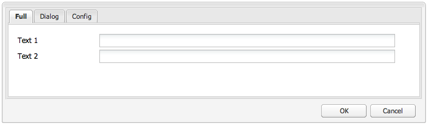

# Widgets gebruiken en uitbreiden (klassieke UI){#using-and-extending-widgets-classic-ui}

>[!NOTE]
>
>Deze pagina beschrijft het gebruik van widgets in de klassieke gebruikersinterface, die in AEM 6.4 is afgekeurd.
>
>Adobe raadt u aan de moderne, [aanraakinterface](/help/sites-developing/touch-ui-concepts.md) te gebruiken op basis van de gebruikersinterface [van](/help/sites-developing/touch-ui-concepts.md#coral-ui) Coral en de gebruikersinterface [van](/help/sites-developing/touch-ui-concepts.md#granite-ui-foundation-components)Granite.

De webinterface van Adobe Experience Manager gebruikt AJAX en andere moderne browsertechnologieën om WYSIWYG-bewerking en -opmaak van inhoud door auteurs rechtstreeks op de webpagina mogelijk te maken.

Adobe Experience Manager (AEM) gebruikt de [ExtJS](https://www.sencha.com/) -widgetbibliotheek, die de zeer gepolijste gebruikersinterface-elementen biedt die werken in alle belangrijkste browsers en waarmee gebruikersinterface-ervaringen van desktopniveau kunnen worden gemaakt.

Deze widgets worden opgenomen in AEM en kunnen, naast het gebruik door AEM zelf, worden gebruikt door elke website die met AEM is gemaakt.

Voor een volledige verwijzing naar alle beschikbare widgets in AEM kunt u de documentatie [van de](https://helpx.adobe.com/experience-manager/6-5/sites/developing/using/reference-materials/widgets-api/index.html) widget API of de [lijst van bestaande xtypes](/help/sites-developing/xtypes.md)raadplegen. Daarnaast zijn er veel voorbeelden van het gebruik van het ExtJS-framework beschikbaar op de [Sencha](https://www.sencha.com/products/extjs/examples/) -site, de eigenaar van het framework.

Deze pagina biedt inzicht in het gebruik en uitbreiden van widgets. Hierin wordt eerst beschreven hoe clientcode op een pagina [moet worden](#including-the-client-sided-code-in-a-page)opgenomen. Vervolgens worden enkele voorbeeldcomponenten beschreven die zijn gemaakt om een aantal basistoepassingen en -extensies te illustreren. Deze componenten zijn beschikbaar in het **pakket ExtJS-widgets** gebruiken voor **delen** van pakketten.

Het pakket bevat voorbeelden van:

* [Standaarddialoogvensters](#basic-dialogs) die zijn gemaakt met widgets die niet in de verpakking staan.
* [Dynamische dialoogvensters](#dynamic-dialogs) die zijn gemaakt met kant-en-klare widgets en aangepaste javascript-logica.
* Dialoogvensters op basis van [aangepaste widgets](#custom-widgets).
* Een [structuurdeelvenster](#tree-overview) met een JCR-structuur onder een bepaald pad.
* Een [rastervenster](#grid-overview) waarin gegevens in tabelvorm worden weergegeven.

>[!NOTE]
>
>De klassieke gebruikersinterface van Adobe Experience Manager is gebaseerd op [ExtJS 3.4.0](https://extjs.cachefly.net/ext-3.4.0/docs/).

## De code aan de clientzijde opnemen in een pagina {#including-the-client-sided-code-in-a-page}

JavaScript- en stijlbladcode aan clientzijde moet in een clientbibliotheek worden geplaatst.

Een clientbibliotheek maken:

1. Maak hieronder een knooppunt `/apps/<project>` met de volgende eigenschappen:

   * name=&quot;clientlib&quot;
   * jcr:mixinTypes=&quot;[mix:lockable]&quot;
   * jcr:primaryType=&quot;cq:ClientLibraryFolder&quot;
   * sling:resourceType=&quot;widgets/clientlib&quot;
   * Categ=&quot;[&lt;category-name>]&quot;
   * afhankelijkheden=&quot;[cq.widgets]&quot;
   `Note: <category-name> is the name of the custom library (e.g. "cq.extjstraining") and is used to include the library on the page.`

1. Maak hieronder `clientlib` de `css` en `js` mappen (nt:folder).

1. Maak hieronder `clientlib` de `css.txt` en `js.txt` bestanden (nt:files). Deze .txt-bestanden bevatten de bestanden die in de bibliotheek zijn opgenomen.

1. Bewerken `js.txt`: moet beginnen met &#39; `#base=js`&#39;, gevolgd door de lijst met bestanden die worden samengevoegd door de CQ-clientbibliotheekservice, bijvoorbeeld:

   ```
   #base=js
    components.js
    exercises.js
    CustomWidget.js
    CustomBrowseField.js
    InsertTextPlugin.js
   ```

1. Bewerken `css.txt`: moet beginnen met &#39; `#base=css`&#39;, gevolgd door de lijst met bestanden die worden samengevoegd door de CQ-clientbibliotheekservice, bijvoorbeeld:

   ```
   #base=css
    components.css
   ```

1. Plaats onder de `js` map de javascript-bestanden die bij de bibliotheek horen.

1. Plaats onder de `css` map de `.css` bestanden en bronnen die door de CSS-bestanden worden gebruikt (bijvoorbeeld `my_icon.png`).

>[!NOTE]
>
>Het hanteren van de hierboven beschreven opmaakmodellen is optioneel.

De clientbibliotheek opnemen in de jsp voor de paginacomponent:

* om zowel javascript-code als stijlpagina&#39;s op te nemen:
   `<ui:includeClientLib categories="<category-name1>, <category-name2>, ..."/>`
waarbij `<category-nameX>` de naam van de bibliotheek aan de clientzijde staat.

* alleen javascript-code opnemen:
   `<ui:includeClientLib js="<category-name>"/>`

Zie de beschrijving van de tag [&lt;ui:includeClientLib>](/help/sites-developing/taglib.md#lt-ui-includeclientlib) voor meer informatie.

In sommige gevallen mag een clientbibliotheek alleen beschikbaar zijn in de modus Schrijver en moet deze worden uitgesloten in de publicatiemodus. Dit kan als volgt worden bereikt:

```xml
    if (WCMMode.fromRequest(request) != WCMMode.DISABLED) {
        %><ui:includeClientLib categories="cq.collab.blog"/><%
    }
```

### Aan de slag met de voorbeelden {#getting-started-with-the-samples}

Als u de zelfstudies op deze pagina wilt volgen, installeert u het pakket ExtJS-widgets **** gebruiken in een lokale AEM-instantie en maakt u een voorbeeldpagina met de componenten. Daartoe:

1. Download in uw AEM-instantie het pakket ExtJS-widgets (v01) **** gebruiken vanuit Package Share en installeer het pakket. Het leidt `extjstraining` hieronder tot het project `/apps` in de bewaarplaats.
1. Neem de clientbibliotheek met de scripts (js) en het stijlblad (css) op in de koptag van de geometrixx page jsp, aangezien u de voorbeeldcomponenten opneemt op een nieuwe pagina van de **Geometrixx** -vertakking:
in **CRXDE Lite** open het dossier `/apps/geometrixx/components/page/headlibs.jsp` en voeg de `cq.extjstraining` categorie aan de bestaande `<ui:includeClientLib>` markering als volgt toe:
   `%><ui:includeClientLib categories="apps.geometrixx-main, cq.extjstraining"/><%`
1. Maak een nieuwe pagina in de onderstaande **vertakking Geometrixx** `/content/geometrixx/en/products` en noem deze **met ExtJS-widgets**.
1. Ga in ontwerpwijze en voeg alle componenten van de groep toe genoemd **Gebruikend Widgets** ExtJS aan het ontwerp van Geometrixx
1. Ga terug in bewerkingsmodus: de componenten van de groep **ExtJS Widgets** gebruiken zijn beschikbaar in de Sidetrap.

>[!NOTE]
>
>De voorbeelden op deze pagina zijn gebaseerd op de Geometrixx-voorbeeldinhoud, die niet meer bij AEM wordt geleverd en door We.Retail is vervangen. Zie het document [We.Retail Reference Implementation](/help/sites-developing/we-retail.md#we-retail-geometrixx) voor het downloaden en installeren van Geometrixx.

### Standaarddialoogvensters {#basic-dialogs}

Dialoogvensters worden doorgaans gebruikt om inhoud te bewerken, maar kunnen ook alleen informatie weergeven. Een gemakkelijke manier om een volledig dialoogvenster weer te geven, is om toegang te krijgen tot de representatie in json-indeling. U doet dit door de browser op te vragen:

`https://localhost:4502/<path-to-dialog>.-1.json`

De eerste component van de **Using ExtJS Widgets** groep in de Sidetrap wordt genoemd **1. De Grondbeginselen** van de dialoog en omvat vier basisdialogen die met uit-van-de-doos widgets en zonder aangepaste javascript logica worden gebouwd. De dialoogvensters worden hieronder opgeslagen `/apps/extjstraining/components/dialogbasics`. De basisdialoogvensters zijn:

* het volledige dialoogvenster ( `full` knooppunt): er wordt een venster weergegeven met drie tabbladen, die elk twee tekstvelden hebben.
* het dialoogvenster Eén deelvenster (- `singlepanel` knooppunt): er wordt een venster weergegeven met 1 tab die 2 tekstvelden heeft.
* het dialoogvenster Meerdere deelvensters(- `multipanel` knooppunt): de weergave is hetzelfde als het dialoogvenster Volledig, maar het is anders opgebouwd.
* het dialoogvenster Ontwerpen (&quot; `design` node&quot;): er wordt een venster weergegeven met twee tabbladen. De eerste tab heeft een tekstveld, een vervolgkeuzemenu en een inklapbaar tekstgebied. Het tweede tabblad bevat een veldset met 4 tekstvelden en een inklapbaar veld met 2 tekstvelden.

Neem de **1 op. De component Grondbeginselen** van het dialoogvenster in de voorbeeldpagina:

1. Voeg de **1 toe. De component van de Grondbeginselen** van de dialoog aan de steekproefpagina van het **Gebruiken van Widgets** ExtJS in de **Sidetrap**.
1. De component geeft een titel, tekst en een koppeling **EIGENSCHAPPEN** weer: Klik op de koppeling om de eigenschappen van de alinea weer te geven die in de repository zijn opgeslagen. Klik nogmaals op de koppeling om de eigenschappen te verbergen.

De component wordt als volgt weergegeven:


#### Voorbeeld 1: Volledig dialoogvenster {#example-full-dialog}

In het dialoogvenster **Volledig** wordt een venster weergegeven met drie tabbladen, die elk twee tekstvelden bevatten. Dit is het standaarddialoogvenster van de component **Dialoogbeginselen** . De kenmerken zijn:

* Wordt gedefinieerd door een knooppunt: knooppunttype = `cq:Dialog`, xtype = ` [dialog](/help/sites-developing/xtypes.md#dialog)`.
* Geeft 3 tabbladen weer (knooppunttype = `cq:Panel`).
* Elk tabblad heeft twee tekstvelden (knooppunttype = `cq:Widget`, xtype = ` [textfield](/help/sites-developing/xtypes.md#textfield)`).
* Wordt gedefinieerd door het knooppunt:
   `/apps/extjstraining/components/dialogbasics/full`
* Wordt in JSON-indeling weergegeven door het volgende aan te vragen:
   `https://localhost:4502/apps/extjstraining/components/dialogbasics/full.-1.json`

Het dialoogvenster wordt als volgt weergegeven:



#### Voorbeeld 2: Dialoogvenster Eén venster {#example-single-panel-dialog}

In het dialoogvenster **Eén deelvenster** wordt een venster weergegeven met één tab die twee tekstvelden heeft. De kenmerken zijn:

* Geeft 1 tab weer (knooppunttype = `cq:Dialog`, xtype = ` [panel](/help/sites-developing/xtypes.md#panel)`)
* Het tabblad bevat 2 tekstvelden (knooppunttype = `cq:Widget`, xtype = ` [textfield](/help/sites-developing/xtypes.md#textfield)`)
* Wordt gedefinieerd door het knooppunt:
   `/apps/extjstraining/components/dialogbasics/singlepanel`
* Wordt in json-indeling weergegeven door het volgende aan te vragen:
   `https://localhost:4502/apps/extjstraining/components/dialogbasics/singlepanel.-1.json`
* Een voordeel ten opzichte van de **volledige dialoog** is dat er minder configuratie nodig is.
* Aanbevolen gebruik: voor eenvoudige dialoogvensters die informatie weergeven of slechts een paar velden bevatten.

Het dialoogvenster Eén deelvenster gebruiken:

1. Vervang het dialoogvenster **Basisprincipes** van dialoogvenster door het dialoogvenster **Eén deelvenster** :
   1. Verwijder het knooppunt in **CRXDE Lite**: `/apps/extjstraining/components/dialogbasics/dialog`
   1. Klik op Alles **** opslaan om de wijzigingen op te slaan.
   1. Kopieer het knooppunt: `/apps/extjstraining/components/dialogbasics/singlepanel`
   1. Plak het gekopieerde knooppunt hieronder: `/apps/extjstraining/components/dialogbasics`
   1. Selecteer het knooppunt: `/apps/extjstraining/components/dialogbasics/Copy of singlepanel`en hernoemen `dialog`.
1. Bewerk de component: het dialoogvenster wordt als volgt weergegeven:


#### Voorbeeld 3: Dialoogvenster Meerdere deelvensters {#example-multi-panel-dialog}

Het dialoogvenster **Meerdere deelvensters** wordt op dezelfde manier weergegeven als het dialoogvenster **Volledig** , maar het wordt anders samengesteld. De kenmerken zijn:

* Wordt gedefinieerd door een knooppunt (knooppunttype = `cq:Dialog`, xtype = ` [tabpanel](/help/sites-developing/xtypes.md#tabpanel)`).
* Geeft 3 tabbladen weer (knooppunttype = `cq:Panel`).
* Elk tabblad heeft twee tekstvelden (knooppunttype = `cq:Widget`, xtype = ` [textfield](/help/sites-developing/xtypes.md#textfield)`).
* Wordt gedefinieerd door het knooppunt:
   `/apps/extjstraining/components/dialogbasics/multipanel`
* Wordt in json-indeling weergegeven door het volgende aan te vragen:
   `https://localhost:4502/apps/extjstraining/components/dialogbasics/multipanel.-1.json`
* Een voordeel ten opzichte van de **volledige dialoog** is dat deze een vereenvoudigde structuur heeft.
* Aanbevolen gebruik: voor dialoogvensters met meerdere tabbladen.

Het dialoogvenster Meerdere deelvensters gebruiken:

1. Vervang het dialoogvenster Basisprincipes van **dialoogvenster** door het dialoogvenster **Meerdere deelvensters** :
Voer de stappen uit die voor [Voorbeeld 2 worden beschreven: Dialoogvenster Eén venster](#example-single-panel-dialog)
1. Bewerk de component: het dialoogvenster wordt als volgt weergegeven:


#### Voorbeeld 4: Rich Dialog {#example-rich-dialog}

In het dialoogvenster **Rich** wordt een venster met twee tabbladen weergegeven. De eerste tab heeft een tekstveld, een vervolgkeuzemenu en een inklapbaar tekstgebied. Het tweede tabblad bevat een veldset met vier tekstvelden en een set opvouwbare velden met twee tekstvelden. De kenmerken zijn:

* Wordt gedefinieerd door een knooppunt (knooppunttype = `cq:Dialog`, xtype = ` [dialog](/help/sites-developing/xtypes.md#dialog)`).
* Geeft 2 tabbladen weer (knooppunttype = `cq:Panel`).
* Het eerste tabblad bevat een ` [dialogfieldset](/help/sites-developing/xtypes.md#dialogfieldset)` widget met een ` [textfield](/help/sites-developing/xtypes.md#textfield)` en een ` [selection](/help/sites-developing/xtypes.md#selection)` widget met drie opties, en een inklapbaar tabblad ` [dialogfieldset](/help/sites-developing/xtypes.md#dialogfieldset)` met een ` [textarea](/help/sites-developing/xtypes.md#textarea)` widget.
* Het tweede tabblad heeft een ` [dialogfieldset](/help/sites-developing/xtypes.md#dialogfieldset)` widget met 4 ` [textfield](/help/sites-developing/xtypes.md#textfield)` widgets en een inklapbaar tabblad `dialogfieldset` met 2 ` [textfield](/help/sites-developing/xtypes.md#textfield)` widgets.
* Wordt gedefinieerd door het knooppunt:
   `/apps/extjstraining/components/dialogbasics/rich`
* Wordt in json-indeling weergegeven door het volgende aan te vragen:
   `https://localhost:4502/apps/extjstraining/components/dialogbasics/rich.-1.json`

Het dialoogvenster **Rich** gebruiken:

1. Vervang het dialoogvenster Basisprincipes van **dialoogvenster** door het dialoogvenster **Rich** :
Voer de stappen uit die voor [Voorbeeld 2 worden beschreven: Dialoogvenster Eén venster](#example-single-panel-dialog)
1. Bewerk de component: het dialoogvenster wordt als volgt weergegeven:

 

### Dynamische dialoogvensters {#dynamic-dialogs}

De tweede component van de **Using ExtJS Widgets** groep in de Sidetrap wordt genoemd **2. De dynamische Dialogen** en omvat drie dynamische dialogen die met uit-van-de-doos widgets en **met aangepaste javascript logica** worden gebouwd. De dialoogvensters worden hieronder opgeslagen `/apps/extjstraining/components/dynamicdialogs`. De dynamische dialoogvensters zijn:

* Het dialoogvenster Tabs wisselen ( `switchtabs` knooppunt): er wordt een venster weergegeven met twee tabbladen. Het eerste tabblad bevat een keuzerondje met drie opties: als een optie is geselecteerd, wordt een tabblad weergegeven dat betrekking heeft op de optie. Het tweede tabblad bevat twee tekstvelden.
* het willekeurige dialoogvenster ( `arbitrary` knooppunt): er wordt een venster weergegeven met één tab. Het tabblad bevat een veld voor het neerzetten of uploaden van een element en een veld dat informatie weergeeft over de pagina die het element bevat en over het element als ernaar wordt verwezen.
* het dialoogvenster Velden in-/uitschakelen ( `togglefield` knooppunt): er wordt een venster weergegeven met één tab. De tab heeft een selectievakje: wanneer deze is ingeschakeld, wordt een veldset met twee tekstvelden weergegeven.

De **2 opnemen. Dynamische dialoogvensters** op de voorbeeldpagina:

1. Voeg de **2 toe. Dynamische dialoogvensters** op de voorbeeldpagina vanaf het tabblad **ExtJS-widgets** gebruiken in de **Sidetrap**.
1. De component geeft een titel, tekst en een koppeling **EIGENSCHAPPEN** weer: Klik om de eigenschappen van de alinea weer te geven die in de repository zijn opgeslagen. Klik nogmaals om de eigenschappen te verbergen.

De component wordt als volgt weergegeven:


#### Voorbeeld 1: Dialoogvenster Tabs wisselen {#example-switch-tabs-dialog}

In het dialoogvenster **Tabs** wisselen wordt een venster met twee tabbladen weergegeven. Het eerste tabblad bevat een keuzerondje met drie opties: als een optie is geselecteerd, wordt een tabblad weergegeven dat betrekking heeft op de optie. Het tweede tabblad bevat twee tekstvelden.

De belangrijkste kenmerken zijn:

* Wordt gedefinieerd door een knooppunt (knooppunttype = `cq:Dialog`, xtype = ` [dialog](/help/sites-developing/xtypes.md#dialog)`).
* Geeft 2 tabbladen weer (knooppunttype = `cq:Panel`): 1 selectietab. is het tweede tabblad afhankelijk van de selectie op het eerste tabblad (3 opties).
* Heeft 3 facultatieve lusjes (knooptype = `cq:Panel`), elk heeft 2 tekstgebieden (knooptype = `cq:Widget`, xtype = ` [textfield](/help/sites-developing/xtypes.md#textfield)`). Er wordt slechts één optioneel tabblad tegelijk weergegeven.
* Wordt gedefinieerd door het `switchtabs` knooppunt bij:
   `/apps/extjstraining/components/dynamicdialogs/switchtabs`
* Wordt in json-indeling weergegeven door het volgende aan te vragen:
   `https://localhost:4502/apps/extjstraining/components/dynamicdialogs/switchtabs.-1.json`

De logica wordt als volgt geïmplementeerd via gebeurtenislisteners en javascript-code:

* Het knooppunt Dialog heeft een listener &quot; `beforeshow`&quot; die alle optionele tabbladen verbergt voordat het dialoogvenster wordt weergegeven:
   `beforeshow="function(dialog){Ejst.x2.manageTabs(dialog.items.get(0));}"`
   `dialog.items.get(0)` Hiermee krijgt u het deelvenster met tabbladen dat het selectievenster en de drie optionele deelvensters bevat.
* Het `Ejst.x2` object wordt gedefinieerd in het `exercises.js` bestand op:
   `/apps/extjstraining/clientlib/js/exercises.js`
* Aangezien de waarde -1 is in de `Ejst.x2.manageTabs()` `index` methode, worden alle optionele tabbladen verborgen (deze loopt van 1 tot en met 3).
* Het selectietabblad heeft twee listeners: een tab die het geselecteerde tabblad weergeeft wanneer het dialoogvenster wordt geladen (&quot; `loadcontent`&quot;-gebeurtenis) en een tab die het geselecteerde tabblad weergeeft wanneer de selectie wordt gewijzigd (&quot; `selectionchanged`&quot;-gebeurtenis):
   `loadcontent="function(field,rec,path){Ejst.x2.showTab(field);}"`
   `selectionchanged="function(field,value){Ejst.x2.showTab(field);}"`
* In de `Ejst.x2.showTab()` methode:
   `field.findParentByType('tabpanel')` Hiermee wordt het deelvenster met alle tabbladen opgehaald ( `field` vertegenwoordigt de selectiewidget)
   `field.getValue()` Hiermee wordt de waarde van de selectie opgehaald, bijvoorbeeld: tab2
   `Ejst.x2.manageTabs()` geeft het geselecteerde tabblad weer.
* Elk optioneel tabblad bevat een listener die het tabblad van de gebeurtenis &quot; `render`&quot; verbergt:
   `render="function(tab){Ejst.x2.hideTab(tab);}"`
* In de `Ejst.x2.hideTab()` methode:
   `tabPanel` is het deelvenster met tabbladen dat alle tabbladen bevat
   `index` is de index van het optionele tabblad
   `tabPanel.hideTabStripItem(index)` verbergt de tab

Het wordt als volgt weergegeven:


#### Voorbeeld 2: Willekeurig dialoogvenster {#example-arbitrary-dialog}

Heel vaak wordt de inhoud van de onderliggende component in een dialoogvenster weergegeven. Het hier beschreven dialoogvenster, het **Willekeurige** dialoogvenster, trekt inhoud van een andere component.

In het dialoogvenster **Instelbaar** wordt een venster met één tab weergegeven. De tab heeft twee velden: een om een element te plaatsen of te uploaden en een element dat informatie over de pagina met het element en over het element weergeeft als er naar wordt verwezen.

De belangrijkste kenmerken zijn:

* Wordt gedefinieerd door een knooppunt (knooppunttype = `cq:Dialog`, xtype = ` [dialog](/help/sites-developing/xtypes.md#dialog)`).
* Geeft 1 widget voor tabbladen weer (knooppunttype = `cq:Widget`, xtype = ` [tabpanel](/help/sites-developing/xtypes.md#tabpanel)`) met 1 paneel (knooppunttype = `cq:Panel`)
* Het deelvenster heeft een widget smartfile (knooppunttype = `cq:Widget`, xtype = ` [smartfile](/help/sites-developing/xtypes.md#smartfile)`) en een widget ownerdraw (knooppunttype = `cq:Widget`, xtype = ` [ownerdraw](/help/sites-developing/xtypes.md#ownerdraw)`)
* Wordt gedefinieerd door het `arbitrary` knooppunt bij:
   `/apps/extjstraining/components/dynamicdialogs/arbitrary`
* Wordt in json-indeling weergegeven door het volgende aan te vragen:
   `https://localhost:4502/apps/extjstraining/components/dynamicdialogs/arbitrary.-1.json`

De logica wordt als volgt geïmplementeerd via gebeurtenislisteners en javascript-code:

* De ownerdraw-widget heeft een `loadcontent`&quot;listener&quot; die informatie bevat over de pagina die de component bevat en het element waarnaar door de widget voor het smartbestand wordt verwezen wanneer de inhoud wordt geladen:
   `loadcontent="function(field,rec,path){Ejst.x2.showInfo(field,rec,path);}"`
   `field` wordt ingesteld met het eigentekenobject
   `path` wordt ingesteld met het inhoudspad van de component (bijvoorbeeld: /content/geometrixx/nl/products/triangle/ui-tutorial/jcr:content/par/dynamicdialogs)
* Het `Ejst.x2` object wordt gedefinieerd in het `exercises.js` bestand op:
   `/apps/extjstraining/clientlib/js/exercises.js`
* In de `Ejst.x2.showInfo()` methode:
   `pagePath` is het pad van de pagina die de component bevat
   `pageInfo` geeft de pagina-eigenschappen in de json-indeling aan
   `reference` is het pad van het element waarnaar wordt verwezen
   `metadata` vertegenwoordigt de metagegevens van het element in json-indeling
   `ownerdraw.getEl().update(html);` Hiermee wordt de gemaakte HTML weergegeven in het dialoogvenster

Het dialoogvenster **Instelbaar** gebruiken:

1. Het dialoogvenster van de component **Dynamisch dialoogvenster** vervangen door het dialoogvenster **Instelbaar** :
Voer de stappen uit die voor [Voorbeeld 2 worden beschreven: Dialoogvenster Eén venster](#example-single-panel-dialog)
1. Bewerk de component: het dialoogvenster wordt als volgt weergegeven:


#### Voorbeeld 3: Dialoogvenster Velden in-/uitschakelen {#example-toggle-fields-dialog}

In het dialoogvenster **Velden** in-/uitschakelen wordt een venster met één tab weergegeven. De tab heeft een selectievakje: wanneer deze is ingeschakeld, wordt een veldset met twee tekstvelden weergegeven.

De belangrijkste kenmerken zijn:

* Wordt gedefinieerd door een knooppunt (knooppunttype = `cq:Dialog`, xtype = ` [dialog](/help/sites-developing/xtypes.md#dialog)`).
* Geeft 1 widget voor tabbladen weer (knooppunttype = `cq:Widget`, xtype = ` [tabpanel](/help/sites-developing/xtypes.md#textpanel)`) met 1 paneel (knooppunttype = `cq:Panel`).
* Het paneel heeft een selectie/checkbox widget (knooptype = `cq:Widget`, xtype = ` [selection](/help/sites-developing/xtypes.md#selection)`, type = ` [checkbox](/help/sites-developing/xtypes.md#checkbox)`) en een inklapbaar dialogfieldset widget (knooppunttype = `cq:Widget`, xtype = ` [dialogfieldset](/help/sites-developing/xtypes.md#dialogfieldset)`) die door gebrek, met 2 textfield widgets (knooptype = `cq:Widget`, xtype = ` [textfield](/help/sites-developing/xtypes.md#textfield)`) wordt verborgen.
* Wordt gedefinieerd door het `togglefields` knooppunt bij:
   `/apps/extjstraining/components/dynamicdialogs/togglefields`
* Wordt in json-indeling weergegeven door het volgende aan te vragen:
   `https://localhost:4502/apps/extjstraining/components/dynamicdialogs/togglefields.-1.json`

De logica wordt als volgt geïmplementeerd via gebeurtenislisteners en javascript-code:

* het selectietabblad heeft twee listeners: een element dat de dialogfieldset weergeeft wanneer de inhoud wordt geladen (&quot; `loadcontent`&quot;-gebeurtenis) en een element dat de dialogfieldset weergeeft wanneer de selectie wordt gewijzigd (&quot; `selectionchanged`&quot;-gebeurtenis):
   `loadcontent="function(field,rec,path){Ejst.x2.toggleFieldSet(field);}"`
   `selectionchanged="function(field,value){Ejst.x2.toggleFieldSet(field);}"`
* Het `Ejst.x2` object wordt gedefinieerd in het `exercises.js` bestand op:
   `/apps/extjstraining/clientlib/js/exercises.js`
* In de `Ejst.x2.toggleFieldSet()` methode:
   `box` is het selectieobject
   `panel` is het deelvenster met de selectie en de widgets voor de dialogfieldset
   `fieldSet` is het dialogfieldset-object
   `show` is de waarde van de selectie (true of false) op basis van &#39; `show`&#39; of de dialogfieldset al dan niet wordt weergegeven.

Het dialoogvenster **Velden** in-/uitschakelen gebruiken:

1. Vervang het dialoogvenster van de component **Dynamisch dialoogvenster** door het dialoogvenster **Velden** in-/uitschakelen:
Voer de stappen uit die voor [Voorbeeld 2 worden beschreven: Dialoogvenster Eén venster](#example-single-panel-dialog)
1. Bewerk de component: het dialoogvenster wordt als volgt weergegeven:


### Aangepaste widgets {#custom-widgets}

De widgets die buiten de doos worden geleverd bij AEM zouden de meeste gebruiksgevallen moeten behandelen. Het kan echter soms nodig zijn om een aangepaste widget te maken die voldoet aan een projectspecifieke vereiste. Aangepaste widgets kunnen worden gemaakt door bestaande widgets uit te breiden. Om u te helpen aan de slag te gaan met deze aanpassing, bevat het **pakket ExtJS-widgets** gebruiken drie dialoogvensters die drie verschillende aangepaste widgets gebruiken:

* In het dialoogvenster Meerdere velden ( `multifield` knooppunt) wordt een venster met één tab weergegeven. De tab heeft een aangepaste widget met meerdere velden die twee velden heeft: een vervolgkeuzemenu met twee opties en een tekstveld. Omdat de widget is gebaseerd op de `multifield` widget uit de doos (die alleen een tekstveld heeft), heeft deze alle functies van de `multifield` widget.
* In het dialoogvenster Bladeren door structuur ( `treebrowse` knooppunt) wordt een venster weergegeven met één tabblad dat een widget voor padbrowsers bevat: wanneer u op de pijl klikt, wordt een venster geopend waarin u door een hiërarchie kunt bladeren en een item kunt selecteren. Het pad van het item wordt vervolgens toegevoegd aan het padveld en wordt voortgezet wanneer het dialoogvenster wordt gesloten.
* een op plug-in gebaseerd dialoogvenster van de teksteditor ( `rteplugin` knooppunt) dat een aangepaste knop toevoegt aan de Rich Text Editor om aangepaste tekst in te voegen in de hoofdtekst. Het bestaat uit een `richtext` widget (RTE) en van een douaneeigenschap die door het de insteekmechanisme van RTE wordt toegevoegd.

De aangepaste widgets en de insteekmodule zijn opgenomen in de component met de naam **3. Aangepaste widgets** van het **pakket ExtJS-widgets** gebruiken. Deze component opnemen in de voorbeeldpagina:

1. Voeg de **3 toe. Aangepaste widgets** component naar de voorbeeldpagina vanaf het tabblad ExtJS-widgets **gebruiken in de** Sidetrap ****.
1. De component geeft een titel, tekst en, wanneer u op de koppeling **EIGENSCHAPPEN** klikt, de eigenschappen van de alinea weer die in de opslagplaats zijn opgeslagen. Als u nogmaals klikt, worden de eigenschappen verborgen.
De component wordt als volgt weergegeven:


#### Voorbeeld 1: Aangepaste widget voor meerdere velden {#example-custom-multifield-widget}

In het dialoogvenster **Aangepaste widget voor meerdere velden** wordt een venster met één tab weergegeven. De tab heeft een aangepaste widget met meerdere velden die, in tegenstelling tot de standaard widget met één veld, twee velden heeft: een vervolgkeuzemenu met twee opties en een tekstveld.

Het dialoogvenster **Aangepaste widget voor meerdere velden** :

* Wordt gedefinieerd door een knooppunt (knooppunttype = `cq:Dialog`, xtype = ` [dialog](/help/sites-developing/xtypes.md#dialog)`).
* Geeft 1 widget voor tabbladen weer (knooppunttype = `cq:Widget`, xtype = ` [tabpanel](/help/sites-developing/xtypes.md#tabpanel)`) die een deelvenster bevat (knooppunttype = `cq:Widget`, xtype = ` [panel](/help/sites-developing/xtypes.md#panel)`).
* Het deelvenster heeft een `multifield` widget (knooppunttype = `cq:Widget`, xtype = ` [multifield](/help/sites-developing/xtypes.md#multifield)`).
* De `multifield` widget heeft een fieldconfig (knooppunttype = `nt:unstructured`, xtype = `ejstcustom`, optionsProvider = `Ejst.x3.provideOptions`) die op douane xtype &#39; `ejstcustom`&#39; gebaseerd is:
   * &#39; `fieldconfig`&#39; is een configuratieoptie van het ` [CQ.form.MultiField](https://helpx.adobe.com/experience-manager/6-5/sites/developing/using/reference-materials/widgets-api/index.html?class=CQ.form.MultiField)` object.
   * &#39; `optionsProvider`&#39; is een configuratie van de `ejstcustom` widget. De methode wordt ingesteld met de `Ejst.x3.provideOptions` methode die wordt gedefinieerd in `exercises.js` de volgende code:
      `/apps/extjstraining/clientlib/js/exercises.js`
en retourneert twee opties.
* Wordt gedefinieerd door het `multifield` knooppunt bij:
   `/apps/extjstraining/components/customwidgets/multifield`
* Wordt in json-indeling weergegeven door het volgende aan te vragen:
   `https://localhost:4502/apps/extjstraining/components/customwidgets/multifield.-1.json`

De aangepaste multifield-widget (xtype = `ejstcustom`):

* Is een javascript-object dat `Ejst.CustomWidget`wordt aangeroepen.
* Wordt gedefinieerd in het `CustomWidget.js` javascript-bestand op:
   `/apps/extjstraining/clientlib/js/CustomWidget.js`
* Breidt de ` [CQ.form.CompositeField](https://helpx.adobe.com/experience-manager/6-5/sites/developing/using/reference-materials/widgets-api/index.html?class=CQ.form.CompositeField)` widget uit.
* Bevat 3 velden: `hiddenField` (TextField), `allowField` (ComboBox) en `otherField` (TextField)
* Overschrijvingen `CQ.Ext.Component#initComponent` om de drie velden toe te voegen:
   * `allowField` is een [CQ.form.Selection](https://helpx.adobe.com/experience-manager/6-5/sites/developing/using/reference-materials/widgets-api/index.html?class=CQ.form.Selection) -object van het type &#39;select&#39;. optionsProvider is een configuratie van het Selection-object die wordt geïnstantieerd met de optionsProvider-configuratie van de CustomWidget die is gedefinieerd in het dialoogvenster
   * `otherField` is een [CQ.Ext.form.TextField](https://helpx.adobe.com/experience-manager/6-5/sites/developing/using/reference-materials/widgets-api/index.html?class=CQ.Ext.form.TextField) -object
* Overschrijft de methoden `setValue`, `getValue` en `getRawValue` van [CQ.form.CompositeField](https://helpx.adobe.com/experience-manager/6-5/sites/developing/using/reference-materials/widgets-api/index.html?class=CQ.form.CompositeField) om de waarde van CustomWidget in te stellen en op te halen met de indeling:
   `<allowField value>/<otherField value>, e.g.: 'Bla1/hello'`.
* Registreert zichzelf als &#39; `ejstcustom`&#39; xtype:
   `CQ.Ext.reg('ejstcustom', Ejst.CustomWidget);`

Het dialoogvenster **Aangepaste widget voor meerdere velden** wordt als volgt weergegeven:


#### Voorbeeld 2: Aangepaste Edge-widget {#example-custom-treebrowse-widget}

In het dialoogvenster met aangepaste **webbrowse** -widgets wordt een venster weergegeven met één tab die een aangepaste padwidget bevat: wanneer u op de pijl klikt, wordt een venster geopend waarin u door een hiërarchie kunt bladeren en een item kunt selecteren. Het pad van het item wordt vervolgens toegevoegd aan het padveld en wordt voortgezet wanneer het dialoogvenster wordt gesloten.

Het dialoogvenster Aangepaste browse:

* Wordt gedefinieerd door een knooppunt (knooppunttype = `cq:Dialog`, xtype = ` [dialog](/help/sites-developing/xtypes.md#dialog)`).
* Geeft 1 widget voor tabbladen weer (knooppunttype = `cq:Widget`, xtype = ` [tabpanel](/help/sites-developing/xtypes.md#tabpanel)`) die een deelvenster bevat (knooppunttype = `cq:Widget`, xtype = ` [panel](/help/sites-developing/xtypes.md#panel)`).
* Het deelvenster heeft een aangepaste widget (knooppunttype = `cq:Widget`, xtype = `ejstbrowse`)
* Wordt gedefinieerd door het `treebrowse` knooppunt bij:
   `/apps/extjstraining/components/customwidgets/treebrowse`
* Wordt in json-indeling weergegeven door het volgende aan te vragen:
   `https://localhost:4502/apps/extjstraining/components/customwidgets/treebrowse.-1.json`

De aangepaste widget voor browse (xtype = `ejstbrowse`):

* Is een javascript-object dat `Ejst.CustomWidget`wordt aangeroepen.
* Wordt gedefinieerd in het `CustomBrowseField.js` javascript-bestand op:
   `/apps/extjstraining/clientlib/js/CustomBrowseField.js`
* Breidt uit ` [CQ.Ext.form.TriggerField](https://helpx.adobe.com/experience-manager/6-5/sites/developing/using/reference-materials/widgets-api/index.html?class=CQ.Ext.form.TriggerField)`.
* Definieert een bladervenster met de naam `browseWindow`.
* Hiermee overschrijft u ` [CQ.Ext.form.TriggerField](https://helpx.adobe.com/experience-manager/6-5/sites/developing/using/reference-materials/widgets-api/index.html?class=CQ.Ext.form.TriggerField)#onTriggerClick` de instelling waarmee het bladervenster wordt weergegeven wanneer op de pijl wordt geklikt.
* Definieert een [CQ.Ext.tree.TreePanel](https://helpx.adobe.com/experience-manager/6-5/sites/developing/using/reference-materials/widgets-api/index.html?class=CQ.Ext.tree.TreePanel) -object:
   * Het krijgt zijn gegevens door servlet te roepen die bij `/bin/wcm/siteadmin/tree.json`wordt geregistreerd.
   * De basis is &quot; `apps/extjstraining`&quot;.
* Definieert een `window` object ( ` [CQ.Ext.Window](https://helpx.adobe.com/experience-manager/6-5/sites/developing/using/reference-materials/widgets-api/index.html?class=CQ.Ext.Window)`):
   * Gebaseerd op het vooraf gedefinieerde deelvenster.
   * Bevat een knop **OK** die de waarde van het geselecteerde pad instelt en het deelvenster verbergt.
* Het venster is verankerd onder het veld **Pad** .
* Het geselecteerde pad wordt bij `show` gebeurtenis van het bladerveld naar het venster doorgegeven.
* Registreert zichzelf als &#39; `ejstbrowse`&#39; xtype:
   `CQ.Ext.reg('ejstbrowse', Ejst.CustomBrowseField);`

Het dialoogvenster **Aangepaste webbrowse** -widget gebruiken:

1. Vervang het dialoogvenster van de **component Aangepaste widgets** door het dialoogvenster **Aangepaste** Edge:
Voer de stappen uit die voor [Voorbeeld 2 worden beschreven: Dialoogvenster Eén venster](#example-single-panel-dialog)
1. Bewerk de component: het dialoogvenster wordt als volgt weergegeven:


#### Voorbeeld 3: Insteekmodule Rich Text Editor (RTE) {#example-rich-text-editor-rte-plug-in}

Het op plug-in **gebaseerde dialoogvenster van de** Rich Text Editor (RTE) is een dialoogvenster met de Rich Text Editor dat een aangepaste knop bevat om aangepaste tekst tussen vierkante haakjes in te voegen. De aangepaste tekst kan worden geparseerd door bepaalde logica aan serverzijde (niet geïmplementeerd in dit voorbeeld), bijvoorbeeld door tekst toe te voegen die op het opgegeven pad is gedefinieerd:

Het dialoogvenster **RTE-insteekmodule** :

* Wordt gedefinieerd door het knooppunt rteplugin op:
   `/apps/extjstraining/components/customwidgets/rteplugin`
* Wordt in json-indeling weergegeven door het volgende aan te vragen:
   `https://localhost:4502/apps/extjstraining/components/customwidgets/rteplugin.-1.json`
* Het `rtePlugins` knooppunt heeft een onderliggend knooppunt `inserttext` (knooppunttype = `nt:unstructured`) dat naar de plug-in is benoemd. Het heeft een genoemd bezit `features`, dat bepaalt welke van de plugin eigenschappen aan RTE beschikbaar zijn.

De RTE-plug-in:

* Is een javascript-object dat `Ejst.InsertTextPlugin`wordt aangeroepen.
* Wordt gedefinieerd in het `InsertTextPlugin.js` javascript-bestand op:
   `/apps/extjstraining/clientlib/js/InsertTextPlugin.js`
* Breidt het ` [CQ.form.rte.plugins.Plugin](https://helpx.adobe.com/experience-manager/6-5/sites/developing/using/reference-materials/widgets-api/index.html?class=CQ.form.rte.plugins.Plugin)` object uit.
* De volgende methoden definiëren het ` [CQ.form.rte.plugins.Plugin](https://helpx.adobe.com/experience-manager/6-5/sites/developing/using/reference-materials/widgets-api/index.html?class=CQ.form.rte.plugins.Plugin)` object en worden overschreven in de implementerende plug-in:
   * `getFeatures()` retourneert een array met alle functies die de plug-in beschikbaar stelt.
   * `initializeUI()` voegt de nieuwe knoop aan de toolbar van RTE toe.
   * `notifyPluginConfig()` geeft de titel en de tekst weer wanneer de knop wordt aangeroepen.
   * `execute()` wordt aangeroepen wanneer op de knop wordt geklikt en de insteekactie wordt uitgevoerd: er wordt een venster weergegeven waarin de tekst wordt gedefinieerd die moet worden opgenomen.
* `insertText()` Voegt tekst in met behulp van het bijbehorende dialoogvenster `Ejst.InsertTextPlugin.Dialog` (zie verderop).
* `executeInsertText()` wordt aangeroepen door de `apply()` methode van het dialoogvenster, dat wordt geactiveerd wanneer op de knop **OK** wordt geklikt.
* Registreert zichzelf als plug-in &#39; `inserttext`&#39;:
   `CQ.form.rte.plugins.PluginRegistry.register("inserttext", Ejst.InsertTextPlugin);`
* het `Ejst.InsertTextPlugin.Dialog` object definieert het dialoogvenster dat wordt geopend wanneer op de insteekmodule wordt geklikt. Het dialoogvenster bestaat uit een deelvenster, een formulier, een tekstveld en 2 knoppen (**OK** en **Annuleren**).

Het dialoogvenster **Rich Text Editor (RTE) Insteekmodule** gebruiken:

1. Vervang het dialoogvenster van de component **Aangepaste widgets** door het dialoogvenster dat is gebaseerd op de plug-in **Rich Text Editor (RTE)** :
Voer de stappen uit die voor [Voorbeeld 2 worden beschreven: Dialoogvenster Eén venster](#example-single-panel-dialog)
1. Bewerk de component.
1. Klik op het laatste pictogram aan de rechterkant (het pictogram met vier pijlen). Voer een pad in en klik op **OK**:
Het pad wordt tussen haakjes weergegeven ([ ]).
1. Klik op **OK** om de RTF-editor te sluiten.

Het op plug-in **gebaseerde dialoogvenster van de** Rich Text Editor (RTE) wordt als volgt weergegeven:


>[!NOTE]
>
>In dit voorbeeld wordt alleen getoond hoe u het clientgedeelte van de logica implementeert: de plaatsaanduidingen (*[tekst]*) moeten vervolgens expliciet op de server worden geparseerd (bijvoorbeeld in de JSP-component).

### Overzicht van boomstructuur {#tree-overview}

Het uit-van-de-doos ` [CQ.Ext.tree.TreePanel](https://helpx.adobe.com/experience-manager/6-5/sites/developing/using/reference-materials/widgets-api/index.html?class=CQ.Ext.tree.TreePanel)` voorwerp verstrekt boom-gestructureerde vertegenwoordiging UI van boom-gestructureerde gegevens. De component Tree Overview die in het pakket ExtJS-widgets **** gebruiken is opgenomen, laat zien hoe u met het `TreePanel` object een JCR-structuur onder een bepaald pad kunt weergeven. Het venster zelf kan worden gekoppeld of losgekoppeld. In dit voorbeeld wordt de vensterlogica ingesloten in de spa van de component tussen &lt;script>&lt;/script>-tags.

De component Overzicht **van** boomstructuur opnemen in de voorbeeldpagina:

1. Voeg de **4 toe. De component Overzicht** van de boom aan de steekproefpagina van het **Gebruiken van Widgets** ExtJS in de **Sidetrap**.
1. De component wordt weergegeven:
   * een titel, met tekst
   * een koppeling **EIGENSCHAPPEN** : Klik om de eigenschappen van de alinea weer te geven die in de repository zijn opgeslagen. Klik nogmaals om de eigenschappen te verbergen.
   * een zwevend venster met een boomrepresentatie van de repository, die kan worden uitgebreid.

De component wordt als volgt weergegeven:


De component Overzicht van de Boom:

* Wordt gedefinieerd bij:
   `/apps/extjstraining/components/treeoverview`

* In het dialoogvenster kunt u de grootte van het venster instellen en het venster koppelen/ontkoppelen (zie de details hieronder).

The component jsp:

* Haalt de breedte, hoogte en gedokte eigenschappen op van de repository.
* Geeft enige tekst weer over de gegevensindeling van het boomoverzicht.
* Hiermee sluit u de vensterlogica in de jsp van de component tussen javascript-tags in.
* Wordt gedefinieerd bij:
   `apps/extjstraining/components/treeoverview/content.jsp`

De javascript-code die is ingesloten in de jsp van de component:

* Definieert een `tree` object door te proberen een structuurvenster van de pagina op te halen.
* Als het venster met de boomstructuur niet bestaat, wordt `treePanel` ([CQ.Ext.tree.TreePanel](https://helpx.adobe.com/experience-manager/6-5/sites/developing/using/reference-materials/widgets-api/index.html?class=CQ.Ext.tree.TreePanel)) gemaakt:
   * `treePanel` bevat de gegevens die worden gebruikt om het venster te maken.
   * De gegevens worden teruggewonnen door servlet te roepen die bij wordt geregistreerd:
      `/bin/wcm/siteadmin/tree.json`
* De `beforeload` listener zorgt ervoor dat het aangeklikte knooppunt wordt geladen.
* Het `root` object stelt het pad in `apps/extjstraining` als de hoofdstructuur van de structuur.
* `tree` ( ` [CQ.Ext.Window](https://helpx.adobe.com/experience-manager/6-5/sites/developing/using/reference-materials/widgets-api/index.html?class=CQ.Ext.Window)`) wordt ingesteld op basis van de vooraf gedefinieerde `treePanel`en wordt weergegeven met:
   `tree.show();`
* Als het venster al bestaat, wordt het weergegeven op basis van de breedte, hoogte en gedokte eigenschappen die zijn opgehaald uit de opslagplaats.

Het dialoogvenster Component:

* Geeft 1 tab met 2 velden weer om de grootte (breedte en hoogte) van het venster met het overzicht van de structuur in te stellen en 1 veld om het venster te koppelen/ontkoppelen
* Wordt gedefinieerd door een knooppunt (knooppunttype = `cq:Dialog`, xtype = ` [panel](/help/sites-developing/xtypes.md#panel)`).
* Het deelvenster heeft een widget sizefeld (knooppunttype = `cq:Widget`, xtype = ` [sizefield](/help/sites-developing/xtypes.md#sizefield)`) en een selectiewidget (knooppunttype = `cq:Widget`, xtype = ` [selection](/help/sites-developing/xtypes.md#selection)`, type = `radio`) met 2 opties (true/false)
* Wordt gedefinieerd door het dialoogknooppunt op:
   `/apps/extjstraining/components/treeoverview/dialog`
* Wordt in json-indeling weergegeven door het volgende aan te vragen:
   `https://localhost:4502/apps/extjstraining/components/treeoverview/dialog.-1.json`
* Hieronder wordt weergegeven:


### Rasteroverzicht {#grid-overview}

Een deelvenster Raster vertegenwoordigt gegevens in tabelvorm van rijen en kolommen. Het bestaat uit:

* Winkel: het model met de gegevensrecords (rijen).
* Kolommodel: de kolomsamenstelling.
* Weergave: kapselt het gebruikersinterface in.
* Selectiemodel: het selectiegedrag.

De component van het Overzicht van het Net inbegrepen in het **Gebruiken van het Widget** pakket ExtJS toont hoe te om gegevens in een tabellarische formaat te tonen:

* In voorbeeld 1 worden statische gegevens gebruikt.
* In voorbeeld 2 worden gegevens gebruikt die uit de gegevensopslagruimte zijn opgehaald.

De component Rasteroverzicht opnemen in de voorbeeldpagina:

1. Voeg de **5 toe. De component van het Overzicht** van het net aan de steekproefpagina van het **Gebruiken van Widgets** ExtJS in de **Sidetrap**.
1. De component wordt weergegeven:
   * een titel met tekst
   * een koppeling **EIGENSCHAPPEN** : Klik om de eigenschappen van de alinea weer te geven die in de repository zijn opgeslagen. Klik nogmaals om de eigenschappen te verbergen.
   * een zwevend venster met gegevens in tabelvorm.

De component wordt als volgt weergegeven:


#### Voorbeeld 1: Standaardraster {#example-default-grid}

In zijn uit-van-de-doos versie, toont de component van het Overzicht **van het** Net een venster met statische gegevens in een tabelvorm formaat. In dit voorbeeld wordt de logica op twee manieren ingesloten in de jsp van de component:

* de algemene logica wordt gedefinieerd tussen &lt;script>&lt;/script>-tags
* de specifieke logica is beschikbaar in een afzonderlijk JS-bestand en is gekoppeld in het Jsp. Met deze instelling kunt u eenvoudig schakelen tussen de twee logica (statisch/dynamisch) door de gewenste &lt;script>-tags toe te voegen.

De component Rasteroverzicht:

* Wordt gedefinieerd bij:
   `/apps/extjstraining/components/gridoverview`
* In dit dialoogvenster kunt u de grootte van het venster instellen en het venster koppelen/ontkoppelen.

The component jsp:

* Haalt de breedte, hoogte en gedokte eigenschappen op van de repository.
* Geeft wat tekst weer als inleiding op de gegevensindeling van het rasteroverzicht.
* Verwijst naar javascript-code die het GridPanel-object definieert:
   `<script type="text/javascript" src="/apps/extjstraining/components/gridoverview/defaultgrid.js"></script>`
   `defaultgrid.js` bepaalt sommige statische gegevens als basis voor het voorwerp GridPanel.
* Hiermee wordt javascript-code ingesloten tussen javascript-tags die het Window-object definiëren dat het GridPanel-object gebruikt.
* Wordt gedefinieerd bij:
   `apps/extjstraining/components/gridoverview/content.jsp`

De javascript-code die is ingesloten in de jsp van de component:

* Definieert het `grid` object door te proberen de venstercomponent van de pagina op te halen:
   `var grid = CQ.Ext.getCmp("<%= node.getName() %>-grid");`
* Als `grid` dit niet het geval is, wordt een [object CQ.Ext.grid.GridPanel](https://helpx.adobe.com/experience-manager/6-5/sites/developing/using/reference-materials/widgets-api/index.html?class=CQ.Ext.grid.GridPanel) ( `gridPanel`) gedefinieerd door de `getGridPanel()` methode aan te roepen (zie hieronder). Deze methode wordt gedefinieerd in `defaultgrid.js`.
* `grid` is een ` [CQ.Ext.Window](https://helpx.adobe.com/experience-manager/6-5/sites/developing/using/reference-materials/widgets-api/index.html?class=CQ.Ext.Window)` voorwerp, dat op vooraf bepaalde GridPanel wordt gebaseerd, en getoond: `grid.show();`
* Als dit `grid` al het geval is, wordt het weergegeven op basis van de breedte, hoogte en gedokte eigenschappen die uit de opslagplaats zijn opgehaald.

Het javascript-bestand ( `defaultgrid.js`) waarnaar wordt verwezen in de component jsp, definieert de `getGridPanel()` methode die wordt aangeroepen door het script dat is ingesloten in de JSP en retourneert een ` [CQ.Ext.grid.GridPanel](https://helpx.adobe.com/experience-manager/6-5/sites/developing/using/reference-materials/widgets-api/index.html?class=CQ.Ext.grid.GridPanel)` object op basis van statische gegevens. De logica is als volgt:

* `myData` is een array van statische gegevens die zijn opgemaakt als een tabel van 5 kolommen en 4 rijen.
* `store` is een `CQ.Ext.data.Store` object dat verbruikt `myData`.
* `store` wordt geladen in het geheugen:
   `store.load();`
* `gridPanel` is een ` [CQ.Ext.grid.GridPanel](https://helpx.adobe.com/experience-manager/6-5/sites/developing/using/reference-materials/widgets-api/index.html?class=CQ.Ext.grid.GridPanel)` object dat verbruikt `store`:
   * de kolombreedten worden altijd opnieuw proportioneel:
      `forceFit: true`
   * u kunt slechts één rij tegelijk selecteren:
      `singleSelect:true`

#### Voorbeeld 2: Zoekraster naslaggids {#example-reference-search-grid}

Wanneer u het pakket installeert, toont de component `content.jsp` van het Overzicht **van het** Net een net dat op statische gegevens gebaseerd is. Het is mogelijk om de component te wijzigen om een raster met de volgende kenmerken weer te geven:

* Bevat drie kolommen.
* Is gebaseerd op gegevens die van de bewaarplaats door een servlet te roepen worden teruggewonnen.
* De cellen van de laatste kolom kunnen worden bewerkt. De waarde blijft bestaan in een `test` eigenschap onder het knooppunt dat wordt gedefinieerd door het pad dat in de eerste kolom wordt weergegeven.

Zoals in de sectie eerder is uitgelegd, krijgt het vensterobject zijn ` [CQ.Ext.grid.GridPanel](https://helpx.adobe.com/experience-manager/6-5/sites/developing/using/reference-materials/widgets-api/index.html?class=CQ.Ext.grid.GridPanel)` object door de `getGridPanel()` methode aan te roepen die in het `defaultgrid.js` bestand op `/apps/extjstraining/components/gridoverview/defaultgrid.js`. De **Grid overzichtscomponent **verstrekt een verschillende implementatie voor de `getGridPanel()` methode, die in het `referencesearch.js` dossier bij wordt bepaald `/apps/extjstraining/components/gridoverview/referencesearch.js`. Door het .js dossier te schakelen dat in component jsp van verwijzingen wordt voorzien, zal het net op gegevens worden gebaseerd die van de bewaarplaats worden teruggewonnen.

Van .js dossier schakelen dat in component jsp van verwijzingen wordt voorzien:

1. In **CRXDE Lite**, in het `content.jsp` dossier van de component, commentaarde de lijn die het `defaultgrid.js` dossier omvat, zodat het als volgt kijkt:
   `<!-- script type="text/javascript" src="/apps/extjstraining/components/gridoverview/defaultgrid.js"></script-->`
1. Verwijder de opmerking van de regel die het `referencesearch.js` bestand bevat, zodat deze er als volgt uitziet:
   `<script type="text/javascript" src="/apps/extjstraining/components/gridoverview/referencesearch.js"></script>`
1. Sla de wijzigingen op.
1. Vernieuw de voorbeeldpagina.

De component wordt als volgt weergegeven:


De javascript-code waarnaar in de component jsp ( `referencesearch.js`) wordt verwezen, definieert de `getGridPanel()` methode die vanuit de component jsp wordt aangeroepen en retourneert een ` [CQ.Ext.grid.GridPanel](https://helpx.adobe.com/experience-manager/6-5/sites/developing/using/reference-materials/widgets-api/index.html?class=CQ.Ext.grid.GridPanel)` object op basis van gegevens die dynamisch worden opgehaald uit de opslagplaats. De logica in `referencesearch.js` bepaalt sommige dynamische gegevens als basis voor GridPanel:

* `reader` is een ` [CQ.Ext.data.JsonReader](https://helpx.adobe.com/experience-manager/6-5/sites/developing/using/reference-materials/widgets-api/index.html?class=CQ.Ext.data.JsonReader)`object dat de servlet-reactie in json-indeling voor 3 kolommen leest.
* `cm` is een ` [CQ.Ext.grid.ColumnModel](https://helpx.adobe.com/experience-manager/6-5/sites/developing/using/reference-materials/widgets-api/index.html?class=CQ.Ext.grid.ColumnModel)` object voor 3 kolommen.
De kolomcellen van de &quot;Test&quot;kunnen worden uitgegeven aangezien zij met een redacteur worden bepaald:
   `editor: new [CQ.Ext.form.TextField](https://helpx.adobe.com/experience-manager/6-5/sites/developing/using/reference-materials/widgets-api/index.html?class=CQ.Ext.form.TextField)({})`
* de kolommen kunnen worden gesorteerd:
   `cm.defaultSortable = true;`
* `store` is een ` [CQ.Ext.data.GroupingStore](https://helpx.adobe.com/experience-manager/6-5/sites/developing/using/reference-materials/widgets-api/index.html?class=CQ.Ext.data.GroupingStore)` object:
   * het krijgt zijn gegevens door servlet te roepen die bij &quot; `/bin/querybuilder.json`&quot;met een paar parameters wordt geregistreerd die worden gebruikt om de vraag te filtreren
   * het is gebaseerd op `reader`, vooraf gedefinieerd
   * de tabel wordt in oplopende volgorde gesorteerd volgens de kolom &#39;**jcr:path**&#39;
* `gridPanel` is een ` [CQ.Ext.grid.EditorGridPanel](https://helpx.adobe.com/experience-manager/6-5/sites/developing/using/reference-materials/widgets-api/index.html?class=CQ.Ext.grid.EditorGridPanel)` object dat kan worden bewerkt:
   * het is gebaseerd op het vooraf bepaalde `store` en op het kolommodel `cm`
   * u kunt slechts één rij tegelijk selecteren:
      `sm: new [CQ.Ext.grid.RowSelectionModel](https://helpx.adobe.com/experience-manager/6-5/sites/developing/using/reference-materials/widgets-api/index.html?class=CQ.Ext.grid.RowSelectionModel)({singleSelect:true})`
   * zorgt de `afteredit` listener ervoor dat een cel in de kolom &quot;**Testen**&quot; is bewerkt:
      * De eigenschap &#39; `test`&#39; van het knooppunt op het pad dat wordt gedefinieerd door de kolom &quot;**jcr:path**&quot; wordt in de repository ingesteld met de waarde van de cel
      * als de POST succesvol is, wordt de waarde toegevoegd aan het `store` voorwerp, anders wordt het verworpen
