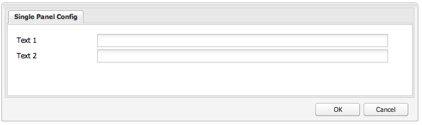

# Widgets gebruiken en uitbreiden (klassieke UI){#using-and-extending-widgets-classic-ui}

>[!NOTE]
>
>Deze pagina beschrijft het gebruik van widgets in de klassieke gebruikersinterface, die in AEM 6.4 is afgekeurd.
>
>Adobe raadt u aan de moderne [interface met aanraakbediening](/help/sites-developing/touch-ui-concepts.md) gebaseerd op [Koraalinterface](/help/sites-developing/touch-ui-concepts.md#coral-ui) en [Graniet-interface](/help/sites-developing/touch-ui-concepts.md#granite-ui-foundation-components).

De (AEM) Web-based interface van Adobe Experience Manager gebruikt AJAX en andere moderne browser technologieën om het uitgeven WYSIWYG en het formatteren van inhoud door auteurs direct op de Web-pagina toe te laten.

AEM gebruikt de [ExtJS](https://www.sencha.com/) Widget-bibliotheek, die de zeer gepolijste elementen van de gebruikersinterface biedt die in alle belangrijkste browsers werken en het maken van gebruikersinterface van desktopniveau mogelijk maken.

Deze widgets zijn opgenomen in AEM en kunnen, naast het gebruik door AEM zelf, worden gebruikt door elke website die met AEM is gemaakt.

Zie voor een volledige verwijzing naar alle beschikbare widgets in AEM [API-documentatie voor widget](https://developer.adobe.com/experience-manager/reference-materials/6-5/widgets-api/index.html) of de [lijst van bestaande xtypes](/help/sites-developing/xtypes.md). Daarnaast zijn er veel voorbeelden beschikbaar van het gebruik van het ExtJS-framework op de [Sencha](https://examples.sencha.com/extjs/7.6.0/) , de eigenaar van het raamwerk.

Deze pagina biedt inzicht in het gebruik en uitbreiden van widgets. Hierin wordt eerst beschreven hoe u [clientcode op een pagina opnemen](#including-the-client-sided-code-in-a-page). Vervolgens worden enkele voorbeeldcomponenten beschreven die zijn gemaakt om een aantal basistoepassingen en -extensies te illustreren. Deze componenten zijn beschikbaar in de **ExtJS-widgets gebruiken** pakket op **Pakket delen**.

Het pakket bevat voorbeelden van:

* [Standaarddialoogvensters](#basic-dialogs) gemaakt met kant-en-klare widgets.
* [Dynamische dialoogvensters](#dynamic-dialogs) gemaakt met kant-en-klare widgets en aangepaste JavaScript-logica.
* Dialoogvensters gebaseerd op [aangepaste widgets](#custom-widgets).
* A [deelvenster met boomstructuur](#tree-overview) een JCR-structuur onder een bepaald pad weergeven.
* A [rasterdeelvenster](#grid-overview) gegevens weergeven in tabelvorm.

>[!NOTE]
>
>De klassieke gebruikersinterface van Adobe Experience Manager is gebaseerd op [ExtJS 3.4.0](https://extjs.cachefly.net/ext-3.4.0/docs/).

## De code aan de clientzijde opnemen in een pagina {#including-the-client-sided-code-in-a-page}

JavaScript-code en stijlbladcode aan clientzijde moeten in een clientbibliotheek worden geplaatst.

Een clientbibliotheek maken:

1. Hieronder een knooppunt maken `/apps/<project>` met de volgende eigenschappen:

   * name=&quot;clientlib&quot;
   * jcr:mixinTypes=&quot;[mix:vergrendelbaar]&quot;
   * jcr:primaryType=&quot;cq:ClientLibraryFolder&quot;
   * sling:resourceType=&quot;widgets/clientlib&quot;
   * categorieën=&quot;[&lt;category-name>]&quot;
   * afhankelijkheden=&quot;[cq.widgets]&quot;

   `Note: <category-name> is the name of the custom library (for example, "cq.extjstraining") and is used to include the library on the page.`

1. Onder `clientlib` de `css` en `js` mappen (nt:folder).

1. Onder `clientlib` de `css.txt` en `js.txt` bestanden (nt:bestanden). Deze .txt-bestanden bevatten de bestanden die in de bibliotheek zijn opgenomen.

1. Bewerken `js.txt`: het moet beginnen met &#39; `#base=js`&quot;, gevolgd door de lijst met bestanden die worden samengevoegd door de CQ-clientbibliotheekservice, bijvoorbeeld:

   ```
   #base=js
    components.js
    exercises.js
    CustomWidget.js
    CustomBrowseField.js
    InsertTextPlugin.js
   ```

1. Bewerken `css.txt`: het moet beginnen met &#39; `#base=css`&quot;, gevolgd door de lijst met bestanden die worden samengevoegd door de CQ-clientbibliotheekservice, bijvoorbeeld:

   ```
   #base=css
    components.css
   ```

1. Onder de `js` , plaatst u de JavaScript-bestanden die bij de bibliotheek horen.

1. Onder de `css` map plaatsen `.css` bestanden en de bronnen die door de CSS-bestanden worden gebruikt (bijvoorbeeld `my_icon.png`).

>[!NOTE]
>
>De afhandeling van de hierboven beschreven stijlpagina&#39;s is optioneel.

De clientbibliotheek opnemen in de jsp voor de paginacomponent:

* om zowel JavaScript-code als stijlpagina&#39;s op te nemen:
  `<ui:includeClientLib categories="<category-name1>, <category-name2>, ..."/>`
waar `<category-nameX>` is de naam van de bibliotheek aan de clientzijde.

* alleen JavaScript-code opnemen:
  `<ui:includeClientLib js="<category-name>"/>`

Zie de beschrijving van de [&lt;ui:includeClientLib>](/help/sites-developing/taglib.md#lt-ui-includeclientlib) tag&lt;/ui:includeClientLib> voor meer informatie.

Soms is een clientbibliotheek alleen beschikbaar in de auteursmodus en moet deze worden uitgesloten in de publicatiemodus. Dit kan als volgt worden bereikt:

```xml
    if (WCMMode.fromRequest(request) != WCMMode.DISABLED) {
        %><ui:includeClientLib categories="cq.collab.blog"/><%
    }
```

### Aan de slag met de voorbeelden {#getting-started-with-the-samples}

Installeer het pakket om de zelfstudies op deze pagina te volgen **ExtJS-widgets gebruiken** in een lokale AEM en een voorbeeldpagina maken waarin de componenten zijn opgenomen. Ga als volgt te werk om dit te doen:

1. Download het pakket met de naam **ExtJS-widgets gebruiken (v01)** van Package Share en installeer het pakket. Het leidt tot het project `extjstraining` onder `/apps` in de repository.
1. Neem de clientbibliotheek met de scripts (js) en de stijlpagina (css) op in de koptag van de pagina Geometrixx. U gaat de voorbeeldcomponenten opnemen in een nieuwe pagina van het dialoogvenster **Geometrixx** vertakking: in **CRXDE Lite** het bestand openen `/apps/geometrixx/components/page/headlibs.jsp` en voeg de `cq.extjstraining` de bestaande `<ui:includeClientLib>` label als volgt:
   `%><ui:includeClientLib categories="apps.geometrixx-main, cq.extjstraining"/><%`
1. Een pagina maken in het dialoogvenster **Geometrixx** vertakking onder `/content/geometrixx/en/products` en noem het **ExtJS-widgets gebruiken**.
1. Ga in ontwerpwijze en voeg alle componenten van de geroepen groep toe **ExtJS-widgets gebruiken** aan het ontwerp van Geometrixx
1. Terug in bewerkingsmodus: de componenten van de groep **ExtJS-widgets gebruiken** zijn beschikbaar in de Sidekick.

>[!NOTE]
>
>De voorbeelden op deze pagina zijn gebaseerd op de inhoud van het Geometrixx-voorbeeld, die niet meer wordt verzonden met AEM, en die is vervangen door We.Retail. Zie de [We.Retail Reference Implementation](/help/sites-developing/we-retail.md#we-retail-geometrixx) voor het downloaden en installeren van Geometrixx.

### Standaarddialoogvensters {#basic-dialogs}

Dialoogvensters worden doorgaans gebruikt om inhoud te bewerken, maar kunnen ook informatie weergeven. Een gemakkelijke manier om een volledig dialoogvenster weer te geven, is om toegang te krijgen tot de representatie in json-indeling. U doet dit door de browser op te vragen:

`https://localhost:4502/<path-to-dialog>.-1.json`

De eerste component van de **ExtJS-widgets gebruiken** groep in de Sidekick wordt aangeroepen **1. Grondbeginselen van dialoogvensters** en bevat vier basisdialoogvensters die zijn samengesteld met kant-en-klare widgets en zonder aangepaste JavaScript-logica. De dialoogvensters worden hieronder opgeslagen `/apps/extjstraining/components/dialogbasics`. De basisdialoogvensters zijn:

* het volledige dialoogvenster ( `full` knooppunt): er wordt een venster weergegeven met drie tabbladen, elk met twee tekstvelden.
* Het dialoogvenster Eén deelvenster ( `singlepanel` knooppunt): er wordt een venster weergegeven met één tab met twee tekstvelden.
* Het dialoogvenster Meerdere deelvensters ( `multipanel` knooppunt): de weergave is gelijk aan het dialoogvenster Volledig, maar het is anders samengesteld.
* het dialoogvenster Ontwerpen( `design` node): er wordt een venster met twee tabbladen weergegeven. De eerste tab heeft een tekstveld, een vervolgkeuzemenu en een inklapbaar tekstgebied. Het tweede tabblad bevat een veldset met vier tekstvelden en een set opvouwbare velden met twee tekstvelden.

Inclusief de **1. Grondbeginselen van dialoogvensters** component in de voorbeeldpagina:

1. Voeg de **1. Grondbeginselen van dialoogvensters** naar de voorbeeldpagina van de **ExtJS-widgets gebruiken** in de **Sidekick**.
1. De component geeft een titel, tekst en een **EIGENSCHAPPEN** koppeling. Als u de koppeling selecteert, worden de eigenschappen van de alinea weergegeven die in de opslagplaats zijn opgeslagen. Selecteer nogmaals de koppeling om de eigenschappen te verbergen.

De component wordt als volgt weergegeven:


#### Voorbeeld 1: Volledig dialoogvenster {#example-full-dialog}

De **Volledig** wordt een venster weergegeven met drie tabbladen, die elk twee tekstvelden hebben. Dit is het standaarddialoogvenster van het dialoogvenster **Grondbeginselen van dialoogvensters** component. De kenmerken zijn:

* Wordt gedefinieerd door een knooppunt: knooppunttype = `cq:Dialog`, xtype = ` [dialog](/help/sites-developing/xtypes.md#dialog)`.
* Geeft drie tabbladen weer (knooppunttype = `cq:Panel`).
* Elke tab heeft twee tekstvelden (knooppunttype = `cq:Widget`, xtype = ` [textfield](/help/sites-developing/xtypes.md#textfield)`).
* Wordt gedefinieerd door het knooppunt:
  `/apps/extjstraining/components/dialogbasics/full`
* Wordt in JSON-indeling weergegeven door het volgende aan te vragen:
  `https://localhost:4502/apps/extjstraining/components/dialogbasics/full.-1.json`

Het dialoogvenster wordt als volgt weergegeven:


#### Voorbeeld 2: Dialoogvenster Eén venster {#example-single-panel-dialog}

De **Eén deelvenster** wordt een venster weergegeven met één tabblad dat twee tekstvelden heeft. De kenmerken zijn:

* Hiermee wordt één tab weergegeven (knooppunttype = `cq:Dialog`, xtype = ` [panel](/help/sites-developing/xtypes.md#panel)`)
* De tab heeft twee tekstvelden (knooppunttype = `cq:Widget`, xtype = ` [textfield](/help/sites-developing/xtypes.md#textfield)`)
* Wordt gedefinieerd door het knooppunt:
  `/apps/extjstraining/components/dialogbasics/singlepanel`
* Wordt in json-indeling weergegeven door het volgende aan te vragen:
  `https://localhost:4502/apps/extjstraining/components/dialogbasics/singlepanel.-1.json`
* Eén voordeel ten opzichte van **Volledig dialoogvenster** is dat er minder configuratie nodig is.
* Aanbevolen gebruik: voor eenvoudige dialoogvensters die informatie weergeven of slechts een paar velden bevatten.

Het dialoogvenster Eén deelvenster gebruiken:

1. Het dialoogvenster van het dialoogvenster **Grondbeginselen van dialoogvensters** met de **Eén deelvenster** dialoogvenster:
   1. In **CRXDE Lite**, verwijdert u het knooppunt: `/apps/extjstraining/components/dialogbasics/dialog`
   1. Klikken **Alles opslaan** om de wijzigingen op te slaan
   1. Kopieer het knooppunt: `/apps/extjstraining/components/dialogbasics/singlepanel`
   1. Plak het gekopieerde knooppunt hieronder: `/apps/extjstraining/components/dialogbasics`
   1. Selecteer het knooppunt: `/apps/extjstraining/components/dialogbasics/Copy of singlepanel`en hernoemen `dialog`.
1. Bewerk de component: het dialoogvenster wordt als volgt weergegeven:



#### Voorbeeld 3: Dialoogvenster Meerdere deelvensters {#example-multi-panel-dialog}

De **Multipanel** wordt dezelfde weergave weergegeven als het dialoogvenster **Volledig** , maar anders samengesteld. De kenmerken zijn:

* Wordt gedefinieerd door een knooppunt (knooppunttype = `cq:Dialog`, xtype = ` [tabpanel](/help/sites-developing/xtypes.md#tabpanel)`).
* Geeft drie tabbladen weer (type knooppunt = `cq:Panel`).
* Elk tabblad heeft twee tekstvelden (type knooppunt = `cq:Widget`, xtype = ` [textfield](/help/sites-developing/xtypes.md#textfield)`).
* Wordt gedefinieerd door het knooppunt:
  `/apps/extjstraining/components/dialogbasics/multipanel`
* Wordt in json-indeling weergegeven door het volgende aan te vragen:
  `https://localhost:4502/apps/extjstraining/components/dialogbasics/multipanel.-1.json`
* Eén voordeel ten opzichte van **Volledig dialoogvenster** is dat het een vereenvoudigde structuur heeft.
* Aanbevolen gebruik: voor dialoogvensters met meerdere tabbladen.

Het dialoogvenster Meerdere deelvensters gebruiken:

1. Het dialoogvenster van het dialoogvenster **Grondbeginselen van dialoogvensters** met de **Multipanel** dialoogvenster: voer de beschreven stappen uit voor het dialoogvenster [Voorbeeld 2: Dialoogvenster Eén venster](#example-single-panel-dialog)
1. Bewerk de component: het dialoogvenster wordt als volgt weergegeven:


#### Voorbeeld 4: Rich Dialog {#example-rich-dialog}

De **Rich** wordt een venster met twee tabbladen weergegeven. De eerste tab heeft een tekstveld, een vervolgkeuzemenu en een inklapbaar tekstgebied. Het tweede tabblad bevat een veldset met vier tekstvelden en een set opvouwbare velden met twee tekstvelden. De kenmerken zijn:

* Wordt gedefinieerd door een knooppunt (knooppunttype = `cq:Dialog`, xtype = ` [dialog](/help/sites-developing/xtypes.md#dialog)`).
* Geeft twee tabbladen weer (knooppunttype = `cq:Panel`).
* Het eerste tabblad bevat een ` [dialogfieldset](/help/sites-developing/xtypes.md#dialogfieldset)` widget met een ` [textfield](/help/sites-developing/xtypes.md#textfield)` en ` [selection](/help/sites-developing/xtypes.md#selection)` widget met drie opties en een inklapbaar object ` [dialogfieldset](/help/sites-developing/xtypes.md#dialogfieldset)` met een ` [textarea](/help/sites-developing/xtypes.md#textarea)` widget.
* Het tweede tabblad bevat een ` [dialogfieldset](/help/sites-developing/xtypes.md#dialogfieldset)` widget met vier ` [textfield](/help/sites-developing/xtypes.md#textfield)` widgets en een inklapbaar `dialogfieldset` met twee ` [textfield](/help/sites-developing/xtypes.md#textfield)` widgets.
* Wordt gedefinieerd door het knooppunt:
  `/apps/extjstraining/components/dialogbasics/rich`
* Wordt in json-indeling weergegeven door het volgende aan te vragen:
  `https://localhost:4502/apps/extjstraining/components/dialogbasics/rich.-1.json`

Als u de opdracht **Rich** dialoogvenster:

1. Het dialoogvenster van het dialoogvenster **Grondbeginselen van dialoogvensters** met de **Rich** dialoogvenster: voer de beschreven stappen uit voor het dialoogvenster [Voorbeeld 2: Dialoogvenster Eén venster](#example-single-panel-dialog)
1. Bewerk de component: het dialoogvenster wordt als volgt weergegeven:

 

### Dynamische dialoogvensters {#dynamic-dialogs}

De tweede component van de **ExtJS-widgets gebruiken** groep in de Sidekick wordt aangeroepen **2. Dynamische dialoogvensters** en bevat drie dynamische dialoogvensters die zijn samengesteld met widgets die niet in de verpakking staan, en **met aangepaste JavaScript-logica**. De dialoogvensters worden hieronder opgeslagen `/apps/extjstraining/components/dynamicdialogs`. De dynamische dialoogvensters zijn:

* het dialoogvenster Tabs wisselen ( `switchtabs` node): er wordt een venster met twee tabbladen weergegeven. Het eerste tabblad bevat een keuzerondje met drie opties: wanneer een optie is geselecteerd, wordt een tabblad weergegeven dat betrekking heeft op de optie. Het tweede tabblad bevat twee tekstvelden.
* het Arbitrage dialoogvenster ( `arbitrary` node): er wordt een venster weergegeven met één tab. Het tabblad bevat een veld voor het neerzetten of uploaden van een element en een veld dat informatie weergeeft over de pagina die het element bevat en over het element als ernaar wordt verwezen.
* het dialoogvenster Velden in-/uitschakelen ( `togglefield` node): er wordt een venster weergegeven met één tab. De tab heeft een selectievakje: als deze is ingeschakeld, wordt een veldset met twee tekstvelden weergegeven.

Als u de opdracht **2. Dynamische dialoogvensters** component op de voorbeeldpagina:

1. Voeg de **2. Dynamische dialoogvensters** naar de voorbeeldpagina van de **ExtJS-widgets gebruiken** in de **Sidekick**.
1. De component geeft een titel, tekst en een **EIGENSCHAPPEN** koppeling. Als u de koppeling selecteert, worden de eigenschappen van de alinea weergegeven die in de opslagplaats zijn opgeslagen. Selecteer nogmaals de koppeling om de eigenschappen te verbergen.

De component wordt als volgt weergegeven:


#### Voorbeeld 1: dialoogvenster Tabs wisselen {#example-switch-tabs-dialog}

De **Tabs wisselen** wordt een venster met twee tabbladen weergegeven. Het eerste tabblad bevat een keuzerondje met drie opties: wanneer een optie is geselecteerd, wordt een tabblad weergegeven dat betrekking heeft op de optie. Het tweede tabblad bevat twee tekstvelden.

De belangrijkste kenmerken zijn:

* Wordt gedefinieerd door een knooppunt (knooppunttype = `cq:Dialog`, xtype = ` [dialog](/help/sites-developing/xtypes.md#dialog)`).
* Geeft twee tabbladen weer (knooppunttype = `cq:Panel`): één selectietabblad, het tweede tabblad is afhankelijk van de selectie op het eerste tabblad (drie opties).
* Bevat drie optionele tabbladen (knooppunttype = `cq:Panel`), heeft elk twee tekstvelden (knooppunttype = `cq:Widget`, xtype = ` [textfield](/help/sites-developing/xtypes.md#textfield)`). Er wordt slechts één optioneel tabblad tegelijk weergegeven.
* Wordt gedefinieerd door de `switchtabs` knooppunt bij:
  `/apps/extjstraining/components/dynamicdialogs/switchtabs`
* Wordt in json-indeling weergegeven door het volgende aan te vragen:
  `https://localhost:4502/apps/extjstraining/components/dynamicdialogs/switchtabs.-1.json`

De logica wordt als volgt geïmplementeerd via gebeurtenislisteners en JavaScript-code:

* Het knooppunt Dialoogvenster heeft een &quot; `beforeshow`&quot; listener die alle optionele tabbladen verbergt voordat het dialoogvenster wordt weergegeven:
  `beforeshow="function(dialog){Ejst.x2.manageTabs(dialog.items.get(0));}"`
  `dialog.items.get(0)` krijgt de `tabpanel` die het selectievenster en de drie optionele deelvensters bevat.
* De `Ejst.x2` object wordt gedefinieerd in het dialoogvenster `exercises.js` bestand op:
  `/apps/extjstraining/clientlib/js/exercises.js`
* In de `Ejst.x2.manageTabs()` als de waarde van `index` is -1, zijn alle optionele tabbladen verborgen (ik ga van 1 naar 3).
* Het selectietabblad heeft twee listeners: een listener die het geselecteerde tabblad weergeeft wanneer het dialoogvenster wordt geladen (&quot; `loadcontent`&quot; (gebeurtenis) en een item dat het geselecteerde tabblad weergeeft wanneer de selectie wordt gewijzigd (&quot; `selectionchanged`&quot; (gebeurtenis):
  `loadcontent="function(field,rec,path){Ejst.x2.showTab(field);}"`
  `selectionchanged="function(field,value){Ejst.x2.showTab(field);}"`
* Voor de `Ejst.x2.showTab()` methode,
  `field.findParentByType('tabpanel')` krijgt de `tabpanel` dat alle tabbladen bevat ( `field` staat voor de selectiewidget)
  `field.getValue()` Hiermee wordt de waarde van de selectie opgehaald, bijvoorbeeld tab2
  `Ejst.x2.manageTabs()` geeft het geselecteerde tabblad weer.
* Elk optioneel tabblad bevat een listener die het tabblad &quot; `render`&quot; gebeurtenis:
  `render="function(tab){Ejst.x2.hideTab(tab);}"`
* Voor de `Ejst.x2.hideTab()` methode,
  `tabPanel` is dat `tabpanel` alle tabbladen bevat
  `index` is de index van het optionele tabblad
  `tabPanel.hideTabStripItem(index)` Verbergt het tabblad

Het wordt als volgt weergegeven:


#### Voorbeeld 2: Willekeurig dialoogvenster {#example-arbitrary-dialog}

In een dialoogvenster wordt vaak de inhoud van de onderliggende component weergegeven. Het hier beschreven dialoogvenster, genaamd **Instelbaar** wordt de inhoud van een andere component opgehaald.

De **Instelbaar** wordt een venster met één tab weergegeven. Het tabblad heeft twee velden: een veld voor het neerzetten of uploaden van een element en een veld dat informatie bevat over de pagina die het element bevat en over het element als er naar wordt verwezen.

De belangrijkste kenmerken zijn:

* Wordt gedefinieerd door een knooppunt (knooppunttype = `cq:Dialog`, xtype = ` [dialog](/help/sites-developing/xtypes.md#dialog)`).
* Hiermee geeft u een `tabpanel` widget (knooppunttype = `cq:Widget`, xtype = ` [tabpanel](/help/sites-developing/xtypes.md#tabpanel)`) met één deelvenster (knooppunttype = `cq:Panel`)
* Het deelvenster heeft een widget voor een slim bestand (knooppunttype = `cq:Widget`, xtype = ` [smartfile](/help/sites-developing/xtypes.md#smartfile)`) en een ownerdraw-widget (knooppunttype = `cq:Widget`, xtype = ` [ownerdraw](/help/sites-developing/xtypes.md#ownerdraw)`)
* Wordt gedefinieerd door de `arbitrary` knooppunt bij:
  `/apps/extjstraining/components/dynamicdialogs/arbitrary`
* Wordt in json-indeling weergegeven door het volgende aan te vragen:
  `https://localhost:4502/apps/extjstraining/components/dynamicdialogs/arbitrary.-1.json`

De logica wordt als volgt geïmplementeerd via gebeurtenislisteners en JavaScript-code:

* De `ownerdraw` widget heeft een &quot; `loadcontent`&quot; listener die informatie weergeeft over de pagina die de component bevat. Dit is het element waarnaar wordt verwezen door de widget voor het smartbestand wanneer de inhoud wordt geladen:
  `loadcontent="function(field,rec,path){Ejst.x2.showInfo(field,rec,path);}"`
  `field` wordt ingesteld met de `ownerdraw` object
  `path` wordt ingesteld met het inhoudspad van de component (bijvoorbeeld `/content/geometrixx/en/products/triangle/ui-tutorial/jcr:content/par/dynamicdialogs`)
* De `Ejst.x2` object wordt gedefinieerd in het dialoogvenster `exercises.js` bestand op:
  `/apps/extjstraining/clientlib/js/exercises.js`
* Voor de `Ejst.x2.showInfo()` methode,
  `pagePath` het pad is van de pagina die de component bevat;
  `pageInfo` geeft de pagina-eigenschappen weer in json-indeling;
  `reference` het pad is van het element waarnaar wordt verwezen;
  `metadata` de metagegevens van het actief in json-indeling weergeeft;
  `ownerdraw.getEl().update(html);` Hiermee wordt de gemaakte HTML weergegeven in het dialoogvenster

Als u de opdracht **Instelbaar** dialoogvenster:

1. Vervang het dialoogvenster van de **component dynamisch dialoogvenster** door het **dialoogvenster Willekeurig** :
Voer de stappen uit die worden beschreven in het [dialoogvenster Voorbeeld 2: Eén deelvenster](#example-single-panel-dialog)
1. Bewerk de component: het dialoogvenster wordt als volgt weergegeven:


#### Voorbeeld 3: Dialoogvenster Velden in-/uitschakelen {#example-toggle-fields-dialog}

De **Velden in-/uitschakelen** wordt een venster met één tab weergegeven. Het tabblad heeft een selectievakje: als het is ingeschakeld, wordt een veldset met twee tekstvelden weergegeven.

De belangrijkste kenmerken zijn:

* Wordt gedefinieerd door een knooppunt (type knooppunt = `cq:Dialog`, xtype = ` [dialog](/help/sites-developing/xtypes.md#dialog)`).
* Hiermee geeft u één `tabpanel` widget (type knooppunt = `cq:Widget`, xtype = ` [tabpanel](/help/sites-developing/xtypes.md#textpanel)`) weer met één deelvenster (type knooppunt = `cq:Panel`).
* Het deelvenster heeft een widget voor selectie/selectievakje (type knooppunt = `cq:Widget`, xtype = ` [selection](/help/sites-developing/xtypes.md#selection)`, type = ` [checkbox](/help/sites-developing/xtypes.md#checkbox)`) en een inklapbare widget voor dialoogvenstervelden (type knooppunt = `cq:Widget`, xtype = ` [dialogfieldset](/help/sites-developing/xtypes.md#dialogfieldset)`) die standaard is verborgen, met twee tekstveldwidgets (type knooppunt = `cq:Widget`, xtype = ` [textfield](/help/sites-developing/xtypes.md#textfield)`).
* Wordt gedefinieerd door de `togglefields` knooppunt bij:
  `/apps/extjstraining/components/dynamicdialogs/togglefields`
* Wordt in json-indeling weergegeven door het volgende aan te vragen:
  `https://localhost:4502/apps/extjstraining/components/dynamicdialogs/togglefields.-1.json`

De logica wordt als volgt geïmplementeerd via gebeurtenislisteners en JavaScript-code:

* het selectietabblad heeft twee listeners: een listener die de dialogfield-set weergeeft wanneer de inhoud wordt geladen (&quot; `loadcontent`&quot; (gebeurtenis) en een gebeurtenis die de dialogfieldset weergeeft wanneer de selectie wordt gewijzigd (&quot; `selectionchanged`&quot; (gebeurtenis):
  `loadcontent="function(field,rec,path){Ejst.x2.toggleFieldSet(field);}"`
  `selectionchanged="function(field,value){Ejst.x2.toggleFieldSet(field);}"`
* De `Ejst.x2` object wordt gedefinieerd in het dialoogvenster `exercises.js` bestand op:
  `/apps/extjstraining/clientlib/js/exercises.js`
* Voor de `Ejst.x2.toggleFieldSet()` methode,
  `box` het selectieobject is;
  `panel` het deelvenster met de selectie- en dialogfieldsetwidgets;
  `fieldSet` het dialogfieldset-object is;
  `show` is de waarde van de selectie (waar of onwaar); gebaseerd op &#39; `show`&#39; De dialogfieldset wordt al dan niet weergegeven

Als u de opdracht **Velden in-/uitschakelen** voert u de volgende handelingen uit:

1. Het dialoogvenster van het dialoogvenster **Dynamisch dialoogvenster** met de **Velden in-/uitschakelen** dialoogvenster: voer de beschreven stappen uit voor het dialoogvenster [Voorbeeld 2: Dialoogvenster Eén venster](#example-single-panel-dialog)
1. Bewerk de component: het dialoogvenster wordt als volgt weergegeven:


### Aangepaste widgets {#custom-widgets}

De widgets uit de doos die bij AEM worden geleverd, moeten de meeste gevallen van gebruik bestrijken. Het kan echter soms nodig zijn om een aangepaste widget te maken die voldoet aan een projectspecifieke vereiste. Aangepaste widgets kunnen worden gemaakt door bestaande widgets uit te breiden. Om u te helpen met dergelijke aanpassingen aan de slag te gaan, **`Using ExtJS Widgets`** Het pakket bevat drie dialoogvensters die drie verschillende aangepaste widgets gebruiken:

* Het dialoogvenster Meerdere velden ( `multifield` node) geeft een venster weer met één tab. De tab heeft een aangepaste widget met meerdere velden die twee velden heeft: een vervolgkeuzemenu met twee opties en een tekstveld. Omdat het gebaseerd is op het uit-van-de-doos `multifield` widget (die alleen een tekstveld heeft), heeft deze alle functies van de `multifield` widget.
* Het dialoogvenster Bladeren in structuur ( `treebrowse` knooppunt) geeft een venster weer met één tabblad dat een widget voor padbrowsers bevat: wanneer u op de pijl klikt, wordt een venster geopend waarin u door een hiërarchie kunt bladeren en een item kunt selecteren. Het pad van het item wordt vervolgens toegevoegd aan het padveld en wordt voortgezet wanneer het dialoogvenster wordt gesloten.
* een op plug-in gebaseerd dialoogvenster van de teksteditor ( `rteplugin` node) die een aangepaste knop toevoegt aan de Rich Text Editor om aangepaste tekst in te voegen in de hoofdtekst. Het bestaat uit een `richtext` widget (RTE) en van een douanefunctie die door het het insteekmechanisme van RTE wordt toegevoegd.

De aangepaste widgets en de insteekmodule zijn opgenomen in de component **3. Aangepaste widgets** van het **ExtJS Widgets-pakket** gebruiken. Deze component opnemen in de voorbeeldpagina:

1. Voeg de **3 toe. Aangepaste widgetscomponent** naar de voorbeeldpagina vanaf het **tabblad ExtJS-widgets** gebruiken in de **sidekick**.
1. De component geeft een titel, wat tekst en, wanneer u op de **koppeling EIGENSCHAPPEN** klikt, de eigenschappen van de alinea weer die in de opslagplaats zijn opgeslagen. Als u nogmaals klikt, worden de eigenschappen verborgen.
De component wordt als volgt weergegeven:


#### Voorbeeld 1: Aangepaste widget voor meerdere velden {#example-custom-multifield-widget}

De **Aangepast multiveld** in een op widget gebaseerd dialoogvenster wordt een venster met één tab weergegeven. De tab heeft een aangepaste widget met meerdere velden die, in tegenstelling tot de standaard widget met één veld, twee velden heeft: een vervolgkeuzemenu met twee opties en een tekstveld.

De **Aangepast multiveld** op widget gebaseerd dialoogvenster:

* Wordt gedefinieerd door een knooppunt (knooppunttype = `cq:Dialog`, xtype = ` [dialog](/help/sites-developing/xtypes.md#dialog)`).
* Hiermee geeft u een `tabpanel` widget (knooppunttype = `cq:Widget`, xtype = ` [tabpanel](/help/sites-developing/xtypes.md#tabpanel)`) met een deelvenster (knooppunttype = `cq:Widget`, xtype = ` [panel](/help/sites-developing/xtypes.md#panel)`).
* Het deelvenster bevat een `multifield` widget (knooppunttype = `cq:Widget`, xtype = ` [multifield](/help/sites-developing/xtypes.md#multifield)`).
* De `multifield` widget heeft een fieldconfig (knooppunttype = `nt:unstructured`, xtype = `ejstcustom`, optionsProvider = `Ejst.x3.provideOptions`) die is gebaseerd op het aangepaste xtype &#39; `ejstcustom`&quot;:
   * &#39; `fieldconfig`&#39; is een configuratieoptie van de ` [CQ.form.MultiField](https://developer.adobe.com/experience-manager/reference-materials/6-5/widgets-api/index.html?class=CQ.form.MultiField)` object.
   * &#39; `optionsProvider`&#39; is een configuratie van de `ejstcustom` widget. Deze is ingesteld met de `Ejst.x3.provideOptions` methode die wordt gedefinieerd in `exercises.js` om:
     `/apps/extjstraining/clientlib/js/exercises.js`
en retourneert twee opties.
* Wordt gedefinieerd door de `multifield` knooppunt bij:
  `/apps/extjstraining/components/customwidgets/multifield`
* Wordt in json-indeling weergegeven door het volgende aan te vragen:
  `https://localhost:4502/apps/extjstraining/components/customwidgets/multifield.-1.json`

De aangepaste `multifield` widget (xtype = `ejstcustom`):

* Is een JavaScript-object dat wordt aangeroepen `Ejst.CustomWidget`
* Is gedefinieerd in de `CustomWidget.js` JavaScript-bestand op:
  `/apps/extjstraining/clientlib/js/CustomWidget.js`
* Hiermee breidt u de ` [CQ.form.CompositeField](https://developer.adobe.com/experience-manager/reference-materials/6-5/widgets-api/index.html?class=CQ.form.CompositeField)` widget.
* Bevat drie velden: `hiddenField` (TextField), `allowField` (ComboBox), en `otherField` (TextField)
* Overschrijvingen `CQ.Ext.Component#initComponent` om de drie velden toe te voegen:
   * `allowField` is een [CQ.form.Selection](https://developer.adobe.com/experience-manager/reference-materials/6-5/widgets-api/index.html?class=CQ.form.Selection) object van het type &#39;select&#39;. optionsProvider is een configuratie van het Selection-object die wordt geïnstantieerd met de optionsProvider-configuratie van de CustomWidget die is gedefinieerd in het dialoogvenster
   * `otherField` is een [CQ.Ext.form.TextField](https://developer.adobe.com/experience-manager/reference-materials/6-5/widgets-api/index.html?class=CQ.Ext.form.TextField) object
* Hiermee overschrijft u de methoden `setValue`, `getValue`en `getRawValue` [CQ.form.CompositeField](https://developer.adobe.com/experience-manager/reference-materials/6-5/widgets-api/index.html?class=CQ.form.CompositeField) om de waarde van CustomWidget in te stellen en op te halen met de volgende indeling:
  `<allowField value>/<otherField value>, for example: 'Bla1/hello'`.
* Registreert zichzelf als &#39; `ejstcustom`&#39; xtype:
  `CQ.Ext.reg('ejstcustom', Ejst.CustomWidget);`

De **Aangepast multiveld** Op widget gebaseerde dialoogvensters worden als volgt weergegeven:


#### Voorbeeld 2: Aangepaste `Treebrowse` widget {#example-custom-treebrowse-widget}

Het op een aangepaste **`Treebrowse`** widget gebaseerde dialoogvenster toont een venster met één tabblad dat een aangepaste bladerwidget voor paden bevat. Wanneer u de pijl selecteert, wordt er een venster geopend waarin u door een hiërarchie kunt bladeren en een item kunt selecteren. Het pad van het item wordt vervolgens toegevoegd aan het padveld en wordt behouden wanneer het dialoogvenster wordt gesloten.

Het aangepaste `treebrowse` dialoogvenster:

* Wordt gedefinieerd door een knooppunt (type knooppunt = `cq:Dialog`, xtype = ` [dialog](/help/sites-developing/xtypes.md#dialog)`).
* Hiermee geeft u een `tabpanel` widget (knooppunttype = `cq:Widget`, xtype = ` [tabpanel](/help/sites-developing/xtypes.md#tabpanel)`) met een deelvenster (knooppunttype = `cq:Widget`, xtype = ` [panel](/help/sites-developing/xtypes.md#panel)`).
* Het deelvenster heeft een aangepaste widget (knooppunttype = `cq:Widget`, xtype = `ejstbrowse`)
* Wordt gedefinieerd door de `treebrowse` knooppunt bij:
  `/apps/extjstraining/components/customwidgets/treebrowse`
* Wordt in json-indeling weergegeven door het volgende aan te vragen:
  `https://localhost:4502/apps/extjstraining/components/customwidgets/treebrowse.-1.json`

De aangepaste widget voor browsers (xtype = `ejstbrowse`):

* Is een JavaScript-object dat wordt aangeroepen `Ejst.CustomWidget`
* Is gedefinieerd in de `CustomBrowseField.js` JavaScript-bestand op:
  `/apps/extjstraining/clientlib/js/CustomBrowseField.js`
* Uitbreidingen ` [CQ.Ext.form.TriggerField](https://developer.adobe.com/experience-manager/reference-materials/6-5/widgets-api/index.html?class=CQ.Ext.form.TriggerField)`.
* Hiermee definieert u een bladervenster met de naam `browseWindow`.
* Overschrijvingen ` [CQ.Ext.form.TriggerField](https://developer.adobe.com/experience-manager/reference-materials/6-5/widgets-api/index.html?class=CQ.Ext.form.TriggerField)#onTriggerClick` om het bladervenster te tonen wanneer de pijl wordt geklikt.
* Definieert een [CQ.Ext.tree.TreePanel](https://developer.adobe.com/experience-manager/reference-materials/6-5/widgets-api/index.html?class=CQ.Ext.tree.TreePanel) object:
   * Het krijgt zijn gegevens door servlet te roepen die bij wordt geregistreerd `/bin/wcm/siteadmin/tree.json`.
   * De basis is &quot; `apps/extjstraining`&quot;.
* Definieert een `window` object ( ` [CQ.Ext.Window](https://developer.adobe.com/experience-manager/reference-materials/6-5/widgets-api/index.html?class=CQ.Ext.Window)`):
   * Gebaseerd op het vooraf gedefinieerde deelvenster.
   * Heeft een **OK** die de waarde van het geselecteerde pad instelt en het deelvenster verbergt.
* Het venster is verankerd onder de **Pad** veld.
* Het geselecteerde pad wordt van het bladerveld naar het venster doorgegeven `show` gebeurtenis.
* Registreert zichzelf als &#39; `ejstbrowse`&#39; xtype:
  `CQ.Ext.reg('ejstbrowse', Ejst.CustomBrowseField);`

Als u de opdracht **Aangepaste boombladeren** op widget gebaseerd dialoogvenster:

1. Het dialoogvenster van het dialoogvenster **Aangepaste widgets** met de **Aangepaste boombladeren** dialoogvenster: voer de beschreven stappen uit voor het dialoogvenster [Voorbeeld 2: Dialoogvenster Eén venster](#example-single-panel-dialog)
1. Bewerk de component: het dialoogvenster wordt als volgt weergegeven:


#### Voorbeeld 3: insteekmodule RTE (Rich Text Editor) {#example-rich-text-editor-rte-plug-in}

Het **insteekmoduledialoogvenster** RTE (Rich Text Editor) is een dialoogvenster in de Rich Text Editor met een aangepaste knop voor het invoegen van aangepaste tekst binnen vierkante haken. De aangepaste tekst kan door bepaalde serverlogica worden geparseerd (niet geïmplementeerd in dit voorbeeld), bijvoorbeeld om tekst toe te voegen die op het opgegeven pad is gedefinieerd:

Dialoogvenster **voor de RTE-insteekmodule** :

* Wordt gedefinieerd door het knooppunt rteplugin op:
  `/apps/extjstraining/components/customwidgets/rteplugin`
* Wordt in json-indeling weergegeven door het volgende aan te vragen:
  `https://localhost:4502/apps/extjstraining/components/customwidgets/rteplugin.-1.json`
* De `rtePlugins` node heeft een onderliggende node `inserttext` (knooppunttype = `nt:unstructured`) genoemd naar de plug-in. Het heeft een eigenschap genaamd `features` die bepaalt welke van de plugin eigenschappen beschikbaar aan RTE zijn.

De RTE-plug-in:

* Is een JavaScript-object dat wordt aangeroepen `Ejst.InsertTextPlugin`
* Is gedefinieerd in de `InsertTextPlugin.js` JavaScript-bestand op:
  `/apps/extjstraining/clientlib/js/InsertTextPlugin.js`
* Hiermee breidt u de ` [CQ.form.rte.plugins.Plugin](https://developer.adobe.com/experience-manager/reference-materials/6-5/widgets-api/index.html?class=CQ.form.rte.plugins.Plugin)` object.
* De volgende methoden definiëren de ` [CQ.form.rte.plugins.Plugin](https://developer.adobe.com/experience-manager/reference-materials/6-5/widgets-api/index.html?class=CQ.form.rte.plugins.Plugin)` -object en worden overschreven in de implementerende plug-in:
   * `getFeatures()` retourneert een array met alle functies die de plug-in beschikbaar stelt.
   * `initializeUI()` voegt de nieuwe knoop aan de toolbar van RTE toe.
   * `notifyPluginConfig()` geeft de titel en de tekst weer wanneer de knop wordt aangeroepen.
   * `execute()` wordt aangeroepen wanneer op de knop wordt geklikt en de insteekmodule wordt uitgevoerd: er wordt een venster weergegeven waarin de tekst wordt gedefinieerd die moet worden opgenomen.
* `insertText()` voegt tekst in met behulp van het bijbehorende dialoogobject `Ejst.InsertTextPlugin.Dialog` (zie hierna).
* `executeInsertText()` wordt opgeroepen door `apply()` methode van de dialoog, die wordt teweeggebracht wanneer **OK** wordt geklikt.
* Registreert zichzelf als &#39; `inserttext`&#39;plug-in:
  `CQ.form.rte.plugins.PluginRegistry.register("inserttext", Ejst.InsertTextPlugin);`
* de `Ejst.InsertTextPlugin.Dialog` wordt het dialoogvenster gedefinieerd dat wordt geopend wanneer op de insteekmodule wordt geklikt. Het dialoogvenster bestaat uit een deelvenster, een formulier, een tekstveld en twee knoppen (**OK** en **Annuleren**).

Als u de opdracht **Insteekmodule Rich Text Editor (RTE)** gebaseerd dialoogvenster:

1. Het dialoogvenster van het dialoogvenster **Aangepaste widgets** met de **Insteekmodule Rich Text Editor (RTE)** gebaseerd dialoogvenster: voer de beschreven stappen uit voor het [Voorbeeld 2: Dialoogvenster Eén venster](#example-single-panel-dialog)
1. Bewerk de component.
1. Klik op het laatste pictogram aan de rechterkant (het pictogram met vier pijlen). Een pad invoeren en klikken **OK**: Het pad wordt tussen haakjes weergegeven ([ ]).
1. Klikken **OK** Sluit de Rich Text Editor dus.

Het **dialoogvenster van de insteekmodule** RTE (Rich Text Editor) wordt als volgt weergegeven:


>[!NOTE]
>
>In dit voorbeeld wordt alleen getoond hoe u het clientgedeelte van de logica implementeert: de plaatsaanduidingen (*[text]*) moet vervolgens expliciet op de server worden geparseerd (bijvoorbeeld in de JSP-component).

### Overzicht van boomstructuur {#tree-overview}

De out-of-the-box ` [CQ.Ext.tree.TreePanel](https://developer.adobe.com/experience-manager/reference-materials/6-5/widgets-api/index.html?class=CQ.Ext.tree.TreePanel)` -object biedt een gestructureerde UI-representatie van gegevens met boomstructuur. De component Overzicht van de structuur in het **pakket ExtJS-widgets** gebruiken toont hoe u het `TreePanel` object kunt gebruiken om een JCR-boom onder een bepaald pad weer te geven. Het venster zelf kan worden gekoppeld/losgekoppeld. In dit voorbeeld wordt de vensterlogica ingesloten in de jsp van de component tussen &lt;script> de codes.

Ga als volgt te werk om de **boomstructuuroverzichtscomponent** op de voorbeeldpagina op te nemen:

1. Voeg de **4 toe. Boomstructuuroverzichtscomponent** naar de voorbeeldpagina vanaf het **tabblad ExtJS-widgets** gebruiken in de **sidekick**.
1. In de component wordt het volgende weergegeven:
   * een titel, met tekst
   * a **EIGENSCHAPPEN** koppeling: klik om de eigenschappen van de alinea weer te geven die in de repository zijn opgeslagen. Klik nogmaals om de eigenschappen te verbergen.
   * een zwevend venster met een boomrepresentatie van de opslagplaats die kan worden uitgebreid.

De component wordt als volgt weergegeven:


De component Tree Overview:

* Wordt gedefinieerd bij:
  `/apps/extjstraining/components/treeoverview`

* In het dialoogvenster kunt u de grootte van het venster instellen en het venster koppelen of loskoppelen (zie de details hieronder).

The component jsp:

* Haalt de breedte, hoogte en gedokte eigenschappen op uit de opslagplaats.
* Geeft enige tekst weer over de gegevensindeling van het boomoverzicht.
* Sluit de vensterlogica in component jsp tussen markeringen JavaScript in.
* Wordt gedefinieerd bij:
  `apps/extjstraining/components/treeoverview/content.jsp`

De JavaScript-code die is ingesloten in de JSP-component:

* Definieert een `tree` door te proberen een structuurvenster van de pagina op te halen.
* Als het venster met de boomstructuur niet bestaat, `treePanel` ([CQ.Ext.tree.TreePanel](https://developer.adobe.com/experience-manager/reference-materials/6-5/widgets-api/index.html?class=CQ.Ext.tree.TreePanel)) is gemaakt:
   * `treePanel` bevat de gegevens die worden gebruikt om het venster te maken.
   * De gegevens worden teruggewonnen door servlet te roepen die bij wordt geregistreerd:
     `/bin/wcm/siteadmin/tree.json`
* De `beforeload` listener zorgt ervoor dat het geselecteerde knooppunt wordt geladen.
* De `root` object stelt het pad in `apps/extjstraining` als de hoofdstructuur van de boom.
* `tree` ( ` [CQ.Ext.Window](https://developer.adobe.com/experience-manager/reference-materials/6-5/widgets-api/index.html?class=CQ.Ext.Window)`) wordt ingesteld op basis van de vooraf gedefinieerde `treePanel`en wordt weergegeven met:
  `tree.show();`
* Als het venster bestaat, wordt het weergegeven op basis van de breedte, hoogte en gedokte eigenschappen die zijn opgehaald uit de opslagplaats.

Het dialoogvenster Component:

* Hiermee geeft u één tab met twee velden weer om de grootte (breedte en hoogte) van het venster met het overzicht van de structuur in te stellen en één veld om het venster te koppelen/loskoppelen
* Wordt gedefinieerd door een knooppunt (knooppunttype = `cq:Dialog`, xtype = ` [panel](/help/sites-developing/xtypes.md#panel)`).
* Het deelvenster heeft een widget Deelveld op grootte (knooppunttype = `cq:Widget`, xtype = ` [sizefield](/help/sites-developing/xtypes.md#sizefield)`) en een selectiewidget (knooppunttype = `cq:Widget`, xtype = ` [selection](/help/sites-developing/xtypes.md#selection)`, type = `radio`) met twee opties (true/false)
* Wordt gedefinieerd door het dialoogknooppunt op:
  `/apps/extjstraining/components/treeoverview/dialog`
* Wordt in json-indeling weergegeven door het volgende aan te vragen:
  `https://localhost:4502/apps/extjstraining/components/treeoverview/dialog.-1.json`
* Hieronder wordt weergegeven:


### Rasteroverzicht {#grid-overview}

Een deelvenster Raster vertegenwoordigt gegevens in tabelvorm van rijen en kolommen. Het bestaat uit:

* Opslaan: het model waarin de gegevensrecords (rijen) worden opgeslagen.
* Kolommodel: de kolomsamenstelling.
* Weergave: kapselt de gebruikersinterface in.
* Selectiemodel: het selectiegedrag.

De component Rasteroverzicht die is opgenomen in het dialoogvenster **ExtJS-widgets gebruiken** Het pakket toont hoe u gegevens in tabelvorm kunt weergeven:

* In voorbeeld 1 worden statische gegevens gebruikt.
* In voorbeeld 2 worden gegevens gebruikt die uit de gegevensopslagruimte zijn opgehaald.

De component Rasteroverzicht opnemen in de voorbeeldpagina:

1. Voeg de **5. Rasteroverzicht** naar de voorbeeldpagina van de **ExtJS-widgets gebruiken** in de **Sidekick**.
1. De component wordt weergegeven:
   * een titel met tekst
   * a **EIGENSCHAPPEN** koppeling: klik om de eigenschappen van de alinea weer te geven die in de repository zijn opgeslagen. Klik nogmaals om de eigenschappen te verbergen.
   * een zwevend venster met gegevens in tabelvorm.

De component wordt als volgt weergegeven:


#### Voorbeeld 1: standaardraster {#example-default-grid}

In de out-of-the-box versie van de **component Rasteroverzicht** wordt een venster met statische gegevens weergegeven in een tabelindeling. In dit voorbeeld wordt de logica op twee manieren ingesloten in de jsp van de component:

* de algemene logica wordt gedefinieerd tussen &lt;script> codes
* de specifieke logica is beschikbaar in een afzonderlijk JS-bestand en is gekoppeld in het Jsp. Met deze instelling kunt u schakelen tussen de twee logica (statisch/dynamisch) door het gewenste commentaar toe te voegen &lt;script> -tags.

De component Rasteroverzicht:

* Wordt gedefinieerd op:
  `/apps/extjstraining/components/gridoverview`
* In het dialoogvenster kunt u het formaat van het venster instellen en het venster koppelen of loskoppelen.

De component jsp:

* Hiermee haalt u de breedte, hoogte en gekoppelde eigenschappen op uit de opslagplaats.
* Hiermee geeft u tekst weer als inleiding in de gegevensindeling voor rasteroverzicht.
* Verwijst naar JavaScript-code die het GridPanel-object definieert:
  `<script type="text/javascript" src="/apps/extjstraining/components/gridoverview/defaultgrid.js"></script>`
  `defaultgrid.js` bepaalt sommige statische gegevens als basis voor het voorwerp GridPanel.
* Hiermee wordt JavaScript-code ingesloten tussen JavaScript-tags die het Window-object definiëren dat het GridPanel-object gebruikt.
* Wordt gedefinieerd bij:
  `apps/extjstraining/components/gridoverview/content.jsp`

De JavaScript-code die is ingesloten in de JSP-component:

* Definieert de `grid` -object door te proberen de venstercomponent van de pagina op te halen:
  `var grid = CQ.Ext.getCmp("<%= node.getName() %>-grid");`
* Indien `grid` bestaat niet, a [CQ.Ext.grid.GridPanel](https://developer.adobe.com/experience-manager/reference-materials/6-5/widgets-api/index.html?class=CQ.Ext.grid.GridPanel) object ( `gridPanel`) wordt gedefinieerd door het aanroepen van de `getGridPanel()` methode (zie hieronder). Deze methode is gedefinieerd in `defaultgrid.js`.
* `grid` is een ` [CQ.Ext.Window](https://developer.adobe.com/experience-manager/reference-materials/6-5/widgets-api/index.html?class=CQ.Ext.Window)` object, gebaseerd op het vooraf gedefinieerde GridPanel, en wordt weergegeven: `grid.show();`
* Indien `grid` wordt weergegeven op basis van de breedte, hoogte en gedokte eigenschappen die zijn opgehaald uit de opslagplaats.

Het JavaScript-bestand ( `defaultgrid.js`) waarnaar wordt verwezen in de component jsp definieert de `getGridPanel()` methode die wordt aangeroepen door het script dat is ingesloten in de JSP en die een ` [CQ.Ext.grid.GridPanel](https://developer.adobe.com/experience-manager/reference-materials/6-5/widgets-api/index.html?class=CQ.Ext.grid.GridPanel)` object, op basis van statische gegevens. De logica is als volgt:

* `myData` is een array van statische gegevens die zijn opgemaakt als een tabel van vijf kolommen en vier rijen.
* `store` is een `CQ.Ext.data.Store` object dat verbruikt `myData`.
* `store` wordt geladen in het geheugen:
  `store.load();`
* `gridPanel` is een ` [CQ.Ext.grid.GridPanel](https://developer.adobe.com/experience-manager/reference-materials/6-5/widgets-api/index.html?class=CQ.Ext.grid.GridPanel)` object dat verbruikt `store`:
   * De kolombreedten worden altijd opnieuw proportioneel:
     `forceFit: true`
   * u kunt slechts één rij tegelijk selecteren:
     `singleSelect:true`

#### Voorbeeld 2: referentieraster voor zoeken {#example-reference-search-grid}

Wanneer u het pakket installeert, `content.jsp` van de **Rasteroverzicht** geeft een raster weer dat is gebaseerd op statische gegevens. Het is mogelijk om de component te wijzigen om een raster met de volgende kenmerken weer te geven:

* Bevat drie kolommen.
* Is gebaseerd op gegevens die van de bewaarplaats door een servlet te roepen worden teruggewonnen.
* De cellen van de laatste kolom kunnen worden bewerkt. De waarde blijft bestaan in een `test` eigenschap onder het knooppunt dat wordt gedefinieerd door het pad dat in de eerste kolom wordt weergegeven.

Zoals eerder uitgelegd in de sectie, krijgt het vensterobject zijn ` [CQ.Ext.grid.GridPanel](https://developer.adobe.com/experience-manager/reference-materials/6-5/widgets-api/index.html?class=CQ.Ext.grid.GridPanel)` object aanroepen `getGridPanel()` in de `defaultgrid.js` bestand bij `/apps/extjstraining/components/gridoverview/defaultgrid.js`. De **Grid overzichtscomponent **verstrekt een verschillende implementatie voor `getGridPanel()` methode, gedefinieerd in de `referencesearch.js` bestand bij `/apps/extjstraining/components/gridoverview/referencesearch.js`. Door het .js dossier te schakelen dat in component jsp van verwijzingen wordt voorzien, is het net gebaseerd op gegevens die van de bewaarplaats worden teruggewonnen.

Van .js dossier schakelen dat in component jsp van verwijzingen wordt voorzien:

1. In **CRXDE Lite** in de `content.jsp` bestand van de component, de regel met het `defaultgrid.js` bestand, zodat het er als volgt uitziet:
   `<!-- script type="text/javascript" src="/apps/extjstraining/components/gridoverview/defaultgrid.js"></script-->`
1. Verwijder de opmerking uit de regel met de `referencesearch.js` bestand, zodat het er als volgt uitziet:
   `<script type="text/javascript" src="/apps/extjstraining/components/gridoverview/referencesearch.js"></script>`
1. Sla de wijzigingen op.
1. Vernieuw de voorbeeldpagina.

De component wordt als volgt weergegeven:


De JavaScript-code waarnaar wordt verwezen in de component jsp ( `referencesearch.js`) definieert de `getGridPanel()` methode geroepen van component jsp en keert een ` [CQ.Ext.grid.GridPanel](https://developer.adobe.com/experience-manager/reference-materials/6-5/widgets-api/index.html?class=CQ.Ext.grid.GridPanel)` object, op basis van gegevens die dynamisch uit de gegevensopslagruimte worden opgehaald. De logica in `referencesearch.js` bepaalt sommige dynamische gegevens als basis voor GridPanel:

* `reader` is een ` [CQ.Ext.data.JsonReader](https://developer.adobe.com/experience-manager/reference-materials/6-5/widgets-api/index.html?class=CQ.Ext.data.JsonReader)`-object dat de servlet-reactie in json-indeling voor drie kolommen leest.
* `cm` is een ` [CQ.Ext.grid.ColumnModel](https://developer.adobe.com/experience-manager/reference-materials/6-5/widgets-api/index.html?class=CQ.Ext.grid.ColumnModel)` object voor drie kolommen.
De kolomcellen van de &quot;Test&quot;kunnen worden uitgegeven aangezien zij met een redacteur worden bepaald:
  `editor: new [CQ.Ext.form.TextField](https://developer.adobe.com/experience-manager/reference-materials/6-5/widgets-api/index.html?class=CQ.Ext.form.TextField)({})`
* de kolommen kunnen worden gesorteerd:
  `cm.defaultSortable = true;`
* `store` is een ` [CQ.Ext.data.GroupingStore](https://developer.adobe.com/experience-manager/reference-materials/6-5/widgets-api/index.html?class=CQ.Ext.data.GroupingStore)` object:
   * het krijgt zijn gegevens door servlet te roepen die bij &quot; wordt geregistreerd `/bin/querybuilder.json`&quot; met een paar parameters die worden gebruikt om de query te filteren
   * zij is gebaseerd op `reader`, vooraf gedefinieerd
   * de tabel wordt gesorteerd volgens de &quot;**jcr:pad**&#39; kolom in oplopende volgorde
* `gridPanel` is een ` [CQ.Ext.grid.EditorGridPanel](https://developer.adobe.com/experience-manager/reference-materials/6-5/widgets-api/index.html?class=CQ.Ext.grid.EditorGridPanel)` object dat kan worden bewerkt:
   * het is gebaseerd op de vooraf gedefinieerde `store` en op het kolommodel `cm`
   * u kunt slechts één rij tegelijk selecteren:
     `sm: new [CQ.Ext.grid.RowSelectionModel](https://developer.adobe.com/experience-manager/reference-materials/6-5/widgets-api/index.html?class=CQ.Ext.grid.RowSelectionModel)({singleSelect:true})`
   * de `afteredit` listener zorgt ervoor dat na een cel in de map &quot;**Testen**&quot; kolom is bewerkt:
      * de eigenschap &#39; `test`&#39; van het knooppunt op het pad dat wordt gedefinieerd door &quot;**jcr:pad**&quot; column wordt ingesteld in de repository met de waarde van de cel
      * als de POST is gelukt, wordt de waarde toegevoegd aan de `store` object, anders wordt het geweigerd
