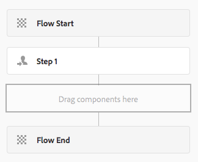

# Uitbreiding van workflowfunctionaliteit{#extending-workflow-functionality}

Dit onderwerp beschrijft hoe te om de componenten van de douanestap voor uw werkschema&#39;s te ontwikkelen, toen hoe te programmatically met werkschema&#39;s in wisselwerking te staan.

Het maken van een aangepaste workflowstap omvat de volgende activiteiten:

* Ontwikkel de component van de werkschemastap.
* Voer de step functionaliteit als dienst OSGi of een manuscript ECMA uit.

U kunt ook [ met uw werkschema&#39;s van uw programma&#39;s en manuscripten ](/help/sites-developing/workflows-program-interaction.md) in wisselwerking staan.

## Workflowstapcomponenten - De basisbeginselen {#workflow-step-components-the-basics}

Een workflowcomponent definieert de vormgeving en het gedrag van de stap bij het maken van workflowmodellen:

* De categorie en de stapnaam in het werkschemahulpje.
* De vormgeving van de stap in workflowmodellen.
* Het dialoogvenster Bewerken voor het configureren van componenteigenschappen.
* De service of het script dat wordt uitgevoerd bij uitvoering.

Zoals met [ alle componenten ](/help/sites-developing/components.md), erven de componenten van de werkschemastap van de component die voor het `sling:resourceSuperType` bezit wordt gespecificeerd. In het volgende diagram wordt de hiërarchie getoond van `cq:component` knooppunten die de basis vormen van alle workflowstapcomponenten. Het diagram omvat ook de **Stap van het Proces**, **Stap van de Deelnemer**, en **Dynamische Stap van de Deelnemer** componenten, aangezien dit de gemeenschappelijkste (en basis) uitgangspunt voor het ontwikkelen van de componenten van de douanestap zijn.


>[!CAUTION]
>
>U ***moet*** niets in de `/libs` weg veranderen.
>
>De reden hiervoor is dat de inhoud van `/libs` de volgende keer dat u een upgrade uitvoert van de instantie wordt overschreven (en dat deze inhoud ook kan worden overschreven wanneer u een hotfix- of functiepakket toepast).
>
>De aanbevolen methode voor configuratie en andere wijzigingen is:
>
>1. Het vereiste item opnieuw maken (dat wil zeggen, zoals het bestaat in `/libs` onder `/apps` )
>2. Breng eventuele wijzigingen aan binnen `/apps`

De `/libs/cq/workflow/components/model/step` component is de meest dichtbijgelegen gemeenschappelijke voorouder van de **Stap van het Proces**, **Stap van de Deelnemer**, en **Dynamische Stap van de Deelnemer**, die allen de volgende punten erven:

* `step.jsp`

  Met het script `step.jsp` wordt de titel van de step-component weergegeven wanneer deze aan een model wordt toegevoegd.

  

* [cq:dialoogvenster](/help/sites-developing/developing-components.md#creating-and-configuring-a-dialog)

  Een dialoogvenster met de volgende tabbladen:

   * **Gemeenschappelijk**: voor het uitgeven van de titel en de beschrijving.
   * **Geavanceerd**: voor het uitgeven van eigenschappen van het e-mailbericht.

   

  >[!NOTE]
  >
  >Wanneer de tabbladen van het dialoogvenster Bewerken van een stapcomponent niet overeenkomen met deze standaardweergave, heeft de stapcomponent scripts, knoopeigenschappen of dialoogtabbladen gedefinieerd die deze overgeërfde tabbladen overschrijven.

### ECMA-scripts {#ecma-scripts}

De volgende objecten zijn beschikbaar (afhankelijk van het type stap) in ECMA-scripts:

* [ WorkItem ](https://helpx.adobe.com/experience-manager/6-5/sites/developing/using/reference-materials/javadoc/com/day/cq/workflow/exec/WorkItem.html) workItem
* [ WorkflowSession ](https://helpx.adobe.com/experience-manager/6-5/sites/developing/using/reference-materials/javadoc/com/day/cq/workflow/WorkflowSession.html) workflowSession
* [ WorkflowData ](https://helpx.adobe.com/experience-manager/6-5/sites/developing/using/reference-materials/javadoc/com/day/cq/workflow/exec/WorkflowData.html) workflowData
* `args` : array met de procesargumenten.

* `sling` : voor toegang tot andere osgi-services.
* `jcrSession`

### MetaDataMaps {#metadatamaps}

U kunt metagegevens over workflows gebruiken om de informatie die tijdens de levensduur van de workflow vereist is, voort te zetten. Een algemene vereiste voor workflowstappen is dat gegevens voor toekomstig gebruik in de workflow moeten worden behouden of dat de blijvend opgeslagen gegevens moeten worden opgehaald.

Er zijn drie typen objecten MetaDataMap: voor objecten `Workflow` , `WorkflowData` en `WorkItem` . Ze hebben allemaal hetzelfde doel: metagegevens opslaan.

Een WorkItem heeft zijn eigen MetaDataMap die slechts kan worden gebruikt terwijl dat werkpunt (bijvoorbeeld, stap) loopt.

Zowel `Workflow` als `WorkflowData` -metagegevens worden over de gehele workflow gedeeld. In deze gevallen wordt aangeraden alleen de `WorkflowData` -metagegevenstoewijzing te gebruiken.

## Aangepaste workflowonderdelen maken {#creating-custom-workflow-step-components}

De de stapcomponenten van het werkschema kunnen [ worden gecreeerd op de zelfde manier zoals een andere component ](/help/sites-developing/components.md).

Voeg de volgende eigenschap toe aan het knooppunt `cq:Component` om van een van de (bestaande) basisstapcomponenten over te nemen:

* Naam: `sling:resourceSuperType`
* Type: `String`
* Waarde: een van de volgende paden die wordt omgezet in een basiscomponent:

   * `cq/workflow/components/model/process`
   * `cq/workflow/components/model/participant`
   * `cq/workflow/components/model/dynamic_participant`

### De standaardtitel en -beschrijving opgeven voor instanties Step {#specifying-the-default-title-and-description-for-step-instances}

Gebruik de volgende procedure om standaardwaarden voor de **Titel** en **3&rbrace; gebieden van de Beschrijving &lbrace;op het** Gemeenschappelijke **lusje te specificeren.**

>[!NOTE]
>
>De veldwaarden worden weergegeven op de stapinstantie wanneer aan beide volgende voorwaarden wordt voldaan:
>
>* In het dialoogvenster Bewerken van de stap worden de titel en de beschrijving opgeslagen op de volgende locaties: >
>* `./jcr:title`
>* `./jcr:description` locaties
>
>  Aan deze vereiste wordt voldaan wanneer het dialoogvenster Bewerken gebruikmaakt van het tabblad Algemeen dat de component `/libs/cq/flow/components/step/step` implementeert.
>
>* De step-component of een voorouder van de component overschrijft het `step.jsp` -script dat de `/libs/cq/flow/components/step/step` -component implementeert niet.

1. Voeg onder het knooppunt `cq:Component` het volgende knooppunt toe:

   * Naam: `cq:editConfig`
   * Type: `cq:EditConfig`

   >[!NOTE]
   >
   >Voor meer informatie over cq:editConfig knoop, zie [ Vormend het Edit Gedrag van een Component ](/help/sites-developing/developing-components.md#configuring-the-edit-behavior).

1. Voeg onder het knooppunt `cq:EditConfig` het volgende knooppunt toe:

   * Naam: `cq:formParameters`
   * Type: `nt:unstructured`

1. Voeg `String` eigenschappen van de volgende namen toe aan het knooppunt `cq:formParameters` :

   * `jcr:title`: De waarde vult het **2&rbrace; gebied van de Titel** van het **Gemeenschappelijke** lusje.
   * `jcr:description`: De waarde vult het **Beschrijving** gebied van het **Gemeenschappelijke** lusje.

### Eigenschapwaarden opslaan in werkstroommetagegevens {#saving-property-values-in-workflow-metadata}

>[!NOTE]
>
>Zie [ Blijvend en Toegang hebbend tot Gegevens ](#persisting-and-accessing-data). Met name, voor informatie over de toegang tot van de bezitswaarde bij runtime, zie [ Toegang tot de Waarden van het Bezit van de Dialoog bij Runtime ](#accessing-dialog-property-values-at-runtime).

De eigenschap name van `cq:Widget` -items geeft het JCR-knooppunt op dat de waarde van de widget opslaat. Wanneer widgets in het dialoogvenster met workflowstapcomponenten waarden opslaan onder het knooppunt `./metaData` , wordt de waarde toegevoegd aan de workflow `MetaDataMap` .

Een tekstveld in een dialoogvenster is bijvoorbeeld een knooppunt `cq:Widget` met de volgende eigenschappen:

| Naam | Type | Waarde |
|---|---|---|
| `xtype` | `String` | `textarea` |
| `name` | `String` | `./metaData/subject` |
| `fieldLabel` | `String` | `Email Subject` |

De waarde die in dit tekstveld wordt opgegeven, wordt toegevoegd aan het ` [MetaDataMap](#metadatamaps)` -object van de werkstroominstantie en is gekoppeld aan de `subject` -toets.

>[!NOTE]
>
>Wanneer de sleutel `PROCESS_ARGS` is, is de waarde gemakkelijk beschikbaar in manuscriptimplementaties ECMA via de `args` variabele. In dit geval is de waarde van de eigenschap name `./metaData/PROCESS_ARGS.`

### De stapimplementatie overschrijven {#overriding-the-step-implementation}

Elke component van de basisstap laat de ontwikkelaars van het werkschemamodel toe om de volgende zeer belangrijke eigenschappen in ontwerptijd te vormen:

* Processtap: de service of het ECMA-script dat bij uitvoering moet worden uitgevoerd.
* Stap van de deelnemer: identiteitskaart van de gebruiker die het geproduceerde het werkpunt wordt toegewezen.
* De dynamische Stap van de Deelnemer: De dienst of het manuscript ECMA dat identiteitskaart van de gebruiker selecteert die het het werkpunt wordt toegewezen.

Om de component voor gebruik in een specifiek werkschemascenario te concentreren, vorm de belangrijkste eigenschap in het ontwerp en verwijder de capaciteit voor modelontwikkelaars om het te veranderen.

1. Voeg onder het cq:component-knooppunt het volgende knooppunt toe:

   * Naam: `cq:editConfig`
   * Type: `cq:EditConfig`

   Voor meer informatie over cq:editConfig knoop, zie [ Vormend het Edit Gedrag van een Component ](/help/sites-developing/developing-components.md#configuring-the-edit-behavior).

1. Voeg onder het knooppunt cq:EditConfig het volgende knooppunt toe:

   * Naam: `cq:formParameters`
   * Type: `nt:unstructured`

1. Voeg een eigenschap `String` toe aan het knooppunt `cq:formParameters` . Het supertype van de component bepaalt de naam van het bezit:

   * Processtap: `PROCESS`
   * Stap deelnemer: `PARTICIPANT`
   * Dynamische deelnemersstap: `DYNAMIC_PARTICIPANT`

1. Geef de waarde van de eigenschap op:

   * `PROCESS`: Het pad naar het ECMA-script of de PID van de service die het stapgedrag implementeert.
   * `PARTICIPANT`: De id van de gebruiker aan wie het werkitem is toegewezen.
   * `DYNAMIC_PARTICIPANT`: Het pad naar het ECMA-script of de PID van de service die de gebruiker selecteert om het werkitem toe te wijzen.

1. Om de capaciteit van modelontwikkelaars te verwijderen om uw bezitswaarden te veranderen, vervang de dialoog van het componentensupertype.

### Forms en dialoogvensters toevoegen aan stappen van deelnemers {#adding-forms-and-dialogs-to-participant-steps}

Pas uw component van de deelnemersstap aan om eigenschappen te verstrekken die in de [ Stap van de Stap van de Deelnemer van de Vorm ](/help/sites-developing/workflows-step-ref.md#form-participant-step) en [ 3&rbrace; componenten van de Stap van de Deelnemer van de Dialoog worden gevonden:](/help/sites-developing/workflows-step-ref.md#dialog-participant-step)

* Een formulier presenteren aan de gebruiker wanneer deze het gegenereerde werkitem opent.
* Presenteer een aangepast dialoogvenster aan de gebruiker wanneer deze het gegenereerde werkitem voltooit.

Voer de volgende procedure op uw nieuwe component (zie [ Creërend de Componenten van de Stap van het Werkschema van de Douane ](#creating-custom-workflow-step-components)) uit:

1. Voeg onder het knooppunt `cq:Component` het volgende knooppunt toe:

   * Naam: `cq:editConfig`
   * Type: `cq:EditConfig`

   Voor meer informatie over cq:editConfig knoop, zie [ Vormend het Edit Gedrag van een Component ](/help/sites-developing/components-basics.md#edit-behavior).

1. Voeg onder het knooppunt cq:EditConfig het volgende knooppunt toe:

   * Naam: `cq:formParameters`
   * Type: `nt:unstructured`

1. Als u een formulier wilt presenteren terwijl de gebruiker het werkitem opent, voegt u de volgende eigenschap toe aan het knooppunt `cq:formParameters` :

   * Naam: `FORM_PATH`
   * Type: `String`
   * Waarde: het pad dat wordt omgezet in het formulier

1. Als u een aangepast dialoogvenster wilt weergeven wanneer de gebruiker het werkitem heeft voltooid, voegt u de volgende eigenschap toe aan het knooppunt `cq:formParameters`

   * Naam: `DIALOG_PATH`
   * Type: `String`
   * Waarde: het pad dat wordt omgezet in het dialoogvenster

### Werking voor Workflowstap configureren {#configuring-the-workflow-step-runtime-behavior}

Voeg onder het knooppunt `cq:Component` een knooppunt `cq:EditConfig` toe. Hieronder staat een knooppunt `nt:unstructured` (moet een naam hebben `cq:formParameters` ) en aan dat knooppunt voegt u de volgende eigenschappen toe:

* Naam: `PROCESS_AUTO_ADVANCE`

   * Type: `Boolean`
   * Waarde:

      * als dit is ingesteld op `true` , wordt die stap uitgevoerd en wordt verder gegaan. Dit is standaard en wordt ook aanbevolen
      * wanneer `false` , wordt de workflow uitgevoerd en gestopt; hiervoor is extra verwerking vereist, dus `true` wordt aanbevolen

* Naam: `DO_NOTIFY`

   * Type: `Boolean`
   * Waarde: geeft aan of e-mailmeldingen moeten worden verzonden voor stappen voor gebruikersdeelname (en gaat ervan uit dat de mailserver correct is geconfigureerd)

## Gegevens behouden en openen {#persisting-and-accessing-data}

### Gegevens behouden voor volgende workflowstappen {#persisting-data-for-subsequent-workflow-steps}

U kunt werkschemagegevens gebruiken om informatie voort te zetten die tijdens het leven van het werkschema - en tussen stappen wordt vereist. Een algemene vereiste voor workflowstappen is dat gegevens voor toekomstig gebruik behouden blijven of dat de blijvend gegevens uit eerdere stappen worden opgehaald.

Metagegevens van werkstromen worden opgeslagen in een [`MetaDataMap`](#metadatamaps) -object. De Java API biedt de methode [`Workflow.getWorkflowData` ](https://helpx.adobe.com/experience-manager/6-5/sites/developing/using/reference-materials/javadoc/com/adobe/granite/workflow/exec/Workflow.html) om een [`WorkflowData` ](https://helpx.adobe.com/experience-manager/6-5/sites/developing/using/reference-materials/javadoc/com/adobe/granite/workflow/exec/WorkflowData.html) -object te retourneren dat het juiste `MetaDataMap` -object biedt. Dit `WorkflowData` `MetaDataMap` -object is beschikbaar voor de OSGi-service of het ECMA-script van een step-component.

#### Java {#java}

De uitvoeringsmethode van de `WorkflowProcess` -implementatie wordt doorgegeven aan het `WorkItem` -object. Gebruik dit object om het object `WorkflowData` voor de huidige werkstroominstantie te verkrijgen. In het volgende voorbeeld wordt een item toegevoegd aan het werkstroomobject `MetaDataMap` en wordt elk item vervolgens geregistreerd. Het item (&quot;mijnsleutel&quot;, &quot;Mijn stapwaarde&quot;) is beschikbaar voor volgende stappen in de workflow.

```java
public void execute(WorkItem item, WorkflowSession session, MetaDataMap args) throws WorkflowException {

    MetaDataMap wfd = item.getWorkflow().getWorkflowData().getMetaDataMap();

    wfd.put("mykey", "My Step Value");

    Set<String> keyset = wfd.keySet();
    Iterator<String> i = keyset.iterator();
    while (i.hasNext()){
     Object key = i.next();
     log.info("The workflow medata includes key {} and value {}",key.toString(),wfd.get(key).toString());
    }
}
```

#### ECMA-script {#ecma-script}

De variabele `graniteWorkItem` is de ECMA-scriptweergave van het huidige Java-object `WorkItem` . Daarom kunt u de variabele `graniteWorkItem` gebruiken om de metagegevens van de workflow te verkrijgen. Het volgende manuscript ECMA kan worden gebruikt om de Stap van het Proces van het a **uit te voeren** om een punt aan het werkschemavoorwerp `MetaDataMap` toe te voegen en dan elk punt te registreren. Deze items zijn vervolgens beschikbaar voor volgende stappen in de workflow.

>[!NOTE]
>
>De variabele `metaData` die direct beschikbaar is voor het stapscript, zijn de metagegevens van de stap. De metagegevens van de stap verschillen van de metagegevens van de workflow.

```
var currentDateInMillis = new Date().getTime();

graniteWorkItem.getWorkflowData().getMetaDataMap().put("hardcodedKey","theKey");

graniteWorkItem.getWorkflowData().getMetaDataMap().put("currentDateInMillisKey",currentDateInMillis);

var iterator = graniteWorkItem.getWorkflowData().getMetaDataMap().keySet().iterator();
while (iterator.hasNext()){
    var key = iterator.next();
    log.info("Workflow metadata key, value = " + key.toString() + ", " + graniteWorkItem.getWorkflowData().getMetaDataMap().get(key));
}
```

### Dialoogvenstereigenschapswaarden openen bij uitvoering {#accessing-dialog-property-values-at-runtime}

Het `MetaDataMap` -object van workflowinstanties is handig voor het opslaan en ophalen van gegevens gedurende de gehele levensduur van de workflow. Voor workflowstapimplementaties is de `MetaDataMap` vooral handig voor het ophalen van componenteigenschapswaarden tijdens runtime.

>[!NOTE]
>
>Voor informatie over het vormen van de componentendialoog om eigenschappen als werkschemameta-gegevens op te slaan, zie [ het Opslaan van de Waarden van het Bezit in de Meta-gegevens van het Werkschema ](#saving-property-values-in-workflow-metadata).

De workflow `MetaDataMap` is beschikbaar voor Java- en ECMA-scriptprocesimplementaties:

* In Java-implementaties van de WorkflowProcess-interface is de `args` -parameter het `MetaDataMap` -object voor de workflow.

* In ECMA-scriptimplementaties is de waarde beschikbaar met de variabelen `args` en `metadata` .

### Voorbeeld: de argumenten van de processtapcomponent ophalen {#example-retrieving-the-arguments-of-the-process-step-component}

De Edit dialoog van de **component van de Stap van het Proces 0&rbrace; &lbrace;omvat het** Argumenten **bezit.** De waarde van het **bezit van Argumenten** wordt opgeslagen in de werkschemameta-gegevens, en wordt geassocieerd met de `PROCESS_ARGS` sleutel.

In het volgende diagram, is de waarde van het **bezit van Argumenten** `argument1, argument2`:


#### Java {#java-1}

De volgende Java-code is de methode `execute` voor een `WorkflowProcess` -implementatie. De methode logt de waarde in `args` `MetaDataMap` in die aan de `PROCESS_ARGS` -toets is gekoppeld.

```java
public void execute(WorkItem item, WorkflowSession session, MetaDataMap args) throws WorkflowException {
     if (args.containsKey("PROCESS_ARGS")){
      log.info("workflow metadata for key PROCESS_ARGS and value {}",args.get("PROCESS_ARGS","string").toString());
     }
    }
```

Wanneer een processtap wordt uitgevoerd die deze Java-implementatie gebruikt, bevat het logbestand de volgende vermelding:

```xml
16.02.2018 12:07:39.566 *INFO* [JobHandler: /var/workflow/instances/server0/2018-02-16/model_855140139900189:/content/we-retail/de] com.adobe.example.workflow.impl.process.LogArguments workflow metadata for key PROCESS_ARGS and value argument1, argument2
```

#### ECMA-script {#ecma-script-1}

Het volgende manuscript ECMA wordt gebruikt als proces voor de **Stap van het Proces**. Het registreert het aantal argumenten en de argumentwaarden:

```
var iterator = graniteWorkItem.getWorkflowData().getMetaDataMap().keySet().iterator();
while (iterator.hasNext()){
    var key = iterator.next();
    log.info("Workflow metadata key, value = " + key.toString() + ", " + graniteWorkItem.getWorkflowData().getMetaDataMap().get(key));
}
log.info("hardcodedKey "+ graniteWorkItem.getWorkflowData().getMetaDataMap().get("hardcodedKey"));
log.info("currentDateInMillisKey "+ graniteWorkItem.getWorkflowData().getMetaDataMap().get("currentDateInMillisKey"));
```

>[!NOTE]
>
>In deze sectie wordt beschreven hoe u met argumenten voor processtappen werkt. De informatie is ook van toepassing op dynamische deelnemerselecties.

>[!NOTE]
>Voor een ander voorbeeld van het opslaan van componenteneigenschappen in werkschemagegevens, zie Voorbeeld: Creeer een Stap van de Werkstroom van het Registratieprogramma. In dit voorbeeld wordt een dialoogvenster weergegeven waarin de metagegevenswaarde wordt gekoppeld aan een andere sleutel dan PROCESS_ARGS.

### Scripts en procesargumenten {#scripts-and-process-arguments}

Binnen een manuscript voor de component van de Stap van het a **Proces**, zijn de argumenten beschikbaar door het `args` voorwerp.

Wanneer u een component met een aangepaste stap maakt, is het object `metaData` beschikbaar in een script. Dit object is beperkt tot één tekenreeksargument.

## Implementaties van processtappen ontwikkelen {#developing-process-step-implementations}

Wanneer de processtappen tijdens het proces van een werkschema zijn begonnen, verzenden de stappen een verzoek naar een dienst OSGi of voeren een manuscript ECMA uit. Ontwikkel de dienst of het manuscript ECMA dat de acties uitvoert die uw werkschema vereist.

>[!NOTE]
>
>Voor informatie over het associëren van uw component van de Stap van het Proces met de dienst of het manuscript, zie [ Stap van het Proces ](/help/sites-developing/workflows-step-ref.md#process-step) of [ met voeten tredend de Implementatie van de Stap ](#overriding-the-step-implementation).

### Een processtap implementeren met een Java-klasse {#implementing-a-process-step-with-a-java-class}

Een processtap definiëren als een OSGI-servicecomponent (Java-bundel):

1. Maak de bundel en plaats deze in de OSGI-container. Verwijs naar de documentatie over het creëren van een bundel met [ CRXDE Lite ](/help/sites-developing/developing-with-crxde-lite.md) of [ Verduistering ](/help/sites-developing/howto-projects-eclipse.md).

   >[!NOTE]
   >
   >De component OSGI moet de interface `WorkflowProcess` implementeren met de methode `execute()` . Zie de voorbeeldcode hieronder.

   >[!NOTE]
   >
   >De pakketnaam moet worden toegevoegd aan de sectie `<*Private-Package*>` van de `maven-bundle-plugin` -configuratie.

1. Voeg de SCR-eigenschap `process.label` toe en stel de waarde naar wens in. Dit zal de naam zijn die uw processtap zoals wanneer het gebruiken van de generische **component van de Stap van het Proces** vermeld is. Zie het onderstaande voorbeeld.
1. In de **Modellen** redacteur, voeg de processtap aan het werkschema toe gebruikend de generische **component van de Stap van het Proces**.
1. In geef dialoog uit (van de **Stap van het Proces**), ga naar het **3&rbrace; lusje van het Proces &lbrace;en selecteer uw procesimplementatie.**
1. Als u argumenten in uw code gebruikt, plaats de **Argumenten van het Proces**. Bijvoorbeeld: false.
1. Sla de wijzigingen op voor zowel de stap als het workflowmodel (linksboven in de modeleditor).

De methoden java, respectievelijk de klassen die de uitvoerbare Java-methode implementeren, worden geregistreerd als OSGI-services, waarmee u tijdens runtime op elk moment methoden kunt toevoegen.

De volgende component OSGI voegt de eigenschap `approved` toe aan het knooppunt page content wanneer de payload een pagina is:

```java
package com.adobe.example.workflow.impl.process;

import com.adobe.granite.workflow.WorkflowException;
import com.adobe.granite.workflow.WorkflowSession;
import com.adobe.granite.workflow.exec.WorkItem;
import com.adobe.granite.workflow.exec.WorkflowData;
import com.adobe.granite.workflow.exec.WorkflowProcess;
import com.adobe.granite.workflow.metadata.MetaDataMap;

import org.apache.felix.scr.annotations.Component;
import org.apache.felix.scr.annotations.Property;
import org.apache.felix.scr.annotations.Service;

import org.osgi.framework.Constants;

import javax.jcr.Node;
import javax.jcr.RepositoryException;
import javax.jcr.Session;

/**
 * Sample workflow process that sets an <code>approve</code> property to the payload based on the process argument value.
 */
@Component
@Service
public class MyProcess implements WorkflowProcess {

 @Property(value = "An example workflow process implementation.")
 static final String DESCRIPTION = Constants.SERVICE_DESCRIPTION;
 @Property(value = "Adobe")
 static final String VENDOR = Constants.SERVICE_VENDOR;
 @Property(value = "My Sample Workflow Process")
 static final String LABEL="process.label";

 private static final String TYPE_JCR_PATH = "JCR_PATH";

 public void execute(WorkItem item, WorkflowSession session, MetaDataMap args) throws WorkflowException {
  WorkflowData workflowData = item.getWorkflowData();
  if (workflowData.getPayloadType().equals(TYPE_JCR_PATH)) {
   String path = workflowData.getPayload().toString() + "/jcr:content";
   try {
    Session jcrSession = session.adaptTo(Session.class);
    Node node = (Node) jcrSession.getItem(path);
    if (node != null) {
     node.setProperty("approved", readArgument(args));
     jcrSession.save();
    }
   } catch (RepositoryException e) {
    throw new WorkflowException(e.getMessage(), e);
   }
  }
 }

 private boolean readArgument(MetaDataMap args) {
  String argument = args.get("PROCESS_ARGS", "false");
  return argument.equalsIgnoreCase("true");
 }
}
```

>[!NOTE]
>
>Als het proces drie keer in een rij mislukt, wordt een item in het Postvak In van de workflowbeheerder geplaatst.

### ECMAScript gebruiken {#using-ecmascript}

Met ECMA-scripts kunnen scriptontwikkelaars processtappen implementeren. De scripts bevinden zich in de JCR-opslagplaats en worden daar uitgevoerd.

In de volgende tabel staan de variabelen die direct beschikbaar zijn voor het verwerken van scripts, waarmee toegang wordt verleend tot objecten van de Java API voor de workflow.

| Java-klasse | Naam scriptvariabele | Beschrijving |
|---|---|---|
| `com.adobe.granite.workflow.exec.WorkItem` | `graniteWorkItem` | De huidige step-instantie. |
| `com.adobe.granite.workflow.WorkflowSession` | `graniteWorkflowSession` | De workflowsessie van de huidige step-instantie. |
| `String[]` (bevat procesargumenten) | `args` | De step-argumenten. |
| `com.adobe.granite.workflow.metadata.MetaDataMap` | `metaData` | De metagegevens van de huidige step-instantie. |
| `org.apache.sling.scripting.core.impl.InternalScriptHelper` | `sling` | Biedt toegang tot de Sling-runtimeomgeving. |

Het volgende voorbeeldscript laat zien hoe u toegang krijgt tot het JCR-knooppunt dat de payload van de workflow vertegenwoordigt. De variabele `graniteWorkflowSession` wordt aangepast aan een JCR-sessievariabele, die wordt gebruikt om het knooppunt op te halen uit het payload-pad.

```
var workflowData = graniteWorkItem.getWorkflowData();
if (workflowData.getPayloadType() == "JCR_PATH") {
    var path = workflowData.getPayload().toString();
    var jcrsession = graniteWorkflowSession.adaptTo(Packages.javax.jcr.Session);
    var node = jcrsession.getNode(path);
    if (node.hasProperty("approved")){
     node.setProperty("approved", args[0] == "true" ? true : false);
     node.save();
 }
}
```

Met het volgende script wordt gecontroleerd of de laadbewerking een afbeelding ( `.png` -bestand) is, wordt er een zwart-witafbeelding van gemaakt en opgeslagen als een knooppunt op hetzelfde niveau.

```
var workflowData = graniteWorkItem.getWorkflowData();
if (workflowData.getPayloadType() == "JCR_PATH") {
    var path = workflowData.getPayload().toString();
    var jcrsession = graniteWorkflowSession.adaptTo(Packages.javax.jcr.Session);
    var node = jcrsession.getRootNode().getNode(path.substring(1));
     if (node.isNodeType("nt:file") && node.getProperty("jcr:content/jcr:mimeType").getString().indexOf("image/") == 0) {
        var is = node.getProperty("jcr:content/jcr:data").getStream();
        var layer = new Packages.com.day.image.Layer(is);
        layer.grayscale();
                var parent = node.getParent();
                var gn = parent.addNode("grey" + node.getName(), "nt:file");
        var content = gn.addNode("jcr:content", "nt:resource");
                content.setProperty("jcr:mimeType","image/png");
                var cal = Packages.java.util.Calendar.getInstance();
                content.setProperty("jcr:lastModified",cal);
                var f = Packages.java.io.File.createTempFile("test",".png");
        var tout = new Packages.java.io.FileOutputStream(f);
        layer.write("image/png", 1.0, tout);
        var fis = new Packages.java.io.FileInputStream(f);
                content.setProperty("jcr:data", fis);
                parent.save();
        tout.close();
        fis.close();
        is.close();
        f.deleteOnExit();
    }
}
```

Het script gebruiken:

1. Maak het script (bijvoorbeeld met CRXDE Lite) en sla het hieronder op in de opslagplaats `//apps/workflow/scripts/`
1. Om een titel te specificeren die het manuscript in de **uitgeeft dialoog van de Stap van het 0&rbrace; Proces identificeert, voeg de volgende eigenschappen aan de `jcr:content` knoop van uw manuscript toe:**

   | Naam | Type | Waarde |
   |---|---|---|
   | `jcr:mixinTypes` | `Name[]` | `mix:title` |
   | `jcr:title` | `String` | De naam die moet worden weergegeven in het dialoogvenster Bewerken. |

1. Bewerk de **instantie van de Stap van het Proces** en specificeer het te gebruiken manuscript.

## Deelnemerkiezers ontwikkelen {#developing-participant-choosers}

U kunt deelnemerverkiessers voor **Dynamische de componenten van de Stap van de Deelnemer** ontwikkelen.

Wanneer de component van de Stap van de Stap van de a **Dynamische Deelnemer** tijdens een werkschema is begonnen, moet de stap de deelnemer bepalen waaraan het geproduceerde het werkpunt kan worden toegewezen. Hiervoor moet u een van de volgende stappen uitvoeren:

* verzendt een verzoek naar een dienst OSGi
* voert een manuscript ECMA uit om de deelnemer te selecteren

U kunt de dienst of een manuscript ontwikkelen ECMA dat de deelnemer volgens de vereisten van uw werkschema selecteert.

>[!NOTE]
>
>Voor informatie over het associëren van uw **Dynamische component van de Stap van de Deelnemer** met de dienst of het manuscript, zie [ Dynamische Stap van de Deelnemer ](/help/sites-developing/workflows-step-ref.md#dynamic-participant-step) of [ met voeten tredend de Implementatie van de Stap ](#persisting-and-accessing-data).

### Een kiezer voor deelnemers ontwikkelen met een Java-klasse {#developing-a-participant-chooser-using-a-java-class}

Een deelnemersstap definiëren als een OSGI-servicecomponent (Java-klasse):

1. De component OSGI moet de interface `ParticipantStepChooser` implementeren met de methode `getParticipant()` . Zie de voorbeeldcode hieronder.

   Maak de bundel en plaats deze in de OSGI-container.

1. Voeg de SCR-eigenschap `chooser.label` toe en stel de waarde naar wens in. Dit zal de naam zijn aangezien uw deelnemerverkiezer vermeld is, gebruikend de **Dynamische component van de Stap van de Deelnemer**. Zie het voorbeeld:

   ```java
   package com.adobe.example.workflow.impl.process;
   
   import com.adobe.granite.workflow.WorkflowException;
   import com.adobe.granite.workflow.WorkflowSession;
   import com.adobe.granite.workflow.exec.ParticipantStepChooser;
   import com.adobe.granite.workflow.exec.WorkItem;
   import com.adobe.granite.workflow.exec.WorkflowData;
   import com.adobe.granite.workflow.metadata.MetaDataMap;
   
   import org.apache.felix.scr.annotations.Component;
   import org.apache.felix.scr.annotations.Property;
   import org.apache.felix.scr.annotations.Service;
   
   import org.osgi.framework.Constants;
   
   /**
    * Sample dynamic participant step that determines the participant based on a path given as argument.
    */
   @Component
   @Service
   
   public class MyDynamicParticipant implements ParticipantStepChooser {
   
    @Property(value = "An example implementation of a dynamic participant chooser.")
    static final String DESCRIPTION = Constants.SERVICE_DESCRIPTION;
       @Property(value = "Adobe")
       static final String VENDOR = Constants.SERVICE_VENDOR;
       @Property(value = "Dynamic Participant Chooser Process")
       static final String LABEL=ParticipantStepChooser.SERVICE_PROPERTY_LABEL;
   
       private static final String TYPE_JCR_PATH = "JCR_PATH";
   
       public String getParticipant(WorkItem workItem, WorkflowSession workflowSession, MetaDataMap args) throws WorkflowException {
           WorkflowData workflowData = workItem.getWorkflowData();
           if (workflowData.getPayloadType().equals(TYPE_JCR_PATH)) {
               String path = workflowData.getPayload().toString();
               String pathFromArgument = args.get("PROCESS_ARGS", String.class);
               if (pathFromArgument != null && path.startsWith(pathFromArgument)) {
                   return "admin";
               }
           }
           return "administrators";
       }
   }
   ```

1. In de **Modellen** redacteur, voeg de dynamische deelnemersstap aan het werkschema toe gebruikend de generische **Dynamische component van de Stap van de Deelnemer**.
1. In geef dialoog uit uitgezocht **Chooser van de Deelnemer** tabel en selecteer uw selecteersimplementatie.
1. Als u argumenten in uw code gebruikt plaats de **Argumenten van het Proces**. In dit voorbeeld: `/content/we-retail/de` .
1. Sla de wijzigingen op voor zowel de stap als het workflowmodel.

### Een kiezer voor deelnemers ontwikkelen met behulp van een ECMA-script {#developing-a-participant-chooser-using-an-ecma-script}

U kunt een manuscript tot stand brengen ECMA dat de gebruiker selecteert die het het werkpunt wordt toegewezen dat de **Stap van de Deelnemer** produceert. Het script moet een functie met de naam `getParticipant` bevatten die geen argumenten vereist en retourneert een `String` die de id van een gebruiker of groep bevat.

Scripts bevinden zich in de JCR-opslagplaats en worden daar uitgevoerd.

De volgende tabel bevat een lijst met variabelen die directe toegang bieden tot Java-workflowobjecten in uw scripts.

| Java-klasse | Naam scriptvariabele |
|---|---|
| `com.adobe.granite.workflow.exec.WorkItem` | `graniteWorkItem` |
| `com.adobe.granite.workflow.WorkflowSession` | `graniteWorkflowSession` |
| `String[]` (bevat procesargumenten) | `args` |
| `com.adobe.granite.workflow.metadata.MetaDataMap` | `metaData` |
| `org.apache.sling.scripting.core.impl.InternalScriptHelper` | `sling` |

```
function getParticipant() {
    var workflowData = graniteWorkItem.getWorkflowData();
    if (workflowData.getPayloadType() == "JCR_PATH") {
        var path = workflowData.getPayload().toString();
        if (path.indexOf("/content/we-retail/de") == 0) {
            return "admin";
        } else {
            return "administrators";
        }
    }
}
```

1. Maak het script (bijvoorbeeld met CRXDE Lite) en sla het hieronder op in de opslagplaats `//apps/workflow/scripts`
1. Om een titel te specificeren die het manuscript in de **uitgeeft dialoog van de Stap van het 0&rbrace; Proces identificeert, voeg de volgende eigenschappen aan de `jcr:content` knoop van uw manuscript toe:**

   | Naam | Type | Waarde |
   |---|---|---|
   | `jcr:mixinTypes` | `Name[]` | `mix:title` |
   | `jcr:title` | `String` | De naam die moet worden weergegeven in het dialoogvenster Bewerken. |

1. Bewerk de [ Dynamische instantie van de Stap van de Deelnemer ](/help/sites-developing/workflows-step-ref.md#dynamic-participant-step) en specificeer het te gebruiken manuscript.

## Workflowpakketten verwerken {#handling-workflow-packages}

[ de pakketten van het Werkschema ](/help/sites-authoring/workflows-applying.md#specifying-workflow-details-in-the-create-workflow-wizard) kunnen tot een werkschema voor verwerking worden overgegaan. Workflowpakketten bevatten verwijzingen naar bronnen zoals pagina&#39;s en elementen.

>[!NOTE]
>
>De volgende stappen in het workflowproces accepteren workflowpakketten voor activering van bulkpagina&#39;s:
>
>* [`com.day.cq.wcm.workflow.process.ActivatePageProcess`](https://helpx.adobe.com/experience-manager/6-5/sites/developing/using/reference-materials/javadoc/com/day/cq/wcm/workflow/process/ActivatePageProcess.html)
>* [`com.day.cq.wcm.workflow.process.DeactivatePageProcess`](https://helpx.adobe.com/experience-manager/6-5/sites/developing/using/reference-materials/javadoc/com/day/cq/wcm/workflow/process/DeactivatePageProcess.html)
>

U kunt workflowstappen ontwikkelen om de pakketbronnen te verkrijgen en deze te verwerken. De volgende leden van het `com.day.cq.workflow.collection` -pakket bieden toegang tot workflowpakketten:

* `ResourceCollection`: Workflowpakketklasse.
* `ResourceCollectionUtil`: gebruiken om ResourceCollection-objecten op te halen.
* `ResourceCollectionManager`: maakt en haalt verzamelingen op. Een implementatie wordt opgesteld als dienst OSGi.

In het volgende voorbeeld van de Java-klasse ziet u hoe u pakketbronnen kunt verkrijgen:

```java
package com.adobe.example;

import java.util.ArrayList;
import java.util.List;

import com.day.cq.workflow.WorkflowException;
import com.day.cq.workflow.WorkflowSession;
import com.day.cq.workflow.collection.ResourceCollection;
import com.day.cq.workflow.collection.ResourceCollectionManager;
import com.day.cq.workflow.collection.ResourceCollectionUtil;
import com.day.cq.workflow.exec.WorkItem;
import com.day.cq.workflow.exec.WorkflowData;
import com.day.cq.workflow.exec.WorkflowProcess;
import com.day.cq.workflow.metadata.MetaDataMap;

import org.apache.felix.scr.annotations.Component;
import org.apache.felix.scr.annotations.Property;
import org.apache.felix.scr.annotations.Service;
import org.apache.felix.scr.annotations.Reference;
import org.osgi.framework.Constants;

import org.slf4j.Logger;
import org.slf4j.LoggerFactory;

import javax.jcr.Node;
import javax.jcr.PathNotFoundException;
import javax.jcr.RepositoryException;
import javax.jcr.Session;

@Component
@Service
public class LaunchBulkActivate implements WorkflowProcess {

 private static final Logger log = LoggerFactory.getLogger(LaunchBulkActivate.class);

 @Property(value="Bulk Activate for Launches")
  static final String PROCESS_NAME ="process.label";
 @Property(value="A sample workflow process step to support Launches bulk activation of pages")
 static final String SERVICE_DESCRIPTION = Constants.SERVICE_DESCRIPTION;

 @Reference
 private ResourceCollectionManager rcManager;
public void execute(WorkItem workItem, WorkflowSession workflowSession) throws Exception {
    Session session = workflowSession.getSession();
    WorkflowData data = workItem.getWorkflowData();
    String path = null;
    String type = data.getPayloadType();
    if (type.equals(TYPE_JCR_PATH) && data.getPayload() != null) {
        String payloadData = (String) data.getPayload();
        if (session.itemExists(payloadData)) {
            path = payloadData;
        }
    } else if (data.getPayload() != null && type.equals(TYPE_JCR_UUID)) {
        Node node = session.getNodeByUUID((String) data.getPayload());
        path = node.getPath();
    }

    // CUSTOMIZED CODE IF REQUIRED....

    if (path != null) {
        // check for resource collection
        ResourceCollection rcCollection = ResourceCollectionUtil.getResourceCollection((Node)session.getItem(path), rcManager);
        // get list of paths to replicate (no resource collection: size == 1
        // otherwise size >= 1
        List<String> paths = getPaths(path, rcCollection);
        for (String aPath: paths) {

            // CUSTOMIZED CODE....

        }
    } else {
        log.warn("Cannot process because path is null for this " + "workitem: " + workItem.toString());
    }
}

/**
 * helper
 */
private List<String> getPaths(String path, ResourceCollection rcCollection) {
    List<String> paths = new ArrayList<String>();
    if (rcCollection == null) {
        paths.add(path);
    } else {
        log.debug("ResourceCollection detected " + rcCollection.getPath());
        // this is a resource collection. the collection itself is not
        // replicated. only its members
        try {
            List<Node> members = rcCollection.list(new String[]{"cq:Page", "dam:Asset"});
            for (Node member: members) {
                String mPath = member.getPath();
                paths.add(mPath);
            }
        } catch(RepositoryException re) {
            log.error("Cannot build path list out of the resource collection " + rcCollection.getPath());
        }
    }
    return paths;
}
}
```

## Voorbeeld: een aangepaste stap maken {#example-creating-a-custom-step}

Een gemakkelijke manier om uw eigen douanestap te beginnen te creëren is een bestaande stap van te kopiëren:

`/libs/cq/workflow/components/model`

### De basisstap maken {#creating-the-basic-step}

1. Maak het pad opnieuw onder /apps; bijvoorbeeld:

   `/apps/cq/workflow/components/model`

   De nieuwe mappen zijn van het type `nt:folder` :

   ```xml
   - apps
     - cq
       - workflow (nt:folder)
         - components (nt:folder)
           - model (nt:folder)
   ```

   >[!NOTE]
   >
   >Deze stap is niet van toepassing op de klassieke UI Model redacteur.

1. Plaats de gekopieerde stap vervolgens in de map /apps, bijvoorbeeld als:

   `/apps/cq/workflow/components/model/myCustomStep`

   Hier is het resultaat van onze voorbeeld aangepaste stap:

   

   >[!CAUTION]
   >
   >Omdat in standaard UI, slechts de titel en niet de details niet op de kaart worden getoond, is `details.jsp` niet nodig aangezien het voor de klassieke redacteur UI was.

1. Pas de volgende eigenschappen toe op het knooppunt:

   `/apps/cq/workflow/components/model/myCustomStep`

   **Eigenschappen van belang:**

   * `sling:resourceSuperType`

     Moet overerven van een bestaande stap.

     In dit voorbeeld overerven we van de basisstap bij `cq/workflow/components/model/step` , maar u kunt andere supertypen gebruiken, zoals `participant` , `process` , enzovoort.

   * `jcr:title`

     Wordt de titel weergegeven wanneer de component in de stapbrowser wordt weergegeven (linkerdeelvenster van de werkstroommodeleditor).

   * `cq:icon`

     Gebruikt om het pictogram van het a [ Koraal ](https://helpx.adobe.com/experience-manager/6-5/sites/developing/using/reference-materials/coral-ui/coralui3/Coral.Icon.html) voor de stap te specificeren.

   * `componentGroup`

     Moet een van de volgende items zijn:

      * Collaboration Workflow
      * DAM-workflow
      * Forms Workflow
      * Projecten
      * WCM-workflow
      * Workflow

   

1. U kunt nu een workflowmodel openen voor bewerking. In de stappen browser kunt u filteren om **Mijn Stap van de Douane te zien**:

   

   Het slepen **Mijn Stap van de Douane** op de modelvertoningen de kaart:

   

   Als er geen `cq:icon` is gedefinieerd voor de stap, wordt een standaardpictogram weergegeven met de eerste twee letters van de titel. Bijvoorbeeld:

   

#### Het bepalen van Stap vormt Dialoogvenster {#defining-the-step-configure-dialog}

Na [ Creërend de BasisStap ](#creating-the-basic-step), bepaal de stap **&#x200B;**&#x200B;dialoog als volgt:

1. Configureer de eigenschappen op het knooppunt `cq:editConfig` als volgt:

   **Eigenschappen van belang:**

   * `cq:inherit`

     Wanneer ingesteld op `true` , overerft uw step-component eigenschappen van de stap die u in `sling:resourceSuperType` hebt opgegeven.

   * `cq:disableTargeting`

     Stel dit naar wens in.

   

1. Configureer de eigenschappen op het knooppunt `cq:formsParameter` als volgt:

   **Eigenschappen van belang:**

   * `jcr:title`

     Plaatst de standaardtitel op de stappenkaart in de modelkaart en in het **1&rbrace; gebied van de Titel {van 2} Mijn Douane - de configuratiedialoog van de Eigenschappen van de Stap**.**&#x200B;**

   * U kunt ook uw eigen aangepaste eigenschappen definiëren.

   

1. Configureer de eigenschappen op het knooppunt `cq:listeners` .

   Met het knooppunt `cq:listener` en de bijbehorende eigenschappen kunt u gebeurtenishandlers instellen die reageren op gebeurtenissen in de modeleditor van de gebruikersinterface met aanraakbediening, zoals het slepen van een stap naar een modelpagina of het bewerken van stapeigenschappen.

   **Eigenschappen van Belang:**

   * `afterMove: REFRESH_PAGE`
   * `afterdelete: CQ.workflow.flow.Step.afterDelete`
   * `afteredit: CQ.workflow.flow.Step.afterEdit`
   * `afterinsert: CQ.workflow.flow.Step.afterInsert`

   Deze configuratie is essentieel voor het goed functioneren van de redacteur. In de meeste gevallen mag deze configuratie niet worden gewijzigd.

   Als u `cq:inherit` echter instelt op true (voor de `cq:editConfig` -node, zie hierboven), kunt u deze configuratie overnemen zonder deze expliciet op te nemen in de stapdefinitie. Als er geen overerving is, moet u dit knooppunt met de volgende eigenschappen en waarden toevoegen.

   In dit voorbeeld is overerving geactiveerd zodat we het knooppunt `cq:listeners` kunnen verwijderen en de stap blijft correct.

   

1. U kunt nu een instantie van uw stap toevoegen aan een workflowmodel. Wanneer u **&#x200B;**&#x200B;vormt de stap u de dialoog zult zien:

    

#### Sampleopmaak die in dit voorbeeld wordt gebruikt {#sample-markup-used-in-this-example}

Opmaak voor een aangepaste stap wordt weergegeven in de `.content.xml` van het hoofdknooppunt van de component. Het voorbeeld `.content.xml` dat voor dit voorbeeld wordt gebruikt:

`/apps/cq/workflow/components/model/myCustomStep/.content.xml`

```xml
<?xml version="1.0" encoding="UTF-8"?>
<jcr:root xmlns:sling="https://sling.apache.org/jcr/sling/1.0" xmlns:cq="https://www.day.com/jcr/cq/1.0" xmlns:jcr="https://www.jcp.org/jcr/1.0"
    cq:icon="bell"
    jcr:primaryType="cq:Component"
    jcr:title="My Custom Step"
    sling:resourceSuperType="cq/workflow/components/model/process"
    allowedParents="[*/parsys]"
    componentGroup="Workflow"/>
```

Het voorbeeld `_cq_editConfig.xml` dat in dit voorbeeld wordt gebruikt:

```xml
<?xml version="1.0" encoding="UTF-8"?>
<jcr:root xmlns:cq="https://www.day.com/jcr/cq/1.0" xmlns:jcr="https://www.jcp.org/jcr/1.0" xmlns:nt="https://www.jcp.org/jcr/nt/1.0"
    cq:disableTargeting="{Boolean}true"
    cq:inherit="{Boolean}true"
    jcr:primaryType="cq:EditConfig">
    <cq:formParameters
        jcr:primaryType="nt:unstructured"
        jcr:title="My Custom Step Card"
        SAMPLE_PROPERY="sample value"/>
    <cq:listeners
        jcr:primaryType="cq:EditListenersConfig"
        afterdelete="CQ.workflow.flow.Step.afterDelete"
        afteredit="CQ.workflow.flow.Step.afterEdit"
        afterinsert="CQ.workflow.flow.Step.afterInsert"
        afterMove="REFRESH_PAGE"/>
</jcr:root>
```

Het voorbeeld `_cq_dialog/.content.xml` dat in dit voorbeeld wordt gebruikt:

```xml
<?xml version="1.0" encoding="UTF-8"?>
<jcr:root xmlns:sling="https://sling.apache.org/jcr/sling/1.0" xmlns:cq="https://www.day.com/jcr/cq/1.0" xmlns:jcr="https://www.jcp.org/jcr/1.0" xmlns:nt="https://www.jcp.org/jcr/nt/1.0"
    jcr:primaryType="nt:unstructured"
    jcr:title="My Custom - Step Properties"
    sling:resourceType="cq/gui/components/authoring/dialog">
    <content
        jcr:primaryType="nt:unstructured"
        sling:resourceType="granite/ui/components/coral/foundation/tabs">
        <items jcr:primaryType="nt:unstructured">
            <common
                cq:hideOnEdit="true"
                jcr:primaryType="nt:unstructured"
                jcr:title="Common"
                sling:resourceType="granite/ui/components/coral/foundation/fixedcolumns"/>
            <process
                cq:hideOnEdit="true"
                jcr:primaryType="nt:unstructured"
                jcr:title="Process"
                sling:resourceType="granite/ui/components/coral/foundation/fixedcolumns"/>
            <mycommon
                jcr:primaryType="nt:unstructured"
                jcr:title="Common"
                sling:resourceType="granite/ui/components/coral/foundation/fixedcolumns">
                <items jcr:primaryType="nt:unstructured">
                    <columns
                        jcr:primaryType="nt:unstructured"
                        sling:resourceType="granite/ui/components/coral/foundation/container">
                        <items jcr:primaryType="nt:unstructured">
                            <title
                                jcr:primaryType="nt:unstructured"
                                sling:resourceType="granite/ui/components/coral/foundation/form/textfield"
                                fieldLabel="Title"
                                name="./jcr:title"/>
                            <description
                                jcr:primaryType="nt:unstructured"
                                sling:resourceType="granite/ui/components/coral/foundation/form/textarea"
                                fieldLabel="Description"
                                name="./jcr:description"/>
                        </items>
                    </columns>
                </items>
            </mycommon>
            <advanced
                jcr:primaryType="nt:unstructured"
                jcr:title="Advanced"
                sling:resourceType="granite/ui/components/coral/foundation/fixedcolumns">
                <items jcr:primaryType="nt:unstructured">
                    <columns
                        jcr:primaryType="nt:unstructured"
                        sling:resourceType="granite/ui/components/coral/foundation/container">
                        <items jcr:primaryType="nt:unstructured">
                            <email
                                jcr:primaryType="nt:unstructured"
                                sling:resourceType="granite/ui/components/coral/foundation/form/checkbox"
                                fieldDescription="Notify user via email."
                                fieldLabel="Email"
                                name="./metaData/PROCESS_AUTO_ADVANCE"
                                text="Notify user via email."
                                value="true"/>
                        </items>
                    </columns>
                </items>
            </advanced>
        </items>
    </content>
</jcr:root>
```

>[!NOTE]
>
>Let op de algemene knooppunten en procesknooppunten in de dialoogdefinitie. Deze worden geërft van de processtap die wij als supertype voor onze douanestreep hebben gebruikt:
>
>`sling:resourceSuperType : cq/workflow/components/model/process`

>[!NOTE]
>
>Dialoogvensters van de klassieke UI-modeleditor werken nog steeds met de standaardinterface-editor met aanraakbediening.
>
>Hoewel AEM [ moderniseringshulpmiddelen ](/help/sites-developing/modernization-tools.md) heeft als u uw klassieke UI geleidelijke dialogen aan standaardUI dialogen wilt bevorderen. Na de conversie zijn er nog enkele handmatige verbeteringen die in bepaalde gevallen in de dialoog kunnen worden aangebracht.
>
>* Als een bijgewerkt dialoogvenster leeg is, kunt u dialoogvensters in `/libs` bekijken die soortgelijke functionaliteit hebben als voorbeelden van hoe u een oplossing kunt bieden. Bijvoorbeeld:
>
>* `/libs/cq/workflow/components/model`
>* `/libs/cq/workflow/components/workflow`
>* `/libs/dam/components`
>* `/libs/wcm/workflow/components/autoassign`
>* `/libs/cq/projects`
>
>  Bewerk niets in `/libs` en gebruik deze als voorbeelden. Als u een van de bestaande stappen wilt gebruiken, kopieert u deze naar `/apps` en bewerkt u ze daar.
