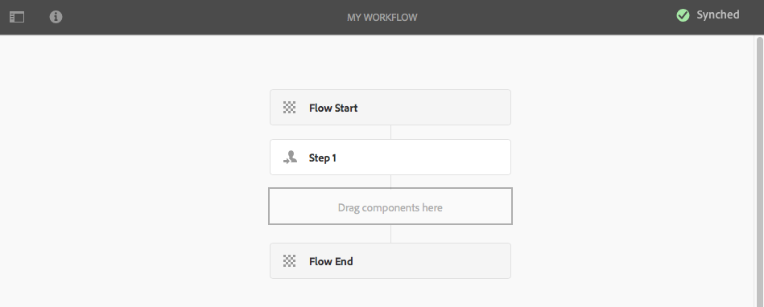
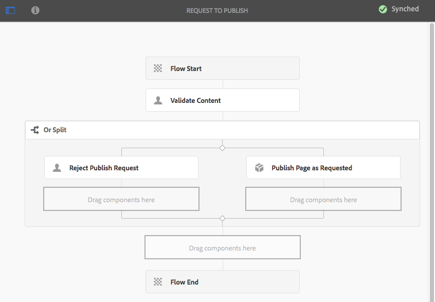

# Workflowmodellen maken{#creating-workflow-models}

>[!CAUTION]
>
>Voor gebruik van klassieke UI, zie [ AEM 6.3 documentatie ](https://helpx.adobe.com/nl/experience-manager/6-3/help/sites-developing/workflows-models.html) voor verwijzing.

U creeert het model van het a [ werkschema ](/help/sites-developing/workflows.md#model) om de reeks uitgevoerde stappen te bepalen wanneer een gebruiker het werkschema begint. U kunt ook modeleigenschappen definiëren, zoals of de workflow van voorbijgaande aard is of meerdere bronnen gebruikt.

Wanneer een gebruiker een werkschema begint, is een instantie begonnen; dit is het overeenkomstige runtime model, dat wordt gecreeerd wanneer u [ synchroniseert ](#sync-your-workflow-generate-a-runtime-model) uw veranderingen.

## Een nieuwe workflow maken {#creating-a-new-workflow}

Wanneer u voor het eerst een workflowmodel maakt, bevat dit:

* De stappen, **Begin van de Stroom** en **Eind van de Stroom**.
Deze vertegenwoordigen het begin en einde van de workflow. Deze stappen zijn vereist en kunnen niet worden bewerkt/verwijderd.
* Een voorbeeld **genoemde stap van de Deelnemer** **Stap 1**.
Deze stap wordt gevormd om een het werkpunt aan de werkschemainitiatiefnemer toe te wijzen. Bewerk of verwijder deze stap en voeg desgewenst stappen toe.

Een workflow maken met de editor:

1. Open de **Modellen van het Werkschema** console; via **Hulpmiddelen**, **Werkschema**, **Modellen** of, bijvoorbeeld: [ https://localhost:4502/aem/workflow ](https://localhost:4502/aem/workflow)
1. Selecteer **creeer**, dan **creeer Model**.
1. Het **voegt de dialoog van het Model van het Werkschema** toe verschijnt. Ga de **Titel** en **Naam** (facultatief) in alvorens **te selecteren Gedaan**.
1. Het nieuwe model wordt vermeld in de **Modellen van het Werkschema** console.
1. Selecteer uw nieuw werkschema, dan gebruik [**geeft** uit om het voor configuratie ](#editinganexistingworkflow) te openen:
   

>[!NOTE]
>
>Als u met programmacode modellen maakt (met behulp van een crx-pakket), kunt u ook een submap maken binnen:
>
>`/var/workflow/models`
>
>Bijvoorbeeld: `/var/workflow/models/prototypes`
>
>Deze omslag kan dan voor [ het leiden toegang tot de modellen in die omslag ](/help/sites-administering/workflows-managing.md#create-a-subfolder-in-var-workflow-models-and-apply-the-acl-to-that) worden gebruikt.

## Een workflow bewerken {#editing-a-workflow}

U kunt elk bestaand workflowmodel bewerken in:

* [ bepaalt stappen ](#addingasteptoamodel-) en hun [ parameters ](#configuring-a-workflow-step)
* vorm werkschemaeigenschappen, met inbegrip van [ stadia ](#configuring-workflow-stages-that-show-workflow-progress), [ of het werkschema voorbijgaand ](#creatingatransientworkflow-) is en/of [ veelvoudige middelen ](#configuring-a-workflow-for-multi-resource-support) gebruikt

Het uitgeven a [**Gebrek en/of Verouderd** (uit-van-de-doos) werkschema ](#editing-a-default-or-legacy-workflow-for-the-first-time) heeft een extra stap, om ervoor te zorgen dat a [ veilige exemplaar ](/help/sites-developing/workflows-best-practices.md#locations-workflow-models) voorafgaand aan uw veranderingen wordt genomen die worden aangebracht.

Wanneer de updates aan uw werkschema volledig zijn moet u **Synchronisatie** gebruiken **een Model van Runtime** produceren. Zie [ Synchroniseer uw Werkschema ](#sync-your-workflow-generate-a-runtime-model) voor details.

### Uw workflow synchroniseren - Een runtimemodel genereren {#sync-your-workflow-generate-a-runtime-model}

**Synchronisatie** (recht in de redacteurstoolbar) produceert a [ runtime model ](/help/sites-developing/workflows.md#runtime-model). Het runtimemodel is het model dat daadwerkelijk wordt gebruikt wanneer een gebruiker een workflow start. Als u niet **synchroniseert** uw veranderingen, dan zullen de veranderingen niet beschikbaar bij runtime zijn.

Wanneer u (of een andere gebruiker) om het even welke veranderingen in het werkschema aanbrengt moet u **Synchronisatie** gebruiken om een runtime model te produceren - zelfs wanneer de individuele dialogen (bijvoorbeeld, voor stappen) hun eigen sparen opties hebben gehad.

Wanneer de veranderingen met runtime (bewaard) model worden gesynchroniseerd, **Gesynchroniseerd** wordt in plaats daarvan getoond.

Sommige stappen hebben verplichte velden en/of ingebouwde validatie. Wanneer deze voorwaarden niet worden voldaan aan een fout wordt getoond wanneer u aan **synchronisatie** probeert het model. Bijvoorbeeld, wanneer geen deelnemer voor de stap van a **Deelnemer** is bepaald:


### Een standaardworkflow of oudere workflow voor het eerst bewerken {#editing-a-default-or-legacy-workflow-for-the-first-time}

Wanneer u a [ Gebrek en/of Verouderd model ](/help/sites-developing/workflows.md#workflow-types) voor het uitgeven opent:

* De browser Stappen is niet beschikbaar (links).
* Er is een **geeft** actie beschikbaar in de toolbar (rechterkant) uit.
* In eerste instantie worden het model en de eigenschappen ervan in de modus Alleen-lezen weergegeven als:
   * Standaardworkflows staan in `/libs`
   * Oudere workflows staan in `/etc`
Het selecteren **geeft uit** zal:
* neem een kopie van de workflow naar `/conf`
* stelt browser Stappen ter beschikking
* laten u veranderingen aanbrengen

>[!NOTE]
>
>Zie [ Plaatsen van de Modellen van het Werkschema ](/help/sites-developing/workflows-best-practices.md#locations-workflow-models) voor verdere informatie.


### Een stap toevoegen aan een model {#adding-a-step-to-a-model}

Voeg stappen aan uw model toe om de uit te voeren activiteit te vertegenwoordigen - elke stap voert een specifieke activiteit uit. Een selectie van stapcomponenten is beschikbaar in een standaard AEM instantie.

Wanneer u een model uitgeeft, verschijnen de beschikbare stappen in de diverse groepen van **browser van Stappen**. Bijvoorbeeld:


>[!NOTE]
>
>Voor informatie over de primaire stapcomponenten die met AEM geïnstalleerd zijn, zie {de Verwijzing van de Stappen van het 0} Werkschema [&#128279;](/help/sites-developing/workflows-step-ref.md).

Stappen toevoegen aan uw workflowmodel:

1. Open een bestaand workflowmodel voor bewerking. Van de **console van het Model van de Werkschema&#39;s**, selecteer het vereiste model, dan **geef** uit.
1. Open browser van Stappen; het gebruiken van **Knevel Zijpaneel**, uiterst links van de hoogste toolbar. Hier kunt u:

   * **Filter** voor specifieke stappen.
   * Gebruik de keuzelijst om de selectie te beperken tot een specifieke groep stappen.
   * Selecteer het pictogram van de Beschrijving van de Show  om meer details over de aangewezen stap te tonen.

   

1. Sleep de desbetreffende stap(en) naar de gewenste locatie in het model.

   Bijvoorbeeld, de Stap van de a **Deelnemer**.

   Zodra toegevoegd aan de stroom kunt u [ de stap ](#configuring-a-workflow-step) vormen.

   

1. Voeg zo veel stappen, of andere updates toe, zoals vereist.

   Tijdens de uitvoering worden de stappen uitgevoerd in de volgorde waarin ze in het model worden weergegeven. Nadat u de onderdelen met stappen hebt toegevoegd, kunt u deze naar een andere locatie in het model slepen.

   U kunt, bestaande stappen kopiëren knippen, kleven, groeperen of schrappen; zoals met de [ paginaredacteur.](/help/sites-authoring/editing-content.md)

   De gespleten stappen kunnen ook worden doen ineenstorten/worden uitgebreid gebruikend de toolbaroptie: 

1. Bevestig de veranderingen met **Synchronisatie** (redacteurstoolbar) om het runtime model te produceren.

   Zie [ Synchroniseer uw Werkschema ](#sync-your-workflow-generate-a-runtime-model) voor details.

### Een workflowstap configureren {#configuring-a-workflow-step}

U kunt **vormen** en het gedrag van een werkschemastap aanpassen gebruikend de **3&rbrace; dialoogvensters van de Eigenschappen van de Stap &lbrace;.**

1. Om de **dialoog van de Eigenschappen van de Stap** voor een stap te openen of:

   * Klik* *step in het werkschemamodel en selecteer **vormen** van de componententoolbar.

   * Dubbelklik op de stap.

   >[!NOTE]
   >
   >Voor informatie over de primaire stapcomponenten die met AEM geïnstalleerd zijn, zie {de Verwijzing van de Stappen van het 0} Werkschema [&#128279;](/help/sites-developing/workflows-step-ref.md).

1. Vorm de **Eigenschappen van de Stap** zoals vereist; de beschikbare eigenschappen hangen van het stappentype af, kunnen er verscheidene beschikbare lusjes ook zijn. Bijvoorbeeld, de standaard **Stap van de Deelnemer**, in een nieuw werkschema als `Step 1` aanwezig:

   

1. Bevestig uw updates met de tik.
1. Bevestig de veranderingen met **Synchronisatie** (redacteurstoolbar) om het runtime model te produceren.

   Zie [ Synchroniseer uw Werkschema ](#sync-your-workflow-generate-a-runtime-model) voor details.

### Een tijdelijke workflow maken {#creating-a-transient-workflow}

U kunt het model van het a [ Voorbijgaande ](/help/sites-developing/workflows.md#transient-workflows) werkschema tot stand brengen wanneer het creëren van een model, of door bestaande te uitgeven:

1. Open het werkschemamodel voor [ het uitgeven ](#editinganexistingworkflow).
1. Selecteer **ModelEigenschappen van het Werkschema** van de toolbar.
1. In de dialoog activeer **het Voorbijgaande Werkschema** (of deactiveer indien nodig):

   

1. Bevestig de verandering met **sparen &amp; sluit**; gevolgd door **Synchronisatie** (redacteurstoolbar) om het runtime model te produceren.

   Zie [ Synchroniseer uw Werkschema ](#sync-your-workflow-generate-a-runtime-model) voor details.

>[!NOTE]
>
>Wanneer u een werkschema in werking stelt op [ transient ](/help/sites-developing/workflows.md#transient-workflows) wijze AEM slaat geen werkschemageschiedenis op. Daarom [ toont de Chronologie ](/help/sites-authoring/basic-handling.md#timeline) geen informatie met betrekking tot dat werkschema.

## Workflowmodellen beschikbaar stellen in Touch UI {#classic2touchui}

Als een workflowmodel aanwezig is in de klassieke gebruikersinterface, maar ontbreekt in het pop-upmenu Selectie in de **[!UICONTROL Timeline]** -rail van de Touch-gebruikersinterface, volgt u de configuratie om het beschikbaar te maken. De volgende stappen illustreren het gebruik van het workflowmodel **[!UICONTROL Request for Activation]** .

1. Bevestig dat het model niet beschikbaar is in een interface met aanraakbediening. Gebruik een `/assets.html/content/dam` -pad om een element te openen. Selecteer een element. Open **[!UICONTROL Timeline]** in linkerraster. Klik op **[!UICONTROL Start Workflow]** en bevestig dat het **[!UICONTROL Request for Activation]** -model niet aanwezig is in de pop-uplijst.

1. Navigeren door **[!UICONTROL Tools > General > Tagging]** . Selecteer **[!UICONTROL Workflow]** .

1. Selecteer **[!UICONTROL Create > Create Tag]**. Stel **[!UICONTROL Title]** in op `DAM` en **[!UICONTROL Name]** op `dam` . Selecteer **[!UICONTROL Submit]** .
   

1. Navigeer naar **[!UICONTROL Tools > Workflow > Models]** . Selecteer **[!UICONTROL Request for Activation]** en selecteer vervolgens **[!UICONTROL Edit]** .

1. Selecteer **[!UICONTROL Edit]** , open het menu **[!UICONTROL Page Information]** en selecteer vervolgens **[!UICONTROL Open Properties]** en ga naar de tab **[!UICONTROL Basic]** (als deze nog niet is geopend).

1. Voeg `Workflow : DAM` toe aan **[!UICONTROL Tags]** veld. Bevestig de selectie met de controle (kruis).

1. Bevestig de toevoeging van de tag met **[!UICONTROL Save & Close]** .
    uit

1. Voltooi het proces met **[!UICONTROL Sync]** . De workflow is nu beschikbaar in de interface voor aanraakbediening.

### Een workflow configureren voor ondersteuning van meerdere bronnen {#configuring-a-workflow-for-multi-resource-support}

U kunt een werkschemamodel voor [ de Multi Steun van het Middel ](/help/sites-developing/workflows.md#multi-resource-support) vormen wanneer het creëren van een model, of door bestaande uit te geven:

1. Open het werkschemamodel voor [ het uitgeven ](#editinganexistingworkflow).
1. Selecteer **ModelEigenschappen van het Werkschema** van de toolbar.

1. In de dialoog activeer **(of deactiveer indien nodig) de Steun van het Meervoudige Middel:**

   

1. Bevestig de verandering met **sparen &amp; sluit**; gevolgd door **Synchronisatie** (redacteurstoolbar) om het runtime model te produceren.

   Zie [ Synchroniseer uw Werkschema ](#sync-your-workflow-generate-a-runtime-model) voor details.

### Werkstroomfasen configureren (die de voortgang van de workflow weergeven) {#configuring-workflow-stages-that-show-workflow-progress}

[ de Stages van het Werkschema ](/help/sites-developing/workflows.md#workflow-stages) hulp visualiseert de vooruitgang van een werkschema wanneer het behandelen van taken.

>[!CAUTION]
>
>Als de werkschemastadia in **Eigenschappen van de Pagina** worden bepaald, maar niet voor om het even welke werkschemastappen worden gebruikt, dan zal de vooruitgangsbar geen vooruitgang tonen (ongeacht de huidige werkschemastap).

De stadia die beschikbaar moeten zijn, worden gedefinieerd in de workflowmodellen; bestaande workflowmodellen kunnen worden bijgewerkt met werkgebieddefinities. U kunt een willekeurig aantal fasen voor het workflowmodel definiëren.

Om **Stages** voor uw werkschema te bepalen:

1. Open uw workflowmodel voor bewerking.
1. Selecteer **ModelEigenschappen van het Werkschema** van de toolbar. Dan open de **Stages** tabel.
1. Voeg (en positie) uw vereiste **Stages** toe. U kunt een willekeurig aantal fasen voor het workflowmodel definiëren.

   Bijvoorbeeld:

   

1. Klik **sparen &amp; Sluiten** om de eigenschappen te bewaren.
1. Wijs een werkgebied toe aan elk van de stappen in het workflowmodel. Bijvoorbeeld:

   

   Een werkgebied kan aan meerdere stappen worden toegewezen. Bijvoorbeeld:

   | **Stap** | **Stadium** |
   |---|---|
   | Stap 1 | Maken |
   | Stap 2 | Maken |
   | Stap 3 | Controleren |
   | Stap 4 | Goedkeuren |
   | Stap 5 | Goedkeuren |
   | Stap 6 | Voltooid |

1. Bevestig de veranderingen met **Synchronisatie** (redacteurstoolbar) om het runtime model te produceren.

   Zie [ Synchroniseer uw Werkschema ](#sync-your-workflow-generate-a-runtime-model) voor details.

## Een workflowmodel exporteren in een pakket {#exporting-a-workflow-model-in-a-package}

Een workflowmodel exporteren in een pakket:

1. Creeer een pakket gebruikend de [ Manager van het Pakket ](/help/sites-administering/package-manager.md#package-manager):

   1. Navigeer aan de Manager van het Pakket via **Hulpmiddelen**, **Plaatsing**, **Pakketten**.

   1. Klik **Create Pakket**.
   1. Specificeer de **Naam van het Pakket**, en om het even welke andere details zoals vereist.
   1. Klik **OK**.

1. Klik **uitgeven** op de toolbar van uw nieuw pakket.

1. Open de **Filters** tabel.

1. Selecteer **filter** toevoegen en de weg van uw werkschemamodel *ontwerp* specificeren:

   `/conf/global/settings/workflow/models/<*your-model-name*>`

   Klik **Gedaan**.

1. Selecteer **toevoegen Filter** en specificeer de weg van uw *runtime* werkschemamodel:

   `/var/workflow/models/<*your-model-name*>`

   Klik **Gedaan**.

1. Voeg extra filters toe voor om het even welke douanescripts die door uw model worden gebruikt.
1. Klik **sparen** om uw filterdefinities te bevestigen.
1. Selecteer **Bouwstijl** van de toolbar van uw pakketdefinitie.
1. Selecteer **Download** van de pakkettoolbar.

## Workflows gebruiken om formulierverzendingen te verwerken {#using-workflows-to-process-form-submissions}

U kunt een formulier configureren voor verwerking door de geselecteerde workflow. Wanneer gebruikers het formulier verzenden, wordt een nieuwe werkstroominstantie gemaakt met de gegevens van het verzenden van het formulier als lading.

U configureert als volgt de workflow die met het formulier moet worden gebruikt:

1. Maak een pagina en open deze voor bewerking.
1. Voeg de component van de a **Vorm** aan de pagina toe.
1. **vormt** de **3&rbrace; component van het Begin van de Vorm &lbrace;die in de pagina verscheen.**
1. Het Werkschema van het Begin van het gebruik **om het gewenste werkschema van die beschikbare te selecteren:**

   

1. Bevestig de nieuwe formulierconfiguratie met de tik.

## Testworkflows {#testing-workflows}

Het is een goede praktijk wanneer het testen van een werkschema om een verscheidenheid van ladingstypes te gebruiken; met inbegrip van types die verschillend zijn aan die waarvoor het is ontwikkeld. Als u bijvoorbeeld van plan bent om met Assets om te gaan, test u deze door een pagina in te stellen als een payload en controleer of er geen fouten optreden.

Test bijvoorbeeld de nieuwe workflow als volgt:

1. [ Begin uw werkschemamodel ](/help/sites-administering/workflows-starting.md) van de console.
1. Bepaal **Payload** en bevestig.

1. Voer de vereiste handelingen uit om de workflow te laten doorgaan.
1. Controleer de logbestanden terwijl de workflow wordt uitgevoerd.

U kunt AEM ook vormen om **te tonen DEBUG** berichten in de logboekdossiers. Zie [ het Registreren ](/help/sites-deploying/configure-logging.md) voor verdere informatie en wanneer de ontwikkeling wordt gebeëindigd, plaats het **Niveau van het Logboek** terug naar **Info**.

## Voorbeelden {#examples}

### Voorbeeld: een (eenvoudige) workflow maken om een aanvraag voor publicatie te accepteren of af te wijzen {#example-creating-a-simple-workflow-to-accept-or-reject-a-request-for-publication}

In het volgende voorbeeld wordt een variatie van de `Publish Example` -workflow gemaakt om enkele mogelijkheden voor het maken van een workflow te illustreren.

1. [ creeer een werkschemamodel ](#creating-a-new-workflow).

   De nieuwe workflow bevat:

   * **Begin van de Stroom**
   * `Step 1`
   * **Eind van de Stroom**

1. Verwijderen `Step 1` (omdat dit het verkeerde staptype is voor dit voorbeeld):

   * Klik op de stap en selecteer **Schrapping** van de componententoolbar. Bevestig de handeling.

1. Van de **selectie van het Werkschema** van de stappen browser, sleep de Stap van de a **Deelnemer** op het werkschema en plaats het tussen **Begin van de Stroom** en **Eind van de Stroom**.
1. U opent als volgt het dialoogvenster Eigenschappen:

   * Klik op de deelnemersstap en selecteer **vormen** van de componententoolbar.
   * Dubbelklik op de stap Deelnemer.

1. In het **Gemeenschappelijke** lusje gaat `Validate Content` voor zowel de **Titel** als **Beschrijving** in.
1. Open het **Gebruiker/Groep** lusje:

   * Activeer **bericht gebruiker via e-mail**.
   * Selecteer `Administrator` ( `admin`) voor het **Gebruiker/Groep** gebied.

   >[!NOTE]
   >
   >Voor te verzenden e-mail, [ de postdienst en de details van de gebruikersrekening moeten worden gevormd ](/help/sites-administering/notification.md).

1. Bevestig de updates met de tik.

   U wordt teruggestuurd naar het overzicht van het workflowmodel, waar de naam van de deelnemer is gewijzigd in `Validate Content` .

1. Sleep een **of Gesplitste** op het werkschema en plaats het tussen `Validate Content` en **Eind van de Stroom**.
1. Open **of Gesplitst** voor configuratie.
1. Configureren:

   * **Gemeenschappelijk**: specificeer de gespleten naam.
   * **Tak 1**: uitgezochte **StandaardRoute**.

   * **Tak 2**: zorg ervoor **StandaardRoute** niet wordt geselecteerd.

1. Bevestig uw updates aan **OF Splitst**.
1. Sleep de Stap van de a **Deelnemer** aan de linkertak, open de eigenschappen, specificeer de volgende waarden, dan bevestig de veranderingen:

   * **Titel**: `Reject Publish Request`

   * **Gebruiker/Groep**: bijvoorbeeld, `projects-administrators`

   * **deelt gebruiker via e-mail** mee: Activeer om de gebruiker te hebben die door e-mail op de hoogte wordt gebracht.

1. Sleep de Stap van het a **Proces** aan de rechtertak, open de eigenschappen, specificeer de volgende waarden, dan bevestig de veranderingen:

   * **Titel**: `Publish Page as Requested`

   * **Proces**: uitgezochte `Activate Page`. Dit proces publiceert de geselecteerde pagina naar de uitgeversinstanties.

1. Klik **Synchronisatie** (redacteurstoolbar) om het runtime model te produceren.

   Zie [ Synchroniseer uw Werkschema ](#sync-your-workflow-generate-a-runtime-model) voor details.

   Uw nieuwe workflowmodel ziet er als volgt uit:

   

1. Pas dit werkschema op uw pagina toe, zodat wanneer de gebruiker zich aan **voltooit** de **Bevestigt Inhoud** stap, zij kunnen selecteren of zij **Publish Pagina zoals Gevraagd** willen, of **het Verzoek van Publish van de Weigering**.

   

### Voorbeeld: Een regel definiëren voor een OR-splitsing met behulp van ECMA-script {#defineruleecmascript}

**OF Splitste** stappen laat u voorwaardelijke verwerkingswegen in uw werkschema introduceren.

Ga als volgt te werk om een OR-regel te definiëren:

1. Maak twee scripts en sla deze op in de repository, bijvoorbeeld onder:

   `/apps/myapp/workflow/scripts`

   >[!NOTE]
   >
   >De manuscripten moeten a [ functie `check()`](#function-check) hebben die een booleaanse winst.

1. Bewerk het werkschema en voeg **OF Gesplitst** aan het model toe.
1. Bewerk de eigenschappen van **Tak 1** van **OF Gesplitst**:

   * Bepaal dit als **StandaardRoute** door de **Waarde** aan `true` te plaatsen.

   * Als **Regel**, plaats de weg aan het manuscript. Bijvoorbeeld:

     `/apps/myapp/workflow/scripts/myscript1.ecma`

   >[!NOTE]
   >
   >U kunt de vertakkingsvolgorde desgewenst wijzigen.

1. Bewerk de eigenschappen van **Tak 2** van **OF Splitst**.

   * Als **Regel**, plaats de weg aan het andere manuscript. Bijvoorbeeld:

     `/apps/myapp/workflow/scripts/myscript2.ecma`

1. Stel de eigenschappen van de afzonderlijke stappen in elke vertakking in. Zorg ervoor de **Gebruiker/Groep** wordt geplaatst.
1. Klik **Synchronisatie** (redacteurstoolbar) om uw veranderingen in het runtime model voort te zetten.

   Zie [ Synchroniseer uw Werkschema ](#sync-your-workflow-generate-a-runtime-model) voor details.

#### Functie check() {#function-check}

>[!NOTE]
>
>Zie [ Gebruikend ECMAScript ](/help/sites-developing/workflows-customizing-extending.md#using-ecmascript).

Het volgende voorbeeldscript retourneert `true` als het knooppunt een `JCR_PATH` onder `/content/we-retail/us/en` is:

```
function check() {
    if (workflowData.getPayloadType() == "JCR_PATH") {
      var path = workflowData.getPayload().toString();
      var node = jcrSession.getItem(path);

      if (node.getPath().indexOf("/content/we-retail/us/en") >= 0) {
       return true;
      } else {
       return false;
      }
     } else {
      return false;
     }
}
```

### Voorbeeld: Aangepast verzoek om activering {#example-customized-request-for-activation}

U kunt om het even welke uit-van-de-doos workflows aanpassen. Voor een aangepast gedrag bedekt u de details van de juiste workflow.

Bijvoorbeeld, **Verzoek om Activering**. Dit werkschema wordt gebruikt voor het publiceren van pagina&#39;s binnen **Plaatsen** en wordt automatisch teweeggebracht wanneer een inhoudsauteur niet de aangewezen replicatierechten heeft. Zie [ het Aanpassen van de Authoring van de Pagina - het Verzoek om het Werkschema van de Activering ](/help/sites-developing/customizing-page-authoring-touch.md#customizing-the-request-for-activation-workflow) voor verdere details aanpassen.
