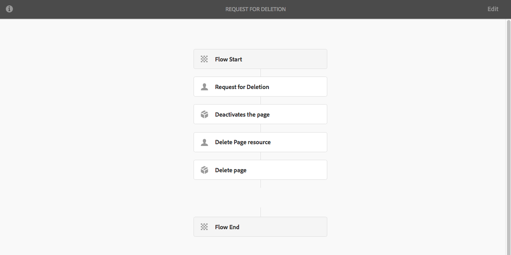

# Workflowmodellen maken{#creating-workflow-models}

>[!CAUTION]
>
>Voor gebruik van de klassieke interface raadpleegt u de [AEM 6.3 documentatie](https://helpx.adobe.com/experience-manager/6-3/help/sites-developing/workflows-models.html) ter referentie.

U maakt een [workflowmodel](/help/sites-developing/workflows.md#model) om de reeks stappen te definiëren die worden uitgevoerd wanneer een gebruiker de workflow start. U kunt ook modeleigenschappen definiëren, zoals of de workflow van voorbijgaande aard is of meerdere bronnen gebruikt.

Wanneer een gebruiker een workflow start, wordt een instantie gestart; Dit is het corresponderende runtimemodel dat wordt gemaakt wanneer u uw wijzigingen [Sync](#sync-your-workflow-generate-a-runtime-model) wijzigt.

## Een nieuwe workflow maken {#creating-a-new-workflow}

Wanneer u voor het eerst een nieuw workflowmodel maakt, bevat dit model:

* De stappen, **Stroom Start** en **Stroom End**.
Deze vertegenwoordigen het begin en einde van de workflow. Deze stappen zijn vereist en kunnen niet worden bewerkt/verwijderd.
* Een voorbeeld **Deelnemer** stap genoemd **Stap 1**.
Deze stap wordt gevormd om een het werkpunt aan de werkschemainitiatiefnemer toe te wijzen. Bewerk of verwijder deze stap en voeg desgewenst stappen toe.

Een nieuwe workflow maken met de editor:

1. Open de **Workflowmodellen**-console; via **Tools**, **Workflow**, **Modellen** of, bijvoorbeeld: [https://localhost:4502/aem/workflow](https://localhost:4502/aem/workflow)
1. Selecteer **Maken** en **Model** maken.
1. Het dialoogvenster **Werkstroommodel toevoegen** wordt weergegeven. Voer de **Titel** en **Naam** (optioneel) in voordat u **Done** selecteert.
1. Het nieuwe model wordt vermeld in **Werkschemamodellen** console.
1. Selecteer uw nieuwe werkschema, dan gebruik [**uitgeven** om het voor configuratie](#editinganexistingworkflow) te openen:
   

>[!NOTE]
>
>Als u met programmacode modellen maakt (met behulp van een crx-pakket), kunt u ook een submap maken binnen:
>
>`/var/workflow/models`
>
>Bijvoorbeeld, `/var/workflow/models/prototypes`
>
>Deze map kan vervolgens worden gebruikt voor [het beheren van de toegang tot de modellen in die map](/help/sites-administering/workflows-managing.md#create-a-subfolder-in-var-workflow-models-and-apply-the-acl-to-that).

## Een workflow bewerken {#editing-a-workflow}

U kunt elk bestaand workflowmodel bewerken in:

* [definiëren van ](#addingasteptoamodel-) stappen en hun  [parameters](#configuring-a-workflow-step)
* workfloweigenschappen configureren, waaronder [stage](#configuring-workflow-stages-that-show-workflow-progress), [of de workflow van voorbijgaande aard is](#creatingatransientworkflow-) en/of [meerdere bronnen gebruikt](#configuring-a-workflow-for-multi-resource-support)

Het uitgeven van [**Standaard en/of Verouderd** (uit-van-de-doos) werkschema](#editing-a-default-or-legacy-workflow-for-the-first-time) heeft een extra stap, om ervoor te zorgen dat een [veilige exemplaar ](/help/sites-developing/workflows-best-practices.md#locations-workflow-models) wordt genomen alvorens uw veranderingen wordt aangebracht.

Wanneer updates van uw werkschema volledig zijn moet u **Sync** aan **Genereer een Model van Runtime** gebruiken. Zie [Uw workflow synchroniseren](#sync-your-workflow-generate-a-runtime-model) voor meer informatie.

### Synchroniseer uw Workflow - Genereer een Runtime Model {#sync-your-workflow-generate-a-runtime-model}

**Met Sync**  (rechts op de editor-werkbalk) wordt een  [runtimemodel](/help/sites-developing/workflows.md#runtime-model) gegenereerd. Het runtimemodel is het model dat daadwerkelijk wordt gebruikt wanneer een gebruiker een workflow start. Als u uw wijzigingen niet **Sync**, dan zijn de wijzigingen niet beschikbaar bij uitvoering.

Wanneer u (of een andere gebruiker) wijzigingen aanbrengt in de workflow, moet u **Sync** gebruiken om een runtimemodel te genereren, zelfs wanneer afzonderlijke dialoogvensters (bijvoorbeeld voor stappen) hun eigen opslagopties hebben.

Wanneer de wijzigingen worden gesynchroniseerd met het (opgeslagen) runtimemodel, wordt in plaats daarvan **Synched** weergegeven.

Sommige stappen hebben verplichte velden en/of ingebouwde validatie. Wanneer aan deze voorwaarden niet wordt voldaan, wordt een fout weergegeven wanneer u het model **Sync** probeert te synchroniseren. Wanneer bijvoorbeeld geen deelnemer is gedefinieerd voor een stap **Deelnemer**:


### Een standaard- of verouderde workflow voor het eerst bewerken {#editing-a-default-or-legacy-workflow-for-the-first-time}

Wanneer u een [Standaard en/of Verouderd model](/help/sites-developing/workflows.md#workflow-types) voor het uitgeven opent:

* De browser Stappen is niet beschikbaar (links).
* Er is een **Handeling Edit** beschikbaar in de toolbar (rechterkant).
* In eerste instantie worden het model en de eigenschappen ervan in de modus Alleen-lezen weergegeven als:
   * Standaardworkflows bevinden zich in `/libs`
   * Verouderde workflows bevinden zich in `/etc`
Selecteren 
**** Editwill:
* een kopie van de workflow opnemen in `/conf`
* stelt browser Stappen ter beschikking
* laten u toe om veranderingen aan te brengen

>[!NOTE]
>
>Zie [Locaties van workflowmodellen](/help/sites-developing/workflows-best-practices.md#locations-workflow-models) voor meer informatie.



### Een stap toevoegen aan een model {#adding-a-step-to-a-model}

U moet stappen aan uw model toevoegen om de uit te voeren activiteit te vertegenwoordigen - elke stap voert een specifieke activiteit uit. Een selectie van stapcomponenten is beschikbaar in een standaard AEM instantie.

Wanneer u een model uitgeeft, verschijnen de beschikbare stappen in de diverse groepen van **browser van Stappen**. Bijvoorbeeld:


>[!NOTE]
>
>Voor informatie over de primaire stapcomponenten die met AEM worden geïnstalleerd, zie [Referentie van de Stappen van het Werkschema](/help/sites-developing/workflows-step-ref.md).

Stappen toevoegen aan uw workflowmodel:

1. Open een bestaand workflowmodel voor bewerking. Selecteer in de **Workflows Model**-console het vereiste model en **Edit**.
1. Open de browser Stappen; met **Zijpaneel in-/uitschakelen**, helemaal links van de bovenste werkbalk. Hier kunt u:

   * **Voor specifieke stappen** filteren.
   * Gebruik de keuzelijst om de selectie te beperken tot een specifieke groep stappen.
   * Selecteer het pictogram Beschrijving tonen  om meer details over de aangewezen stap te tonen.

   

1. Sleep de desbetreffende stap(en) naar de gewenste locatie in het model.

   Bijvoorbeeld een **Deelnemerstap**.

   Zodra toegevoegd aan de stroom kunt u [de stap](#configuring-a-workflow-step) vormen.

   

1. Voeg zo veel stappen, of andere updates toe, zoals vereist.

   Tijdens de uitvoering worden de stappen uitgevoerd in de volgorde waarin ze in het model worden weergegeven. Nadat u de onderdelen met stappen hebt toegevoegd, kunt u deze naar een andere locatie in het model slepen.

   U kunt ook bestaande stappen kopiëren, knippen, plakken, groeperen of verwijderen. zoals met de [paginaredacteur.](/help/sites-authoring/editing-content.md)

   Gesplitste stappen kunnen ook worden samengevouwen/uitgevouwen met de werkbalkoptie: 

1. Bevestig de wijzigingen met **Sync** (editorwerkbalk) om het runtimemodel te genereren.

   Zie [Uw workflow synchroniseren](#sync-your-workflow-generate-a-runtime-model) voor meer informatie.

### Een workflowstap {#configuring-a-workflow-step} configureren

U kunt **Configureren** en het gedrag van een werkschemastap aanpassen gebruikend **Step Properties** dialoogvensters.

1. U opent als volgt het dialoogvenster **Step Properties** voor een stap:

   * Klik/tik de * stap in het werkschemamodel en selecteer **Configure** van de componententoolbar.

   * Dubbelklik op de stap.
   >[!NOTE]
   >
   >Voor informatie over de primaire stapcomponenten die met AEM worden geïnstalleerd, zie [Referentie van de Stappen van het Werkschema](/help/sites-developing/workflows-step-ref.md).

1. Configureer de **Step Properties** naar wens; Welke eigenschappen beschikbaar zijn, is afhankelijk van het type stap. Er kunnen ook verschillende tabbladen beschikbaar zijn. Bijvoorbeeld, het gebrek **Stap van de Deelnemer**, in een nieuwe werkschema als `Step 1` aanwezig:

   

1. Bevestig uw updates met de tik.
1. Bevestig de wijzigingen met **Sync** (editorwerkbalk) om het runtimemodel te genereren.

   Zie [Uw workflow synchroniseren](#sync-your-workflow-generate-a-runtime-model) voor meer informatie.

### Een tijdelijk werkschema maken {#creating-a-transient-workflow}

U kunt een [transient](/help/sites-developing/workflows.md#transient-workflows) werkschemamodel tot stand brengen wanneer het creëren van een nieuw model, of door bestaande uit te geven:

1. Open het workflowmodel voor [bewerken](#editinganexistingworkflow).
1. Selecteer **Eigenschappen workflowmodel** op de werkbalk.
1. Activeer **Tijdelijke workflow** in het dialoogvenster (of deactiveer indien nodig):

   

1. Bevestig de wijziging met **Opslaan en sluiten**; gevolgd door **Sync** (editorwerkbalk) om het runtimemodel te genereren.

   Zie [Uw workflow synchroniseren](#sync-your-workflow-generate-a-runtime-model) voor meer informatie.

>[!NOTE]
>
>Wanneer u een werkschema in [transient](/help/sites-developing/workflows.md#transient-workflows) wijze in werking stelt AEM slaat geen werkschemageschiedenis op. Daarom geeft [Timeline](/help/sites-authoring/basic-handling.md#timeline) geen informatie weer met betrekking tot die workflow. [](/help/sites-authoring/basic-handling.md#timeline)

## Workflowmodellen beschikbaar maken in Touch UI {#classic2touchui}

Als een workflowmodel aanwezig is in de klassieke gebruikersinterface, maar ontbreekt in het pop-upmenu voor selectie in de **[!UICONTROL Timeline]**-rail van de aanraakinterface, volgt u de configuratie om het beschikbaar te maken. De volgende stappen illustreren het gebruiken van het werkschemamodel genoemd **[!UICONTROL Request for Activation]**.

1. Bevestig dat het model niet beschikbaar is in een interface met aanraakbediening. Benader een element via het pad `/assets.html/content/dam`. Selecteer een element. Open **[!UICONTROL Timeline]** in linkerspoor. Klik **[!UICONTROL Start Workflow]** en bevestig dat het model **[!UICONTROL Request for Activation]** niet aanwezig in popup lijst is.

1. Navigeer door **[!UICONTROL Tools > General > Tagging]**. Selecteer **[!UICONTROL Workflow]**.

1. Selecteer **[!UICONTROL Create > Create Tag]**. Stel **[!UICONTROL Title]** in als `DAM` en **[!UICONTROL Name]** als `dam`. Selecteer **[!UICONTROL Submit]**.
   

1. Ga naar **[!UICONTROL Tools > Workflow > Models]**. Selecteer **[!UICONTROL Request for Activation]** en selecteer **[!UICONTROL Edit]**.

1. Selecteer **[!UICONTROL Edit]**, open het **[!UICONTROL Page Information]** menu, en selecteer **[!UICONTROL Open Properties]** en ga naar het **[!UICONTROL Basic]** lusje (als niet reeds open).

1. Voeg `Workflow : DAM` aan **[!UICONTROL Tags]** gebied toe. Bevestig de selectie met de controle (kruis).

1. Bevestig de toevoeging van de tag met **[!UICONTROL Save & Close]**.
   

1. Voltooi het proces met **[!UICONTROL Sync]**. De workflow is nu beschikbaar in de interface voor aanraakbediening.

### Een workflow configureren voor ondersteuning van meerdere bronnen {#configuring-a-workflow-for-multi-resource-support}

U kunt een workflowmodel configureren voor [Ondersteuning voor meerdere bronnen](/help/sites-developing/workflows.md#multi-resource-support) bij het maken van een nieuw model of door een bestaand model te bewerken:

1. Open het workflowmodel voor [bewerken](#editinganexistingworkflow).
1. Selecteer **Eigenschappen workflowmodel** op de werkbalk.

1. Activeer **Ondersteuning voor meerdere bronnen** in het dialoogvenster (of deactiveer indien nodig):

   

1. Bevestig de wijziging met **Opslaan en sluiten**; gevolgd door **Sync** (editorwerkbalk) om het runtimemodel te genereren.

   Zie [Uw workflow synchroniseren](#sync-your-workflow-generate-a-runtime-model) voor meer informatie.

### Werkstroomfasen configureren (die de voortgang van het werkschema weergeven) {#configuring-workflow-stages-that-show-workflow-progress}

[Workflowwerkstroomoverzicht ](/help/sites-developing/workflows.md#workflow-stages) visualiseert de voortgang van een workflow bij het uitvoeren van taken.

>[!CAUTION]
>
>Als werkstroomfasen zijn gedefinieerd in **Pagina-eigenschappen**, maar niet worden gebruikt voor een van de werkstroomstappen, wordt op de voortgangsbalk geen voortgang weergegeven (ongeacht de huidige werkstroomstap).

De stadia die beschikbaar moeten zijn, worden gedefinieerd in de workflowmodellen; bestaande workflowmodellen kunnen worden bijgewerkt met werkgebieddefinities. U kunt een willekeurig aantal fasen voor het workflowmodel definiëren.

**Stages** voor uw werkschema bepalen:

1. Open uw workflowmodel voor bewerking.
1. Selecteer **Eigenschappen workflowmodel** op de werkbalk. Open vervolgens het tabblad **Stages**.
1. Voeg (en plaats) uw vereiste **Stages** toe. U kunt een willekeurig aantal fasen voor het workflowmodel definiëren.

   Bijvoorbeeld:

   

1. Klik **Opslaan en sluiten** om de eigenschappen op te slaan.
1. Wijs een werkgebied aan elk van de stappen in het werkschemamodel toe. Bijvoorbeeld:

   

   Een werkgebied kan aan meerdere stappen worden toegewezen. Bijvoorbeeld:

   | **Stap** | **Werkgebied** |
   |---|---|
   | Stap 1 | Maken |
   | Stap 2 | Maken |
   | Stap 3 | Controleren |
   | Stap 4 | Goedkeuren |
   | Stap 5 | Goedkeuren |
   | Stap 6 | Voltooid |

1. Bevestig de wijzigingen met **Sync** (editorwerkbalk) om het runtimemodel te genereren.

   Zie [Uw workflow synchroniseren](#sync-your-workflow-generate-a-runtime-model) voor meer informatie.

## Een workflowmodel exporteren in een pakket {#exporting-a-workflow-model-in-a-package}

Een workflowmodel exporteren in een pakket:

1. Maak een nieuw pakket met de [Package Manager](/help/sites-administering/package-manager.md#package-manager):

   1. Navigeer naar Pakketbeheer via **Extra**, **Implementatie**, **Pakketten**.

   1. Klik **Pakket maken**.
   1. Geef de **Pakketnaam** op en geef desgewenst andere gegevens op.
   1. Klik **OK**.

1. Klik op **Bewerken** op de werkbalk van het nieuwe pakket.

1. Open het tabblad **Filters**.

1. Selecteer **Filter toevoegen** en geef het pad van uw workflowmodel op *ontwerp*:

   `/conf/global/settings/workflow/models/<*your-model-name*>`

   Klik **Done**.

1. Selecteer **Filter toevoegen** en geef het pad op van uw *runtime*-workflowmodel:

   `/var/workflow/models/<*your-model-name*>`

   Klik **Done**.

1. Voeg extra filters toe voor om het even welke douanescripts die door uw model worden gebruikt.
1. Klik **Save** om uw filterdefinities te bevestigen.
1. Selecteer **Build** in de werkbalk van de pakketdefinitie.
1. Selecteer **Download** van de pakkettoolbar.

## Workflows gebruiken om formulierverzendingen te verwerken {#using-workflows-to-process-form-submissions}

U kunt een formulier configureren voor verwerking door de geselecteerde workflow. Wanneer gebruikers het formulier verzenden, wordt een nieuwe werkstroominstantie gemaakt met de gegevens van het verzenden van het formulier als lading.

U configureert als volgt de workflow die met het formulier moet worden gebruikt:

1. Maak een nieuwe pagina en open deze voor bewerking.
1. Voeg een **Form** component aan de pagina toe.
1. **Configureer** de  **component Start van** formulier die op de pagina werd weergegeven.
1. Gebruik **Workflow starten** om de gewenste workflow te selecteren uit de beschikbare workflows:

   

1. Bevestig de nieuwe formulierconfiguratie met de tik.

## Workflows testen {#testing-workflows}

Het is een goede praktijk wanneer het testen van een werkschema om een verscheidenheid van ladingstypes te gebruiken; met inbegrip van typen die verschillen van de soorten waarvoor zij is ontwikkeld. Als u bijvoorbeeld van plan bent om in uw workflow te werken met Elementen, test u deze door een Pagina in te stellen als een payload en controleer of er geen fouten optreden.

Test bijvoorbeeld de nieuwe workflow als volgt:

1. [Start uw workflowmodel ](/help/sites-administering/workflows-starting.md) vanuit de console.
1. Definieer de **Payload** en bevestig deze.

1. Voer de vereiste handelingen uit zodat de workflow doorgaat.
1. Controleer de logbestanden terwijl de workflow wordt uitgevoerd.

U kunt ook AEM configureren om **DEBUG**-berichten weer te geven in de logbestanden. Zie [Logboekregistratie](/help/sites-deploying/configure-logging.md) voor meer informatie en wanneer de ontwikkeling wordt gebeëindigd, plaats **Logniveau** terug aan **Info**.

## Voorbeelden {#examples}

### Voorbeeld: Een (eenvoudige) workflow maken om een verzoek om publicatie te accepteren of af te wijzen {#example-creating-a-simple-workflow-to-accept-or-reject-a-request-for-publication}

Om enkele mogelijkheden te illustreren om een werkschema tot stand te brengen, leidt het volgende voorbeeld tot een variatie van de `Publish Example` werkschema.

1. [Maak een nieuw workflowmodel](#creating-a-new-workflow).

   De nieuwe workflow bevat:

   * **Stroom starten**
   * `Step 1`
   * **Einde stroom**

1. `Step 1` verwijderen (omdat dit het verkeerde staptype is voor dit voorbeeld):

   * Klik op de stap en selecteer **Delete** van de componententoolbar. Bevestig de handeling.

1. Van **Workflow** selectie van de stappen browser, sleep een **Stap van de Deelnemer** op het werkschema en plaats het tussen **Begin van de Stroom** en **Eind van de Stroom**.
1. U opent als volgt het dialoogvenster Eigenschappen:

   * Klik op de deelnemersstap en selecteer **Configure** van de componententoolbar.
   * Dubbelklik op de stap voor deelnemers.

1. Typ op het tabblad **Algemeen** `Validate Content` voor zowel de **Titel** als **Beschrijving**.
1. Open het tabblad **Gebruiker/Groep**:

   * Activeer **De gebruiker via e-mail op de hoogte stellen**.
   * Selecteer `Administrator` ( `admin`) voor het **Gebruiker/Groep** gebied.

   >[!NOTE]
   >
   >Voor het verzenden van e-mails moeten [de mailservice en gegevens van de gebruikersaccount worden geconfigureerd](/help/sites-administering/notification.md).

1. Bevestig de updates met de tik.

   U wordt teruggestuurd naar het overzicht van het workflowmodel, waar de naam van de deelnemer is gewijzigd in `Validate Content`.

1. Sleep een **Of Splitsen** naar de werkstroom en plaats deze tussen `Validate Content` en **Stroomeinde**.
1. Open **Of Splitsen** voor configuratie.
1. Configureren:

   * **Vaak**: Geef de naam van de splitsing op.
   * **Tak 1**: Selecteer  **StandaardRoute**.

   * **Tak 2**: zorgt ervoor dat  **Standaard** routers niet is geselecteerd.

1. Bevestig uw updates aan **OF Split**.
1. Sleep een **Stap van de Deelnemer** aan de linkertak, open de eigenschappen, specificeer de volgende waarden, dan bevestig de veranderingen:

   * **Titel**:  `Reject Publish Request`

   * **Gebruiker/groep**: bijvoorbeeld:  `projects-administrators`

   * **Gebruikers via e-mail** op de hoogte stellen: Activeer deze functie om de gebruiker per e-mail op de hoogte te stellen.

1. Sleep een **Processtap** naar de rechtervertakking, open de eigenschappen, geef de volgende waarden op en bevestig de wijzigingen:

   * **Titel**:  `Publish Page as Requested`

   * **Proces**: selecteren  `Activate Page`. Dit proces publiceert de geselecteerde pagina naar de uitgeversinstanties.

1. Klik **Sync** (redacteurstoolbar) om het runtime model te produceren.

   Zie [Uw workflow synchroniseren](#sync-your-workflow-generate-a-runtime-model) voor meer informatie.

   Uw nieuwe workflowmodel ziet er als volgt uit:

   

1. Pas deze workflow toe op uw pagina, zodat wanneer de gebruiker naar **Complete** de stap **Inhoud valideren** gaat, deze kan aangeven of de gebruiker **Pagina publiceren wilt als Gevraagd** of **Publicatieverzoek afwijzen**.

   

### Voorbeeld: Een regel definiëren voor een OR-splitsing met ECMA-script {#defineruleecmascript}

**OF met** Splitstappen kunt u voorwaardelijke verwerkingspaden in uw workflow introduceren.

Ga als volgt te werk om een OR-regel te definiëren:

1. Maak twee scripts en sla deze op in de repository, bijvoorbeeld onder:

   `/apps/myapp/workflow/scripts`

   >[!NOTE]
   >
   >De scripts moeten een [functie `check()`](#function-check) hebben die een booleaanse waarde retourneert.

1. Bewerk de workflow en voeg **OF Splitsen** toe aan het model.
1. Bewerk de eigenschappen van **Tak 1** van **OF Split**:

   * Definieer dit als **Standaardroute** door **Waarde** aan `true` te plaatsen.

   * Als **Regel**, plaats de weg aan het manuscript. Bijvoorbeeld:
      `/apps/myapp/workflow/scripts/myscript1.ecma`
   >[!NOTE]
   >
   >U kunt de vertakkingsvolgorde desgewenst wijzigen.

1. Bewerk de eigenschappen van **Tak 2** van **OR Split**.

   * Als **Regel**, plaats de weg aan het andere manuscript. Bijvoorbeeld:
      `/apps/myapp/workflow/scripts/myscript2.ecma`

1. Stel de eigenschappen van de afzonderlijke stappen in elke vertakking in. Zorg ervoor **Gebruiker/Groep** wordt geplaatst.
1. Klik **Sync** (redacteurstoolbar) om uw veranderingen in het runtime model voort te zetten.

   Zie [Uw workflow synchroniseren](#sync-your-workflow-generate-a-runtime-model) voor meer informatie.

#### Functiecontrole() {#function-check}

>[!NOTE]
>
>Zie [ECMAScript](/help/sites-developing/workflows-customizing-extending.md#using-ecmascript) gebruiken.

Het volgende voorbeeldscript retourneert `true` als het knooppunt een `JCR_PATH` onder `/content/we-retail/us/en` is:

```
function check() {
    if (workflowData.getPayloadType() == "JCR_PATH") {
      var path = workflowData.getPayload().toString();
      var node = jcrSession.getItem(path);

      if (node.getPath().indexOf("/content/we-retail/us/en") >= 0) {
       return true;
      } else {
       return false;
      }
     } else {
      return false;
     }
}
```

### Voorbeeld: Aangepast verzoek om activering {#example-customized-request-for-activation}

U kunt om het even welke uit-van-de-doos workflows aanpassen. Voor aangepast gedrag bedekt u de details van de juiste workflow.

Bijvoorbeeld **Verzoek om activering**. Deze workflow wordt gebruikt voor het publiceren van pagina&#39;s binnen **Sites** en wordt automatisch geactiveerd wanneer een auteur van inhoud niet de juiste replicatierechten heeft. Zie [Paginaontwerp aanpassen - Het verzoek om activeringsworkflow aanpassen](/help/sites-developing/customizing-page-authoring-touch.md#customizing-the-request-for-activation-workflow) voor meer informatie.
