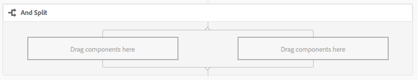
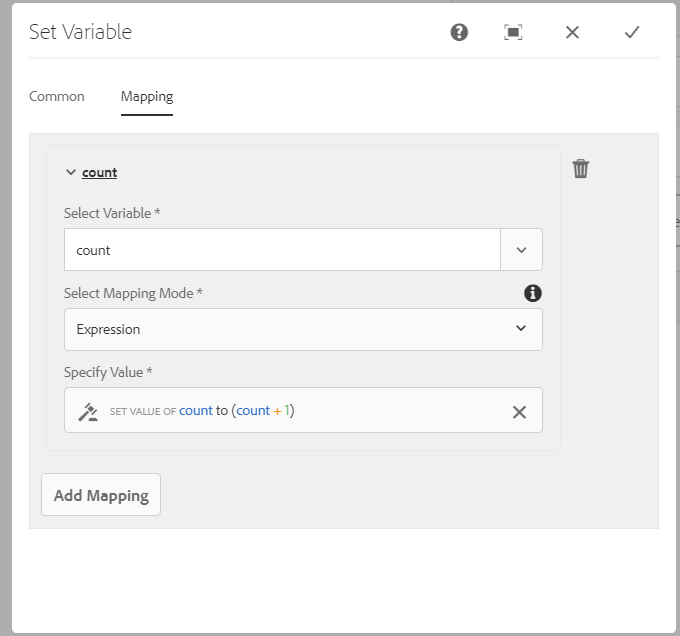

# Referentie workflowstap {#workflow-step-reference}

De modellen van het werkschema bestaan uit een reeks stappen van diverse types. Volgens het type, kunnen deze stappen met parameters en manuscripten worden gevormd en worden uitgebreid om de functionaliteit te verstrekken en de controle u vereist.

>[!NOTE]
>
>In deze sectie worden de standaardworkflowstappen beschreven.
>
>Raadpleeg de volgende secties voor modulespecifieke stappen:
>
>* [ Verwijzing van de Stap van de Werkstroom van AEM Forms ](/help/forms/using/aem-forms-workflow-step-reference.md)
>* [ het Verwerken Assets die de Managers en de Werkschema&#39;s van Media gebruiken ](/help/assets/media-handlers.md)
>

## Step Properties {#step-properties}

Elke stapcomponent heeft de dialoog van de Eigenschappen van de a **Stap** die u de vereiste eigenschappen laat bepalen en uitgeven.

### Step Properties - Common tab {#step-properties-common-tab}

Een combinatie van de volgende eigenschappen is beschikbaar voor de meeste componenten van de werkschemasstap, op het **Gemeenschappelijke** lusje van de eigenschappendialoog:

* **Titel**
De titel voor de stap.

* **Beschrijving**
Een beschrijving van de stap.

* **Werkgebied van het Werkschema**

  Een drop-down selecteur om a [ Stadium ](/help/sites-developing/workflows.md#workflow-stages) op de stap toe te passen.

* **Onderbreking**

  De periode waarna de stap &quot;uitkomt&quot;.
U kunt tussen selecteren: **Van**, **Onmiddellijk**, **1h**, **6h**, **12h**, **24h**.

* **manager van de Onderbreking**

  De manager die het werkschema controleert wanneer de staptijden uit. Bijvoorbeeld: `Auto Advancer`

* **Bewegende Handler**

  Selecteer deze optie als u de workflow na de uitvoering automatisch wilt laten terugkeren naar de volgende stap. Als deze optie niet is geselecteerd, moet het implementatiescript de voortgang van de workflow afhandelen.

### Step Properties - User/Group tab {#step-properties-user-group-tab}

De volgende eigenschappen zijn beschikbaar voor vele componenten van de werkschemastap, op het **Gebruiker/Groep** lusje van de eigenschappendialoog:

* **Melden gebruiker via e-mail**

   * Deelnemers op de hoogte stellen door hen een e-mail te sturen wanneer de werkstroom de stap bereikt.
   * Als toegelaten, wordt een e-mail verzonden naar de gebruiker die door het bezit **wordt bepaald Gebruiker/Groep**, of naar elk lid van de groep als een groep wordt bepaald.

* **Gebruiker/Groep**

   * Met een keuzelijst kunt u naar een gebruiker of groep navigeren en deze selecteren.
   * Als u de stap aan een specifieke gebruiker toewijst, dan slechts kan deze gebruiker op de stap handelen.
   * Als u de stap aan een volledige groep toewijst, toen wanneer het werkschema deze stap bereikt, hebben alle gebruikers in deze groep de actie in hun **Inbox van het Werkschema**.
   * Zie [ Deelnemend in Werkschema&#39;s ](/help/sites-authoring/workflows-participating.md) voor meer informatie.

## EN splitsen {#and-split}

**EN Splitst** leidt tot een spleet in het werkschema, waarna beide takken actief zijn. U voegt workflowstappen naar wens toe aan elke vertakking. Met deze stap kunt u meerdere verwerkingspaden in de workflow opnemen. U kunt bijvoorbeeld toestaan dat bepaalde stappen van de revisie parallel worden uitgevoerd, wat tijd bespaart.



### EN Splitsen - Configuratie {#and-split-configuration}

De splitsing configureren:

* Bewerk **EN Gesplitste Eigenschappen**:

   * **Gesplitste Naam**: wijs een naam voor verklarende doeleinden toe
   * Selecteer het aantal vereiste vertakkingen; 2, 3, 4 of 5.

* Voeg zo nodig workflowstappen toe aan de vertakkingen.

  

## Containerstap {#container-step}

Een containerstap start een ander workflowmodel dat wordt uitgevoerd als een onderliggende workflow.

Met deze container kunt u workflowmodellen opnieuw gebruiken om algemene stappen te implementeren. Een workflowmodel voor vertaling kan bijvoorbeeld worden gebruikt in meerdere bewerkingsworkflows.


### Containerstap - Configuratie {#container-step-configuration}

Om de stap te vormen, geef en gebruik de volgende lusjes uit:

* [Vaak](#step-properties-common-tab)
* **Container**

   * **SubWerkschema**: Selecteer het werkschema om te beginnen.

## Ga naar stap {#goto-step}

**Goto Stap** laat u de volgende stap specificeren in het werkschemamodel uit te voeren. U kunt een regeldefinitie, extern manuscript, of een manuscript ECMA als verpletterende uitdrukking specificeren om de volgende stap voor het werkschemamodel te evalueren.

* Als de voorwaarde die u specificeert waar houdt, **gaat Stap** voltooien en de werkschemamotor voert de gespecificeerde stap uit.
* Als de voorwaarde die u specificeert niet waar houdt, **gaat Stap** voltooien en de normale verpletterende logica bepaalt de volgende uit te voeren stap.

De **Goto Stap** laat u toe om geavanceerde verpletterende structuren in uw werkschemamodellen uit te voeren. Bijvoorbeeld, om een lijn uit te voeren, kan de **Goto Stap** worden bepaald om een vroegere stap in het werkschema, met de verpletterende uitdrukking uit te voeren die een lijnvoorwaarde evalueert.

### Ga naar stap - Configuratie {#goto-step-configuration}

Om de stap te vormen, geef en gebruik de volgende lusjes uit:

* [Vaak](#step-properties-common-tab)
* **Proces**

   * **stap van het Doel**: Selecteer de stap na het evalueren van de voorwaarde voor de verpletterende uitdrukking uit te voeren.
   * **Verpletterend Uitdrukking**: Selecteer de Definitie van de Regel, Extern Manuscript, of een manuscript ECMA dat of bepaalt om de **Stap van het Doel** uit te voeren.

      * **Definitie van de Regel:** Gebruik de [ uitdrukkingsredacteur ](/help/forms/using/variable-in-aem-workflows.md#use-expression-editor) om de regel te bepalen.
      * **Extern Manuscript:** de weg van het externe manuscript.
      * **Manuscript ECMA**: Het manuscript dat bepaalt of om **te voeren gaat Stap**.

#### Een lus voor lus simuleren {#simulating-a-for-loop}

Wanneer u een lus &quot;for&quot; simuleert, moet u een telling bijhouden van het aantal herhalingen van lus dat is opgetreden:

* De telling vertegenwoordigt typisch een index van punten die op in het werkschema worden gehandeld.
* De telling wordt geëvalueerd als uitgangscriteria van de lijn.

Als u bijvoorbeeld een workflow wilt implementeren die een handeling uitvoert op verschillende JCR-knooppunten, kunt u een lusteller gebruiken als index voor de knooppunten. Als u het aantal wilt behouden, slaat u een `integer` -waarde op in de gegevenskaart van de werkstroominstantie. Om de telling te verhogen en de telling met de uitgangscriteria te vergelijken, gebruik het manuscript van de **Goto Stap**.

```
function check(){
   var count=0;
   var keyname="loopcount"
   try{
      if (workflowData.getMetaDataMap().containsKey(keyname)){
        log.info("goto script: found loopcount key");
        count= parseInt(workflowData.getMetaDataMap().get(keyname))+1;
      }

     workflowData.getMetaDataMap().put(keyname,count);

     }catch(err) {
         log.info(err.message);
         return false;
    }
   if (parseInt(count) <7){
       return true;
   } else {
      return false;
   }
}
```

### Simuleren van een lus for met behulp van Regeldefinitie {#simulateforloop}

U kunt ook simuleren voor lijn gebruikend de Definitie van de Regel als verpletterende uitdrukking. [ creeer a **telling** variabele ](/help/forms/using/variable-in-aem-workflows.md#create-a-variable) van Lang gegevenstype. De Uitdrukking van het gebruik **als kaartwijze in de**[ Vastgestelde Veranderlijke ](/help/sites-developing/using-variables-in-aem-workflows.md#set-a-variable)**stap om de waarde van de** telling **variabele aan** telling + 1 **op elke uitvoering van de** Vastgestelde Veranderlijke **stap te plaatsen.**



In de **Goto Stap**, gebruik **Vastgestelde Variabele** als **Stap van het Doel** en **telling &lt; 5** als verpletterende uitdrukking.


De **Vastgestelde Veranderlijke** stap loopt herhaaldelijk, die de waarde van **tellings** variabele door 1 op elke looppas verhogen tot de waarde 5 bereikt.

## OF Splitsen {#or-split}

**OF Splitst** leidt tot een spleet in het werkschema, waarna slechts één tak actief is. Met deze stap kunt u voorwaardelijke verwerkingspaden in uw workflow introduceren. U voegt workflowstappen naar wens toe aan elke vertakking.

>[!NOTE]
>
>Zie [ OF Gesplitste stap ](https://experienceleague.adobe.com/docs/experience-manager-65/developing/extending-aem/extending-workflows/using-variables-in-aem-workflows.html#use-a-variable)


### OF Splitsen - Configuratie {#or-split-configuration}

De splitsing configureren:

* Bewerk **OF Gesplitste Eigenschappen**:

   * **Algemeen**

      * Geef de naam van de splitsing op.

   * **Tanden (*x)***

      * **voeg Tak toe:** voeg meer takken aan de stap toe.
      * **Uitgezocht Verpletterend Uitdrukking**: Om de actieve tak te evalueren, selecteer de verpletterende uitdrukking. Mogelijke waarden zijn: Regeldefinitie, Extern script en ECMA-script.
      * **klik om Uitdrukking** toe te voegen: Voeg uitdrukking toe om de actieve tak te evalueren als u **Definitie van de Regel** als verpletterende uitdrukking selecteert.
      * **Weg van het Manuscript**: De weg aan een dossier dat het manuscript bevat om de actieve tak te evalueren als u **Extern Manuscript** als verpletterende uitdrukking selecteert.
      * **Manuscript**: Voeg het manuscript in de doos toe om de actieve tak te evalueren als u **Manuscript ECMA** als verpletterende uitdrukking selecteert.
      * **StandaardRoute**: De standaardtak wordt gevolgd als er veelvoudige takken zijn. U kunt slechts één vertakking als standaard opgeven.

  >[!NOTE]
  >
  >    * Één tak wordt geëvalueerd in een tijd die op de verpletterende uitdrukking wordt gebaseerd.
  >    * De vertakkingen worden van boven naar beneden geëvalueerd.
  >    * Het eerste script dat true oplevert, wordt uitgevoerd.
  >    * Als geen tak aan waar evalueert, dan gaat het werkschema niet vooruit.
  >
  >

  >[!NOTE]
  >
  >Zie [ het bepalen van een Regel voor OF Splitst ](/help/sites-developing/workflows-models.md#defineruleecmascript).

* Voeg zo nodig workflowstappen toe aan de vertakkingen.

## Stappen en keuzen van deelnemers {#participant-steps-and-choosers}

### Stap deelnemer {#participant-step}

A **Stap van de Deelnemer** laat u toe om eigendom voor een bepaalde actie toe te wijzen. De workflow wordt alleen uitgevoerd wanneer de gebruiker de stap handmatig heeft bevestigd. Deze workflow wordt gebruikt wanneer u wilt dat iemand op de workflow reageert. Bijvoorbeeld een revisiestap.

Hoewel niet direct verwant, moet de gebruikersvergunning worden overwogen wanneer het toewijzen van een actie; de gebruiker moet toegang tot de pagina hebben die het werkschemalading is.

#### Stap van de deelnemer - Configuratie {#participant-step-configuration}

Om de stap te vormen, geef en gebruik de volgende lusjes uit:

* [Vaak](#step-properties-common-tab)
* [Gebruiker/groep](#step-properties-user-group-tab)

>[!NOTE]
>
>De aanvrager van de workflow wordt altijd op de hoogte gesteld wanneer:
>
>* De workflow is voltooid (voltooid).
>* De workflow is afgebroken (beëindigd).
>

>[!NOTE]
>
>Sommige eigenschappen moeten worden geconfigureerd om e-mailmeldingen in te schakelen. U kunt de e-mailsjabloon ook aanpassen of een e-mailsjabloon voor een nieuwe taal toevoegen. Om e-mailberichten in AEM te vormen., zie [ het Vormen E-mailBericht ](/help/sites-administering/notification.md#configuringemailnotification).

### Stap deelnemer van dialoogvenster {#dialog-participant-step}

Gebruik de Stap van de Deelnemer van de a **Dialoog** om informatie van de gebruiker te verzamelen die het het werkpunt wordt toegewezen. Deze stap is nuttig om kleine hoeveelheden gegevens te verzamelen die later in het werkschema worden gebruikt.

Op de voltooiing van de stap, bevat de **Volledige dialoog van het Punt van het Werk** de gebieden die u in uw dialoog bepaalt. De gegevens die in de velden worden verzameld, worden opgeslagen in knooppunten van de werkstroomlading. De volgende workflowstappen kunnen vervolgens de waarde van de repository lezen.

Om de stap te vormen, specificeert u de groep of de gebruiker om het het werkpunt aan toe te wijzen, en de weg aan de dialoog.

#### Stap van de Deelnemer van de dialoog - Configuratie {#dialog-participant-step-configuration}

Om de stap te vormen, geef en gebruik de volgende lusjes uit:

* [Vaak](#step-properties-common-tab)
* [Gebruiker/groep](#step-properties-user-group-tab)
* **Dialoog**

   * **Weg van de Dialoog**: De weg aan de dialoogknoop van de [ dialoog u ](#dialog-participant-step-creating-a-dialog) creeert.

#### Stap deelnemer van dialoogvenster - Een dialoogvenster maken {#dialog-participant-step-creating-a-dialog}

Als u een dialoogvenster wilt maken, moet u het dialoogvenster maken:

* Beslis waar het resulterende gegeven [ wordt opgeslagen in de nuttige lading ](#dialog-participant-step-storing-data-in-the-payload).
* [ bepaalt de dialoog; omvat het bepalen van de gebieden die worden gebruikt om de gegevens ](#dialog-participant-step-dialog-definition) te verzamelen en te bewaren.

#### Stap van de Deelnemer van de dialoog - het Opslaan van Gegevens in de Lading {#dialog-participant-step-storing-data-in-the-payload}

U kunt widgetgegevens opslaan in de werkstroomlading of in de meta-gegevens van het werkpunt. De indeling van de eigenschap `name` van het widgetknooppunt bepaalt waar de gegevens worden opgeslagen.

* **Gegevens van de Opslag met de Payload**

   * Als u widgetgegevens wilt opslaan als een eigenschap van de payload van de workflow, gebruikt u de volgende indeling voor de waarde van de eigenschap name van het widgetknooppunt:
     `./jcr:content/nodename`

   * De gegevens worden opgeslagen in de eigenschap `nodename` van het payload-knooppunt. Als het knooppunt die eigenschap niet bevat, wordt de eigenschap gemaakt.
   * Wanneer opgeslagen met de lading, later gebruik van de dialoog met de zelfde lading overschrijft de waarde van het bezit.

* **Gegevens van de opslag met het Punt van het Werk**

   * Als u widgetgegevens wilt opslaan als een eigenschap van de metagegevens van het werkitem, gebruikt u de volgende indeling voor de waarde van de eigenschap name:
     `nodename`

   * De gegevens worden opgeslagen in de eigenschap `nodename` van het tijdelijke item `metadata` . De gegevens blijven behouden als het dialoogvenster later wordt gebruikt met dezelfde payload.

#### Stap deelnemer van dialoogvenster - Dialoogdefinitie {#dialog-participant-step-dialog-definition}

1. **de Structuur van de Dialoog**

   De dialoogvensters voor de Stappen van de Deelnemer van de Dialoog zijn gelijkaardig aan dialogen die u voor auteurscomponenten creeert. Zij worden opgeslagen onder:

   `/apps/myapp/workflow/dialogs`

   Dialoogvensters voor de standaardinterface met aanraakbediening hebben de volgende knooppuntstructuur:

   ```xml
   newComponent (cq:Component)
     |- cq:dialog (nt:unstructured)
       |- content
         |- layout
           |- items
             |- column
               |- items
                 |- component0
                 |- component1
                 |- ...
   ```

   >[!NOTE]
   >
   >Zie [ Creërend en Vormend een Dialoog ](/help/sites-developing/developing-components.md#creating-and-configuring-a-dialog).

1. **Bezit van de Weg van de Dialoog**

   De **Stap van de Deelnemer van de Dialoog** heeft het **bezit van de Weg van de Dialoog** (samen met de eigenschappen van de Stap van de a [ Deelnemer ](#participant-step)). De waarde van het **bezit van de Weg van de Dialoog** is de weg aan de `dialog` knoop van uw dialoog.

   Het dialoogvenster is bijvoorbeeld opgenomen in een component met de naam `EmailWatch` die is opgeslagen in het knooppunt:

   `/apps/myapp/workflows/dialogs`

   Voor aanraking-toegelaten UI, wordt de volgende waarde gebruikt voor het **bezit van de Weg van de Dialoog**:

   `/apps/myapp/workflow/dialogs/EmailWatch/cq:dialog`

   

1. **Definitie van de Dialoog van het Voorbeeld**

   Het volgende XML-codefragment vertegenwoordigt een dialoogvenster waarin een `String` -waarde wordt opgeslagen in het knooppunt `watchEmail` van de ladingsinhoud. De titelknoop vertegenwoordigt de [ ](https://developer.adobe.com/experience-manager/reference-materials/6-5/granite-ui/api/jcr_root/libs/granite/ui/components/coral/foundation/form/textfield/index.html) component TextField:

   ```xml
   jcr:primaryType="nt:unstructured"
       jcr:title="Watcher Email Address Dialog"
       sling:resourceType="cq/gui/components/authoring/dialog">
       <content jcr:primaryType="nt:unstructured"
           sling:resourceType="granite/ui/components/foundation/container">
           <layout jcr:primaryType="nt:unstructured"
               margin="false"
               sling:resourceType="granite/ui/components/foundation/layouts/fixedcolumns"
           />
           <items jcr:primaryType="nt:unstructured">
               <column jcr:primaryType="nt:unstructured"
                   sling:resourceType="granite/ui/components/foundation/container">
                   <items jcr:primaryType="nt:unstructured">
                       <title jcr:primaryType="nt:unstructured"
                           fieldLabel="Notification Email Address"
                           name="./jcr:content/watchEmails"
                           sling:resourceType="granite/ui/components/foundation/form/textfield"
                       />
                   </items>
               </column>
           </items>
       </content>
   </cq:dialog>
   ```

   In de interface met aanraakbediening resulteert dit voorbeeld in een dialoogvenster zoals:

   

### Dynamische deelnemersstap {#dynamic-participant-step}

De **Dynamische component van de Stap van de Deelnemer** is gelijkaardig aan **[Stap van de Deelnemer](#participant-step)** met het verschil dat de deelnemer automatisch bij runtime wordt geselecteerd.

Om de stap te vormen, selecteert u Kiezer van de a **Deelnemer** die de deelnemer identificeert om het het werkpunt aan, samen met een dialoog toe te wijzen.

#### Dynamische deelnemersstap - Configuratie {#dynamic-participant-step-configuration}

Om de stap te vormen, geef en gebruik de volgende lusjes uit:

* [Vaak](#step-properties-common-tab)
* **Chooser van de Deelnemer**

   * **Chooser van de Deelnemer**: De naam van de [ deelnemerverkiezer die u ](#developingtheparticipantchooser) creeert.
   * **Argumenten**: Om het even welke vereiste argumenten.
   * **E-mail**: Of een e-mailbericht naar de gebruiker zou moeten worden verzonden.

* **Dialoog**

   * **Weg van de Dialoog**: De weg aan de dialoogknoop van de [ dialoog u creeert (zoals met de **Stap van de Deelnemer van de Dialoog**) ](#dialog-participant-step-creating-a-dialog).

#### De dynamische Stap van de Deelnemer - ontwikkelt de deelnemerverkiezer {#dynamic-participant-step-developing-the-participant-chooser}

U maakt de deelnemerkiezer. Daarom kunt u om het even welke selectielogica of criteria gebruiken. Uw deelnemerkiezer kan bijvoorbeeld de gebruiker (binnen een groep) selecteren die de minste werkitems heeft. U kunt om het even welk aantal deelnemerverkieskundigen tot stand brengen om met verschillende instanties van de **Dynamische component van de Stap van de Deelnemer** in uw werkschemamodellen te gebruiken.

Creeer de dienst OSGi of een ECMAScript die een gebruiker selecteert om het het werkpunt aan toe te wijzen.

* **ECMAscript**

  Scripts moeten een functie met de naam getParticipant bevatten die een gebruikers-id als een `String` -waarde retourneert. Sla uw aangepaste scripts op in bijvoorbeeld de map `/apps/myapp/workflow/scripts` of een submap.

  Een voorbeeldscript is opgenomen in een standaard AEM-instantie:

  `/libs/workflow/scripts/initiator-participant-chooser.ecma`

  >[!CAUTION]
  >
  >Wijzig niets in het `/libs` -pad.
  >
  >
  >De reden hiervoor is dat de inhoud van `/libs` de volgende keer dat u een upgrade uitvoert van uw exemplaar, wordt overschreven (en dat deze kan worden overschreven wanneer u een hotfix- of functiepakket toepast).

  Met dit script wordt de aanvrager van de workflow geselecteerd als de deelnemer:

  ```
  function getParticipant() {
      return workItem.getWorkflow().getInitiator();
  }
  ```

  >[!NOTE]
  >
  >De **component van de Server van de Aanvrager van de Aanvrager van het 0} Werkschema { breidt de** Dynamische Stap van de Deelnemer van de Deelnemer **uit en gebruikt dit manuscript als stapimplementatie.**

* **dienst OSGi**

  De diensten moeten [ com.day.cq.workflow.exec.ParticipantStepChooser ](https://developer.adobe.com/experience-manager/reference-materials/6-5/javadoc/com/day/cq/workflow/exec/ParticipantStepChooser.html) interface uitvoeren. De interface definieert de volgende leden:

   * `SERVICE_PROPERTY_LABEL` -veld: gebruik dit veld om de naam van de deelnemerkiezer op te geven. De naam verschijnt in een lijst van beschikbare deelnemerverkieskundigen in de **Dynamische eigenschappen van de Stap van de Deelnemer**.

   * `getParticipant` methode: retourneert de dynamisch opgeloste Principal-id als een `String` -waarde.

  >[!CAUTION]
  >
  >De methode `getParticipant` retourneert de dynamisch opgeloste Principal-id. Deze id kan een groep-id of een gebruikers-id zijn.
  >
  >
  >Nochtans, kan groepsidentiteitskaart slechts voor de Stap van de a **Deelnemer** worden gebruikt, wanneer een lijst van deelnemers is teruggekeerd. Voor de Stap van de a **Dynamische Deelnemer**, is een lege lijst teruggekeerd en kan niet voor delegatie worden gebruikt.

  Om uw implementatie beschikbaar te maken aan **Dynamische de componenten van de Stap van de Deelnemer**, voeg uw klasse Java™ aan een bundel OSGi toe die de dienst uitvoert, en stel de bundel aan de AEM server op.

  >[!NOTE]
  >
  >**Willekeurige Kiezer van de Deelnemer** is de steekproefdienst die een willekeurige gebruiker ( `com.day.cq.workflow.impl.process.RandomParticipantChooser` selecteert). De **Willekeurige Deelnemer kiest** of de steekproef van de stapcomponent breidt de **Dynamische Stap van de Deelnemer** uit en gebruikt deze dienst als stapimplementatie.

#### Stap voor dynamische deelnemer - Voorbeeld van Kiezerservice voor deelnemers {#dynamic-participant-step-example-participant-chooser-service}

De volgende Java™-klasse implementeert de `ParticipantStepChooser` -interface. De klasse retourneert de naam van de deelnemer die de workflow heeft gestart. De code gebruikt de zelfde logica die het steekproefmanuscript (`initiator-participant-chooser.ecma`) gebruikt.

De `@Property` -annotatie stelt de waarde van het `SERVICE_PROPERTY_LABEL` veld in op `Workflow Initiator Participant Chooser` .

```java
package com.adobe.example;

import org.apache.felix.scr.annotations.Component;
import org.apache.felix.scr.annotations.Properties;
import org.apache.felix.scr.annotations.Property;
import org.apache.felix.scr.annotations.Service;
import org.osgi.framework.Constants;
import org.slf4j.Logger;
import org.slf4j.LoggerFactory;

import com.adobe.granite.workflow.WorkflowException;
import com.adobe.granite.workflow.WorkflowSession;
import com.adobe.granite.workflow.exec.ParticipantStepChooser;
import com.adobe.granite.workflow.exec.WorkItem;
import com.adobe.granite.workflow.metadata.MetaDataMap;

@Component
@Service
@Properties({
        @Property(name = Constants.SERVICE_DESCRIPTION, value = "An example implementation of a dynamic participant chooser."),
        @Property(name = ParticipantStepChooser.SERVICE_PROPERTY_LABEL, value = "Workflow Initiator Participant Chooser (service)") })
public class InitiatorParticipantChooser implements ParticipantStepChooser {

 private Logger logger = LoggerFactory.getLogger(this.getClass());

 public String getParticipant(WorkItem arg0, WorkflowSession arg1,
   MetaDataMap arg2) throws WorkflowException {

  String initiator = arg0.getWorkflow().getInitiator();
  logger.info("Assigning Dynamic Participant Step work item to {}",initiator);

  return initiator;
 }
}
```

In de **Dynamische de eigenschappendialoog van de Stap van de Deelnemer**, omvat de **Chooser van de Deelnemer** lijst het punt `Workflow Initiator Participant Chooser (script)`, dat deze dienst vertegenwoordigt.

Wanneer het werkschemamodel is begonnen, wijst het logboek op identiteitskaart van de gebruiker die het werkschema in werking stelde en wie het het werkpunt wordt toegewezen. In dit voorbeeld heeft de gebruiker van `admin` de workflow gestart.

`13.09.2015 15:48:53.037 *INFO* [10.176.129.223 [1347565733037] POST /etc/workflow/instances HTTP/1.1] com.adobe.example.InitiatorParticipantChooser Assigning Dynamic Participant Step work item to admin`

### Stap voor deelnemer aan formulier {#form-participant-step}

De **Stap van de Deelnemer van de Vorm** stelt een vorm voor wanneer het het werkpunt wordt geopend. Wanneer de gebruiker het formulier invult en verzendt, worden de veldgegevens opgeslagen in de knooppunten van het taakvenster van de werkstroom.

Als u de stap wilt configureren, geeft u de groep of gebruiker op waaraan het werkitem moet worden toegewezen en het pad naar het formulier.

>[!CAUTION]
>
>Deze sectie behandelt de [ sectie van Forms van de Componenten van de Stichting voor de Authoring van de Pagina ](/help/sites-authoring/default-components-foundation.md#form).

#### Stap van de deelnemer van de vorm - Configuratie {#form-participant-step-configuration}

Om de stap te vormen, geef en gebruik de volgende lusjes uit:

* [Vaak](#step-properties-common-tab)
* [Gebruiker/groep](#step-properties-user-group-tab)
* **Vorm**

   * **Weg van de Vorm**: De weg aan de [ vorm u ](#form-participant-step-creating-the-form) creeert.

#### Stap deelnemer aan formulier - Het formulier maken {#form-participant-step-creating-the-form}

Creeer een vorm voor gebruik met de Stap van de Deelnemer van de a **Vorm** als normaal. Formulieren voor een stap Formulierdeelnemer moeten echter de volgende configuraties hebben:

* Het **Begin van de component van de Vorm** moet het **bezit hebben van het Type van Actie** dat aan `Edit Workflow Controlled Resource(s)` wordt geplaatst.
* Het **Begin van de component van de Vorm** moet een waarde voor het `Form Identifier` bezit hebben.
* De vormcomponenten moeten het **bezit hebben van de Naam van het 0} Element {dat aan de weg van de knoop wordt geplaatst waar het gebiedsgegeven wordt opgeslagen.** Het pad moet een knooppunt in de ladingsinhoud van de workflow vinden. De waarde gebruikt de volgende indeling:

  `./jcr:content/path_to_node`

* De vorm moet a **Werkschema omvatten legt de component van de Knoop** voor. U vormt geen eigenschappen van de component.

De vereisten van uw workflow bepalen waar u veldgegevens moet opslaan. U kunt bijvoorbeeld veldgegevens gebruiken om de eigenschappen van pagina-inhoud te configureren. De volgende waarde van een **bezit van de Naam van het Element** slaat gebiedsgegevens als waarde van het `redirectTarget` bezit van de `jcr:content` knoop op:

`./jcr:content/redirectTarget`

In het volgende voorbeeld, wordt het gebiedsgegeven gebruikt als inhoud van de component van de a **Tekst** op de ladingspagina:

`./jcr:content/par/text_3/text`

Het eerste voorbeeld kan worden gebruikt voor elke pagina die de component `cq:Page` genereert. Het tweede voorbeeld kan slechts worden gebruikt wanneer de ladingspagina a **component van de Tekst** {omvat die identiteitskaart van `text_3` heeft.

Het formulier kan overal in de gegevensopslagruimte worden gevonden, maar workflowgebruikers moeten worden gemachtigd om het formulier te lezen.

### Kiezer voor willekeurige deelnemers {#random-participant-chooser}

De **Willekeurige Chooser van de Deelnemer** stap is een deelnemerverkiezer die het geproduceerde het werkpunt aan een gebruiker toewijst die willekeurig uit een lijst wordt geselecteerd.


#### Kiezer voor willekeurige deelnemers - Configuratie {#random-participant-chooser-configuration}

Om de stap te vormen, geef en gebruik de volgende lusjes uit:

* [Vaak](#step-properties-common-tab)
* **Argumenten**

   * **Deelnemers**: Specificeert de lijst van gebruikers beschikbaar voor selectie. Om een gebruiker aan de lijst toe te voegen, **voeg Punt** toe en typ de huisweg van de gebruikersknoop of gebruikersidentiteitskaart De volgorde van de gebruikers heeft geen invloed op de waarschijnlijkheid dat een werkitem wordt toegewezen.

### Deelnemerkiezer voor workflow-initiator {#workflow-initiator-participant-chooser}

De **Kiezer van de Deelnemer van de Aanvrager van het Werkschema** stap is een deelnemerverkiezer die het geproduceerde het werkpunt aan de gebruiker toewijst die het werkschema begon. Er zijn geen eigenschappen om buiten de **Gemeenschappelijke** eigenschappen te vormen.

#### Deelnemerkiezer voor workflow-initiator - Configuratie {#workflow-initiator-participant-chooser-configuration}

Om de stap te vormen, geef het gebruiken van de volgende lusjes uit:

* [Vaak](#step-properties-common-tab)

## Processtap {#process-step}

A **Stap van het Proces** voert een ECMAScript uit of roept de dienst OSGi om automatische verwerking uit te voeren.


### Processtap - Configuratie {#process-step-configuration}

Om de stap te vormen, geef en gebruik de volgende lusjes uit:

* [Vaak](#step-properties-common-tab)
* **Proces**

   * **Proces**: De uit te voeren procesimplementatie. Gebruik het drop-down menu om de dienst te selecteren ECMAScript of OSGi. Voor informatie over:

      * De standaardECMAScripts en OSGi diensten, zie [ Ingebouwde Processen voor de Stappen van het Proces ](/help/sites-developing/workflows-process-ref.md).
      * Creërend ECMAScripts voor een stap van het Proces, zie [ Uitvoerend een Stap van het Proces met ECMAScript ](/help/sites-developing/workflows-customizing-extending.md#using-ecmascript).
      * Creërend de diensten OSGi voor een stap van het Proces, zie [ Uitvoerend een Stap van het Proces met een Klasse Java™ ](/help/sites-developing/workflows-customizing-extending.md#implementing-a-process-step-with-a-java-class).

   * **de Vooruitgang van de Bewerker 0}: Selecteer deze optie om het werkschema aan de volgende stap na uitvoering automatisch vooruit te gaan.** Als deze optie niet is geselecteerd, moet het implementatiescript de voortgang van de workflow afhandelen.
   * **Argumenten**: Argumenten die aan het proces moeten worden overgegaan.

## Variabele instellen {#set-variable}

Met de stap Variabele instellen kunt u de waarde van een variabele instellen en de volgorde definiëren waarin de waarden worden ingesteld. De variabele wordt geplaatst in de orde dat de veranderlijke toewijzingen in de Vastgestelde stap van de Variabele vermeld zijn.

 te plaatsen

### Variabele instellen - Configuratie {#setvariable}

Om de stap te vormen, geef en gebruik de volgende lusjes uit:

* [Vaak](/help/sites-developing/workflows-step-ref.md#step-properties-common-tab)
* **Toewijzing**

   * **Uitgezochte Variabele:** gebruik deze optie om een variabele te selecteren om zijn waarde te plaatsen.
   * **Uitgezochte Wijze van de Toewijzing:** om de waarde voor de variabele te plaatsen, selecteer een toewijzingswijze. Afhankelijk van het gegevenstype van de variabele kunt u de volgende opties gebruiken om de waarde van een variabele in te stellen:

      * **Letterlijk:** gebruik de optie wanneer u de nauwkeurige te specificeren waarde kent.
      * **Uitdrukking:** gebruik de optie wanneer de te gebruiken waarde gebaseerd op een uitdrukking wordt berekend. De expressie wordt gemaakt in de beschikbare expressie-editor.
      * **JSON de Nota van de Punt:** Gebruik de optie om een waarde van een JSON of FDM typevariabele terug te winnen.
      * **XPATH:** gebruik de optie om een waarde van een het typevariabele van XML terug te winnen.
      * **met betrekking tot nuttige lading:** gebruik de optie wanneer de waarde die aan variabele moet worden bewaard bij een weg met betrekking tot nuttige lading beschikbaar is.
      * **Absolute weg:** gebruik de optie wanneer de waarde die aan variabele moet worden bewaard bij een absolute weg beschikbaar is.

   * **specificeer Waarde:** aan kaart aan de variabele, specificeer een waarde. De waarde die u in dit veld opgeeft, is afhankelijk van de toewijzingsmodus.
   * **voeg Toewijzing toe:** gebruik deze optie om meer afbeeldingen toe te voegen om een waarde voor de variabele te plaatsen.
