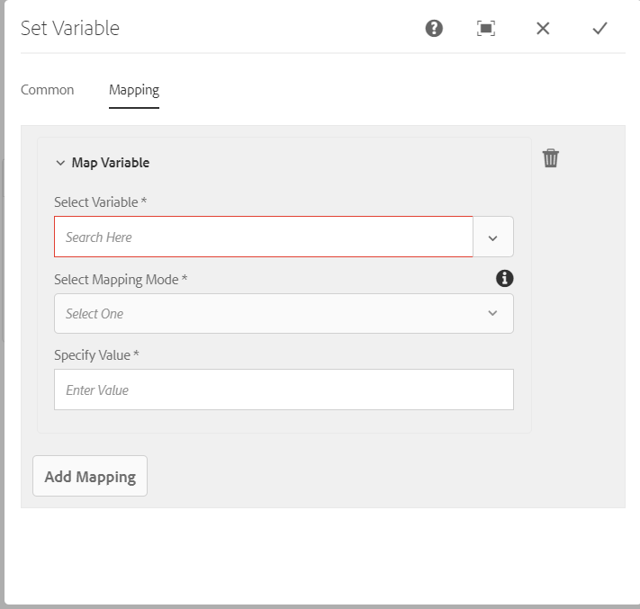

# Referentie workflowstap {#workflow-step-reference}

De modellen van het werkschema bestaan uit een reeks stappen van diverse types. Volgens het type, kunnen deze stappen met parameters en manuscripten worden gevormd en worden uitgebreid om de functionaliteit te verstrekken en de controle u vereist.

>[!NOTE]
>
>In deze sectie worden de standaardworkflowstappen beschreven.
>
>Raadpleeg de volgende secties voor modulespecifieke stappen:
>
>* [AEM Forms Workflow Step Reference](/help/forms/using/aem-forms-workflow-step-reference.md)
>* [Middelen verwerken met behulp van mediafuncties en workflows](/help/assets/media-handlers.md)
>

## Step Properties {#step-properties}

Elke stapcomponent heeft een **Step Properties** een dialoogvenster waarin u de vereiste eigenschappen kunt definiëren en bewerken.

### Step Properties - Common tab {#step-properties-common-tab}

Voor de meeste workflowstapcomponenten is een combinatie van de volgende eigenschappen beschikbaar: **Vaak** tabblad van het dialoogvenster Eigenschappen:

* **Titel**
De titel voor de stap.

* **Beschrijving**
Een beschrijving van de stap.

* **Werkstroomwerkgebied**

  Een vervolgkeuzelijst voor het toepassen van een [Werkgebied](/help/sites-developing/workflows.md#workflow-stages) naar de stap.

* **Time-out**

  De periode waarna de stap &quot;uitkomt&quot;.
U kunt kiezen tussen: **Uit**, **Meteen**, **1h**, **6 uur**, **12 nonies**, **24 nonies**.

* **Timeout-handler**

  De manager die het werkschema controleert wanneer de staptijden uit. Bijvoorbeeld: `Auto Advancer`

* **Handler Advance**

  Selecteer deze optie als u de workflow na de uitvoering automatisch wilt laten terugkeren naar de volgende stap. Als deze optie niet is geselecteerd, moet het implementatiescript de voortgang van de workflow afhandelen.

### Step Properties - User/Group tab {#step-properties-user-group-tab}

De volgende eigenschappen zijn beschikbaar voor veel workflowstapcomponenten op de **Gebruiker/groep** tabblad van het dialoogvenster Eigenschappen:

* **Gebruikers via e-mail op de hoogte stellen**

   * Deelnemers op de hoogte stellen door hen een e-mail te sturen wanneer de werkstroom de stap bereikt.
   * Indien ingeschakeld, wordt een e-mail verzonden naar de gebruiker die door de eigenschap wordt gedefinieerd **Gebruiker/groep**, of aan elk lid van de groep indien een groep is gedefinieerd.

* **Gebruiker/groep**

   * Met een keuzelijst kunt u naar een gebruiker of groep navigeren en deze selecteren.
   * Als u de stap aan een specifieke gebruiker toewijst, dan slechts kan deze gebruiker op de stap handelen.
   * Als u de stap toewijst aan een hele groep en de workflow deze stap bereikt, staan alle gebruikers in deze groep in hun **Workflow Inbox**.
   * Zie [Deelnemen aan workflows](/help/sites-authoring/workflows-participating.md) voor meer informatie .

## EN splitsen {#and-split}

De **EN splitsen** maakt een splitsing in de workflow, waarna beide vertakkingen actief zijn. U voegt workflowstappen naar wens toe aan elke vertakking. Met deze stap kunt u meerdere verwerkingspaden in de workflow opnemen. U kunt bijvoorbeeld toestaan dat bepaalde stappen van de revisie parallel worden uitgevoerd, wat tijd bespaart.


### EN Splitsen - Configuratie {#and-split-configuration}

De splitsing configureren:

* Bewerk de **EN Eigenschappen splitsen**:

   * **Naam splitsing**: een naam toewijzen voor verklarende doeleinden
   * Selecteer het aantal vereiste vertakkingen; 2, 3, 4 of 5.

* Voeg zo nodig workflowstappen toe aan de vertakkingen.

  

## Containerstap {#container-step}

Een containerstap start een ander workflowmodel dat wordt uitgevoerd als een onderliggende workflow.

Met deze container kunt u workflowmodellen opnieuw gebruiken om algemene stappen te implementeren. Een workflowmodel voor vertaling kan bijvoorbeeld worden gebruikt in meerdere bewerkingsworkflows.


### Containerstap - Configuratie {#container-step-configuration}

Om de stap te vormen, geef en gebruik de volgende lusjes uit:

* [Vaak](#step-properties-common-tab)
* **Container**

   * **Subworkflow**: Selecteer de workflow die u wilt starten.

## Ga naar stap {#goto-step}

De **Ga naar stap** Hiermee kunt u de volgende stap opgeven die moet worden uitgevoerd in het workflowmodel. U kunt een regeldefinitie, extern manuscript, of een manuscript ECMA als verpletterende uitdrukking specificeren om de volgende stap voor het werkschemamodel te evalueren.

* Als de voorwaarde die u opgeeft waar is, wordt **Ga naar stap** wordt voltooid en de workflow-engine voert de opgegeven stap uit.
* Als de voorwaarde die u opgeeft, niet waar is, wordt **Ga naar stap** voltooit en de normale verpletterende logica bepaalt de volgende stap uit te voeren.

De **Ga naar stap** laat u toe om geavanceerde verpletterende structuren in uw werkschemamodellen uit te voeren. Als u bijvoorbeeld een lus wilt implementeren, **Ga naar stap** kan worden bepaald om een vroegere stap in het werkschema, met de verpletterende uitdrukking uit te voeren die een lijnvoorwaarde evalueert.

### Ga naar stap - Configuratie {#goto-step-configuration}

Om de stap te vormen, geef en gebruik de volgende lusjes uit:

* [Vaak](#step-properties-common-tab)
* **Proces**

   * **Doelstap**: Selecteer de uit te voeren stap na het evalueren van de voorwaarde voor de verpletterende uitdrukking.
   * **Routeringsuitdrukking**: Selecteer Regeldefinitie, Extern script of een ECMA-script dat bepaalt of de opdracht **Doelstap**.

      * **Regeldefinitie:** Gebruik de [expressie-editor](/help/forms/using/variable-in-aem-workflows.md#use-expression-editor) om de regel te definiëren.
      * **Extern script:** Het pad van het externe script.
      * **ECMA-script**: Het script dat bepaalt of de opdracht **Ga naar stap**.

#### Een lus voor lus simuleren {#simulating-a-for-loop}

Wanneer u een lus &quot;for&quot; simuleert, moet u een telling bijhouden van het aantal herhalingen van lus dat is opgetreden:

* De telling vertegenwoordigt typisch een index van punten die op in het werkschema worden gehandeld.
* De telling wordt geëvalueerd als uitgangscriteria van de lijn.

Als u bijvoorbeeld een workflow wilt implementeren die een handeling uitvoert op verschillende JCR-knooppunten, kunt u een lusteller gebruiken als index voor de knooppunten. Als u het aantal wilt behouden, slaat u een `integer` waarde in de gegevenskaart van de werkschemainstantie. Als u het aantal wilt verhogen en het aantal wilt vergelijken met de afsluitcriteria, gebruikt u het script van het dialoogvenster **Ga naar stap**.

```
function check(){
   var count=0;
   var keyname="loopcount"
   try{
      if (workflowData.getMetaDataMap().containsKey(keyname)){
        log.info("goto script: found loopcount key");
        count= parseInt(workflowData.getMetaDataMap().get(keyname))+1;
      }

     workflowData.getMetaDataMap().put(keyname,count);

     }catch(err) {
         log.info(err.message);
         return false;
    }
   if (parseInt(count) <7){
       return true;
   } else {
      return false;
   }
}
```

### Simuleren van een lus for met behulp van Regeldefinitie {#simulateforloop}

U kunt ook simuleren voor lijn gebruikend de Definitie van de Regel als verpletterende uitdrukking. [Een **aantal** variabel](/help/forms/using/variable-in-aem-workflows.md#create-a-variable) van het gegevenstype Long. Gebruiken **Uitdrukking** als de toewijzingsmodus in de **[Variabele instellen](/help/sites-developing/using-variables-in-aem-workflows.md#set-a-variable)** stap om de waarde van de **aantal** variabele tot **aantal + 1** bij elke uitvoering van de **Variabele instellen** stap.


In de **Ga naar stap**, gebruik **Variabele instellen** als de **Doelstap** en **aantal &lt; 5** als verpletterende uitdrukking.


De **Variabele instellen** stap wordt herhaaldelijk uitgevoerd, waarbij de waarde van **aantal** variëren met 1 op elke looppas tot de waarde 5 bereikt.

## OF Splitsen {#or-split}

De **OF Splitsen** maakt een splitsing in de workflow, waarna slechts één vertakking actief is. Met deze stap kunt u voorwaardelijke verwerkingspaden in uw workflow introduceren. U voegt workflowstappen naar wens toe aan elke vertakking.

>[!NOTE]
>
>Zie [OF stap Splitsen](https://experienceleague.adobe.com/docs/experience-manager-65/developing/extending-aem/extending-workflows/using-variables-in-aem-workflows.html#use-a-variable)


### OF Splitsen - Configuratie {#or-split-configuration}

De splitsing configureren:

* Bewerk de **OF Eigenschappen splitsen**:

   * **Vaak**

      * Geef de naam van de splitsing op.

   * **Branches (*x)***

      * **Vertakking toevoegen:** Voeg meer vertakkingen aan de stap toe.
      * **Selecteer het Verpletteren van Uitdrukking**: Om de actieve vertakking te evalueren, selecteer de verpletterende uitdrukking. Mogelijke waarden zijn: Regeldefinitie, Extern script en ECMA-script.
      * **Klik om uitdrukking toe te voegen**: Voeg expressie toe om de actieve vertakking te evalueren als u **Regeldefinitie** als verpletterende uitdrukking.
      * **Scriptpad**: Het pad naar een bestand dat het script bevat om de actieve vertakking te evalueren als u **Extern script** als verpletterende uitdrukking.
      * **Script**: Voeg het script toe in het vak om de actieve vertakking te evalueren als u **ECMA-script** als verpletterende uitdrukking.
      * **Standaardroute**: De standaardvertakking wordt gevolgd als er meerdere vertakkingen zijn. U kunt slechts één vertakking als standaard opgeven.

  >[!NOTE]
  >
  >    * Één tak wordt geëvalueerd in een tijd die op de verpletterende uitdrukking wordt gebaseerd.
  >    * De vertakkingen worden van boven naar beneden geëvalueerd.
  >    * Het eerste script dat true oplevert, wordt uitgevoerd.
  >    * Als geen tak aan waar evalueert, dan gaat het werkschema niet vooruit.
  >
  >

  >[!NOTE]
  >
  >Zie [Een regel definiëren voor een OR-splitsing](/help/sites-developing/workflows-models.md#defineruleecmascript).

* Voeg zo nodig workflowstappen toe aan de vertakkingen.

## Stappen en keuzen van deelnemers {#participant-steps-and-choosers}

### Stap deelnemer {#participant-step}

A **Stap deelnemer** kunt u de eigendom van een bepaalde handeling toewijzen. De workflow wordt alleen uitgevoerd wanneer de gebruiker de stap handmatig heeft bevestigd. Deze workflow wordt gebruikt wanneer u wilt dat iemand op de workflow reageert. Bijvoorbeeld een revisiestap.

Hoewel niet direct verwant, moet de gebruikersvergunning worden overwogen wanneer het toewijzen van een actie; de gebruiker moet toegang tot de pagina hebben die het werkschemalading is.

#### Stap van de deelnemer - Configuratie {#participant-step-configuration}

Om de stap te vormen, geef en gebruik de volgende lusjes uit:

* [Vaak](#step-properties-common-tab)
* [Gebruiker/groep](#step-properties-user-group-tab)

>[!NOTE]
>
>De aanvrager van de workflow wordt altijd op de hoogte gesteld wanneer:
>
>* De workflow is voltooid (voltooid).
>* De workflow is afgebroken (beëindigd).
>

>[!NOTE]
>
>Sommige eigenschappen moeten worden geconfigureerd om e-mailmeldingen in te schakelen. U kunt de e-mailsjabloon ook aanpassen of een e-mailsjabloon voor een nieuwe taal toevoegen. Als u e-mailmeldingen wilt configureren in AEM, raadpleegt u [E-mailmelding configureren](/help/sites-administering/notification.md#configuringemailnotification).

### Stap deelnemer van dialoogvenster {#dialog-participant-step}

Een **Stap deelnemer van dialoogvenster** om informatie te verzamelen van de gebruiker aan wie het werkitem is toegewezen. Deze stap is nuttig om kleine hoeveelheden gegevens te verzamelen die later in het werkschema worden gebruikt.

Als u de stap hebt voltooid, **Voltooid het werkitem** bevat de velden die u in het dialoogvenster definieert. De gegevens die in de velden worden verzameld, worden opgeslagen in knooppunten van de werkstroomlading. De volgende workflowstappen kunnen vervolgens de waarde van de repository lezen.

Om de stap te vormen, specificeert u de groep of de gebruiker om het het werkpunt aan toe te wijzen, en de weg aan de dialoog.

#### Stap van de Deelnemer van de dialoog - Configuratie {#dialog-participant-step-configuration}

Om de stap te vormen, geef en gebruik de volgende lusjes uit:

* [Vaak](#step-properties-common-tab)
* [Gebruiker/groep](#step-properties-user-group-tab)
* **Dialoog**

   * **Dialoogpad**: Het pad naar het dialoogvenster van het dialoogvenster [dialoogvenster dat u maakt](#dialog-participant-step-creating-a-dialog).

#### Stap deelnemer van dialoogvenster - Een dialoogvenster maken {#dialog-participant-step-creating-a-dialog}

Als u een dialoogvenster wilt maken, moet u het dialoogvenster maken:

* Bepalen waar de resulterende gegevens zijn [opgeslagen in de payload](#dialog-participant-step-storing-data-in-the-payload).
* [Definieer het dialoogvenster. Hierin worden de velden gedefinieerd die worden gebruikt voor het verzamelen en opslaan van de gegevens](#dialog-participant-step-dialog-definition).

#### Stap van de Deelnemer van de dialoog - het Opslaan van Gegevens in de Lading {#dialog-participant-step-storing-data-in-the-payload}

U kunt widgetgegevens opslaan in de werkstroomlading of in de meta-gegevens van het werkpunt. Het formaat van de `name` De eigenschap van het widgetknooppunt bepaalt waar de gegevens worden opgeslagen.

* **Gegevens opslaan met de Payload**

   * Als u widgetgegevens wilt opslaan als een eigenschap van de payload van de workflow, gebruikt u de volgende indeling voor de waarde van de eigenschap name van het widgetknooppunt:
     `./jcr:content/nodename`

   * De gegevens worden opgeslagen in de `nodename` eigenschap van het payload-knooppunt. Als het knooppunt die eigenschap niet bevat, wordt de eigenschap gemaakt.
   * Wanneer opgeslagen met de lading, later gebruik van de dialoog met de zelfde lading overschrijft de waarde van het bezit.

* **Gegevens opslaan met het werkitem**

   * Als u widgetgegevens wilt opslaan als een eigenschap van de metagegevens van het werkitem, gebruikt u de volgende indeling voor de waarde van de eigenschap name:
     `nodename`

   * De gegevens worden opgeslagen in de `nodename` eigenschap van het werkitem `metadata`. De gegevens blijven behouden als het dialoogvenster later wordt gebruikt met dezelfde payload.

#### Stap deelnemer van dialoogvenster - Dialoogdefinitie {#dialog-participant-step-dialog-definition}

1. **Dialoogstructuur**

   De dialoogvensters voor de Stappen van de Deelnemer van de Dialoog zijn gelijkaardig aan dialogen die u voor auteurscomponenten creeert. Zij worden opgeslagen onder:

   `/apps/myapp/workflow/dialogs`

   Dialoogvensters voor de standaardinterface met aanraakbediening hebben de volgende knooppuntstructuur:

   ```xml
   newComponent (cq:Component)
     |- cq:dialog (nt:unstructured)
       |- content
         |- layout
           |- items
             |- column
               |- items
                 |- component0
                 |- component1
                 |- ...
   ```

   >[!NOTE]
   >
   >Zie [Een dialoogvenster maken en configureren](/help/sites-developing/developing-components.md#creating-and-configuring-a-dialog).

1. **Dialoogvensterpad, eigenschap**

   De **Stap deelnemer van dialoogvenster** heeft de **Dialoogpad** eigenschap (samen met de eigenschappen van een [Stap deelnemer](#participant-step)). De waarde van **Dialoogpad** eigenschap is het pad naar de `dialog` knooppunt van uw dialoogvenster.

   Het dialoogvenster bevindt zich bijvoorbeeld in een component met de naam `EmailWatch` dat in de knoop wordt opgeslagen:

   `/apps/myapp/workflows/dialogs`

   Voor de interface met aanraakbediening wordt de volgende waarde gebruikt voor de **Dialoogpad** eigenschap:

   `/apps/myapp/workflow/dialogs/EmailWatch/cq:dialog`

   

1. **Voorbeeld Dialoogdefinitie**

   Het volgende XML-codefragment vertegenwoordigt een dialoogvenster waarin een `String` waarde in de `watchEmail` knooppunt van de ladingsinhoud. Het titelknooppunt vertegenwoordigt de [TextField](https://developer.adobe.com/experience-manager/reference-materials/6-5/granite-ui/api/jcr_root/libs/granite/ui/components/coral/foundation/form/textfield/index.html) component:

   ```xml
   jcr:primaryType="nt:unstructured"
       jcr:title="Watcher Email Address Dialog"
       sling:resourceType="cq/gui/components/authoring/dialog">
       <content jcr:primaryType="nt:unstructured"
           sling:resourceType="granite/ui/components/foundation/container">
           <layout jcr:primaryType="nt:unstructured"
               margin="false"
               sling:resourceType="granite/ui/components/foundation/layouts/fixedcolumns"
           />
           <items jcr:primaryType="nt:unstructured">
               <column jcr:primaryType="nt:unstructured"
                   sling:resourceType="granite/ui/components/foundation/container">
                   <items jcr:primaryType="nt:unstructured">
                       <title jcr:primaryType="nt:unstructured"
                           fieldLabel="Notification Email Address"
                           name="./jcr:content/watchEmails"
                           sling:resourceType="granite/ui/components/foundation/form/textfield"
                       />
                   </items>
               </column>
           </items>
       </content>
   </cq:dialog>
   ```

   In de interface met aanraakbediening resulteert dit voorbeeld in een dialoogvenster zoals:

   

### Dynamische deelnemersstap {#dynamic-participant-step}

De **Dynamische deelnemersstap** component is vergelijkbaar met **[Stap deelnemer](#participant-step)** met het verschil dat de deelnemer automatisch bij runtime wordt geselecteerd.

Om de stap te vormen, selecteert u een **Deelnemerkiezer** die de deelnemer aangeeft waaraan het werkitem moet worden toegewezen, samen met een dialoogvenster.

#### Dynamische deelnemersstap - Configuratie {#dynamic-participant-step-configuration}

Om de stap te vormen, geef en gebruik de volgende lusjes uit:

* [Vaak](#step-properties-common-tab)
* **Deelnemerkiezer**

   * **Deelnemerkiezer**: De naam van de [deelnemerenkiezer die u maakt](#developingtheparticipantchooser).
   * **Argumenten**: Alle vereiste argumenten.
   * **E-mail**: Of een e-mailbericht naar de gebruiker moet worden verzonden.

* **Dialoog**

   * **Dialoogpad**: Het pad naar het dialoogvenster van het dialoogvenster [dialoogvenster dat u maakt (net als met het dialoogvenster **Stap deelnemer van dialoogvenster**)](#dialog-participant-step-creating-a-dialog).

#### De dynamische Stap van de Deelnemer - ontwikkelt de deelnemerverkiezer {#dynamic-participant-step-developing-the-participant-chooser}

U maakt de deelnemerkiezer. Daarom kunt u om het even welke selectielogica of criteria gebruiken. Uw deelnemerkiezer kan bijvoorbeeld de gebruiker (binnen een groep) selecteren die de minste werkitems heeft. U kunt een willekeurig aantal keuzemogelijkheden voor deelnemers maken voor gebruik met verschillende exemplaren van de **Dynamische deelnemersstap** in uw workflowmodellen.

Creeer de dienst OSGi of een ECMAScript die een gebruiker selecteert om het het werkpunt aan toe te wijzen.

* **ECMAscript**

  Scripts moeten een functie met de naam getParticipant bevatten die een gebruikers-id als een `String` waarde. Sla uw aangepaste scripts op in bijvoorbeeld de `/apps/myapp/workflow/scripts` of een submap.

  Een voorbeeldscript is opgenomen in een standaard AEM-instantie:

  `/libs/workflow/scripts/initiator-participant-chooser.ecma`

  >[!CAUTION]
  >
  >Wijzig niets in de `/libs` pad.
  >
  >
  >De reden is dat de inhoud van `/libs` wordt de volgende keer overschreven dat u een upgrade uitvoert van uw exemplaar (en kan worden overschreven wanneer u een hotfix- of functiepakket toepast).

  Met dit script wordt de aanvrager van de workflow geselecteerd als de deelnemer:

  ```
  function getParticipant() {
      return workItem.getWorkflow().getInitiator();
  }
  ```

  >[!NOTE]
  >
  >De **Deelnemerkiezer voor workflow-initiator** component breidt de **Dynamische deelnemersstap** en gebruikt dit script als de stapimplementatie.

* **OSGi-service**

  De diensten moeten uitvoeren [com.day.cq.workflow.exec.ParticipantStepChooser](https://developer.adobe.com/experience-manager/reference-materials/6-5/javadoc/com/day/cq/workflow/exec/ParticipantStepChooser.html) interface. De interface definieert de volgende leden:

   * `SERVICE_PROPERTY_LABEL` veld: gebruik dit veld om de naam van de deelnemer te bepalen. De naam wordt weergegeven in een lijst met beschikbare deelnemerskiezers in het dialoogvenster **Dynamische deelnemersstap** eigenschappen.

   * `getParticipant` methode: hiermee wordt de dynamisch opgeloste Principal-id geretourneerd als een `String` waarde.

  >[!CAUTION]
  >
  >De `getParticipant` De methode keert dynamisch gevormde Belangrijkste identiteitskaart terug. Deze id kan een groep-id of een gebruikers-id zijn.
  >
  >
  >Een groep-id kan echter alleen voor een **Stap deelnemer**, wanneer een lijst met deelnemers wordt geretourneerd. Voor een **Dynamische deelnemersstap**, wordt een lege lijst geretourneerd en kan niet worden gebruikt voor delegatie.

  Om uw implementatie beschikbaar te maken aan **Dynamische deelnemersstap** voegt u uw Java™-klasse toe aan een OSGi-bundel die de service exporteert en implementeert u de bundel op de AEM server.

  >[!NOTE]
  >
  >**Kiezer voor willekeurige deelnemers** is een voorbeeldservice waarmee een willekeurige gebruiker wordt geselecteerd ( `com.day.cq.workflow.impl.process.RandomParticipantChooser`). De **Willekeurige deelnemer kiezen** r stap het componentenvoorbeeld breidt uit **Dynamische deelnemersstap** en gebruikt deze service als de stapimplementatie.

#### Stap voor dynamische deelnemer - Voorbeeld van Kiezerservice voor deelnemers {#dynamic-participant-step-example-participant-chooser-service}

De volgende Java™-klasse implementeert de `ParticipantStepChooser` interface. De klasse retourneert de naam van de deelnemer die de workflow heeft gestart. De code gebruikt de zelfde logica die het steekproefmanuscript (`initiator-participant-chooser.ecma`) gebruikt.

De `@Property` annotatie stelt de waarde van de `SERVICE_PROPERTY_LABEL` veld naar `Workflow Initiator Participant Chooser`.

```java
package com.adobe.example;

import org.apache.felix.scr.annotations.Component;
import org.apache.felix.scr.annotations.Properties;
import org.apache.felix.scr.annotations.Property;
import org.apache.felix.scr.annotations.Service;
import org.osgi.framework.Constants;
import org.slf4j.Logger;
import org.slf4j.LoggerFactory;

import com.adobe.granite.workflow.WorkflowException;
import com.adobe.granite.workflow.WorkflowSession;
import com.adobe.granite.workflow.exec.ParticipantStepChooser;
import com.adobe.granite.workflow.exec.WorkItem;
import com.adobe.granite.workflow.metadata.MetaDataMap;

@Component
@Service
@Properties({
        @Property(name = Constants.SERVICE_DESCRIPTION, value = "An example implementation of a dynamic participant chooser."),
        @Property(name = ParticipantStepChooser.SERVICE_PROPERTY_LABEL, value = "Workflow Initiator Participant Chooser (service)") })
public class InitiatorParticipantChooser implements ParticipantStepChooser {

 private Logger logger = LoggerFactory.getLogger(this.getClass());

 public String getParticipant(WorkItem arg0, WorkflowSession arg1,
   MetaDataMap arg2) throws WorkflowException {

  String initiator = arg0.getWorkflow().getInitiator();
  logger.info("Assigning Dynamic Participant Step work item to {}",initiator);

  return initiator;
 }
}
```

In de **Dynamische deelnemersstap** eigenschappen, dialoogvenster **Deelnemerkiezer** list include the item `Workflow Initiator Participant Chooser (script)`, die deze dienst vertegenwoordigt.

Wanneer het werkschemamodel is begonnen, wijst het logboek op identiteitskaart van de gebruiker die het werkschema in werking stelde en wie het het werkpunt wordt toegewezen. In dit voorbeeld wordt `admin` de gebruiker heeft de workflow gestart.

`13.09.2015 15:48:53.037 *INFO* [10.176.129.223 [1347565733037] POST /etc/workflow/instances HTTP/1.1] com.adobe.example.InitiatorParticipantChooser Assigning Dynamic Participant Step work item to admin`

### Stap voor deelnemer aan formulier {#form-participant-step}

De **Stap voor deelnemer aan formulier** presenteert een formulier wanneer het werkitem wordt geopend. Wanneer de gebruiker het formulier invult en verzendt, worden de veldgegevens opgeslagen in de knooppunten van het taakvenster van de werkstroom.

Als u de stap wilt configureren, geeft u de groep of gebruiker op waaraan het werkitem moet worden toegewezen en het pad naar het formulier.

>[!CAUTION]
>
>In dit gedeelte worden de [Forms sectie of Foundation Components for Page Authoring](/help/sites-authoring/default-components-foundation.md#form).

#### Stap van de deelnemer van de vorm - Configuratie {#form-participant-step-configuration}

Om de stap te vormen, geef en gebruik de volgende lusjes uit:

* [Vaak](#step-properties-common-tab)
* [Gebruiker/groep](#step-properties-user-group-tab)
* **Formulier**

   * **Formulierpad**: Het pad naar de [formulier dat u maakt](#form-participant-step-creating-the-form).

#### Stap deelnemer aan formulier - Het formulier maken {#form-participant-step-creating-the-form}

Een formulier maken voor gebruik met een **Stap voor deelnemer aan formulier** zoals normaal. Formulieren voor een stap Formulierdeelnemer moeten echter de volgende configuraties hebben:

* De **Begin van formulier** de component moet de **Type handeling** eigenschap ingesteld op `Edit Workflow Controlled Resource(s)`.
* De **Begin van formulier** component moet een waarde voor de component hebben `Form Identifier` eigenschap.
* De formuliercomponenten moeten beschikken over de **Elementnaam** eigenschap ingesteld op het pad van het knooppunt waar de veldgegevens zijn opgeslagen. Het pad moet een knooppunt in de ladingsinhoud van de workflow vinden. De waarde gebruikt de volgende indeling:

  `./jcr:content/path_to_node`

* Het formulier moet een **Knop Werkstroom verzenden** component. U vormt geen eigenschappen van de component.

De vereisten van uw workflow bepalen waar u veldgegevens moet opslaan. U kunt bijvoorbeeld veldgegevens gebruiken om de eigenschappen van pagina-inhoud te configureren. De volgende waarde van een **Elementnaam** eigenschap slaat veldgegevens op als de waarde van `redirectTarget` eigendom van de `jcr:content` knooppunt:

`./jcr:content/redirectTarget`

In het volgende voorbeeld worden de veldgegevens gebruikt als de inhoud van een **Tekst** component op de ladingspagina:

`./jcr:content/par/text_3/text`

Het eerste voorbeeld kan worden gebruikt voor elke pagina die `cq:Page` wordt weergegeven. Het tweede voorbeeld kan alleen worden gebruikt wanneer de ladingspagina een **Tekst** component met een id van `text_3`.

Het formulier kan overal in de gegevensopslagruimte worden gevonden, maar workflowgebruikers moeten worden gemachtigd om het formulier te lezen.

### Kiezer voor willekeurige deelnemers {#random-participant-chooser}

De **Kiezer voor willekeurige deelnemers** De stap is een deelnemer verkiesster die het geproduceerde het werkpunt aan een gebruiker toewijst die willekeurig uit een lijst wordt geselecteerd.


#### Kiezer voor willekeurige deelnemers - Configuratie {#random-participant-chooser-configuration}

Om de stap te vormen, geef en gebruik de volgende lusjes uit:

* [Vaak](#step-properties-common-tab)
* **Argumenten**

   * **Deelnemers**: Geeft de lijst met gebruikers aan die beschikbaar zijn voor selectie. Als u een gebruiker aan de lijst wilt toevoegen, klikt u op **Item toevoegen** en typ het homepad van het gebruikersknooppunt of de gebruikers-id. De volgorde van de gebruikers heeft geen invloed op de waarschijnlijkheid dat een werkitem wordt toegewezen.

### Deelnemerkiezer voor workflow-initiator {#workflow-initiator-participant-chooser}

De **Deelnemerkiezer voor workflow-initiator** De stap is een deelnemer verkiest die het geproduceerde het werkpunt aan de gebruiker toewijst die de werkschema begon. Er zijn geen andere eigenschappen dan de **Vaak** eigenschappen.

#### Deelnemerkiezer voor workflow-initiator - Configuratie {#workflow-initiator-participant-chooser-configuration}

Om de stap te vormen, geef het gebruiken van de volgende lusjes uit:

* [Vaak](#step-properties-common-tab)

## Processtap {#process-step}

A **Processtap** Voert een ECMAScript uit of roept de dienst OSGi om automatische verwerking uit te voeren.


### Processtap - Configuratie {#process-step-configuration}

Om de stap te vormen, geef en gebruik de volgende lusjes uit:

* [Vaak](#step-properties-common-tab)
* **Proces**

   * **Proces**: De uit te voeren procesimplementatie. Gebruik het drop-down menu om de dienst te selecteren ECMAScript of OSGi. Voor informatie over:

      * De standaard ECMAScripts en OSGi diensten, zie [Ingebouwde processen voor processtappen](/help/sites-developing/workflows-process-ref.md).
      * ECMAScripts maken voor een processtap, zie [Een processtap implementeren met een ECMAScript](/help/sites-developing/workflows-customizing-extending.md#using-ecmascript).
      * Creërend de diensten OSGi voor een stap van het Proces, zie [Een processtap implementeren met een Java™-klasse](/help/sites-developing/workflows-customizing-extending.md#implementing-a-process-step-with-a-java-class).

   * **Handler Advance**: Selecteer deze optie om de workflow automatisch naar de volgende stap na de uitvoering te verplaatsen. Als deze optie niet is geselecteerd, moet het implementatiescript de voortgang van de workflow afhandelen.
   * **Argumenten**: Argumenten die aan het proces moeten worden doorgegeven.

## Variabele instellen {#set-variable}

Met de stap Variabele instellen kunt u de waarde van een variabele instellen en de volgorde definiëren waarin de waarden worden ingesteld. De variabele wordt geplaatst in de orde dat de veranderlijke toewijzingen in de Vastgestelde stap van de Variabele vermeld zijn.



### Variabele instellen - Configuratie {#setvariable}

Om de stap te vormen, geef en gebruik de volgende lusjes uit:

* [Vaak](/help/sites-developing/workflows-step-ref.md#step-properties-common-tab)
* **Toewijzing**

   * **Variabele selecteren:** Gebruik deze optie om een variabele te selecteren om de waarde ervan in te stellen.
   * **Toewijzingsmodus selecteren:**  Als u de waarde voor de variabele wilt instellen, selecteert u een toewijzingsmodus. Afhankelijk van het gegevenstype van de variabele kunt u de volgende opties gebruiken om de waarde van een variabele in te stellen:

      * **Letterlijk:** Gebruik deze optie als u precies weet welke waarde u moet opgeven.
      * **Uitdrukking:** Gebruik de optie wanneer de te gebruiken waarde wordt berekend op basis van een expressie. De expressie wordt gemaakt in de beschikbare expressie-editor.
      * **JSON-puntnotatie:** Gebruik de optie om een waarde van een JSON of FDM typevariabele terug te winnen.
      * **XPATH:** Gebruik de optie om een waarde van een variabele van het type van XML terug te winnen.
      * **Ten opzichte van lading:** Gebruik de optie wanneer de waarde die u wilt opslaan in een variabele, beschikbaar is op een pad dat relatief is ten opzichte van de laadbewerking.
      * **Absoluut pad:** Gebruik de optie wanneer de waarde die u wilt opslaan in de variabele beschikbaar is in een absoluut pad.

   * **Geef waarde op:** Geef een waarde op om de variabele toe te wijzen. De waarde die u in dit veld opgeeft, is afhankelijk van de toewijzingsmodus.
   * **Toewijzing toevoegen:** Gebruik deze optie om meer toewijzingen toe te voegen om een waarde voor de variabele in te stellen.
