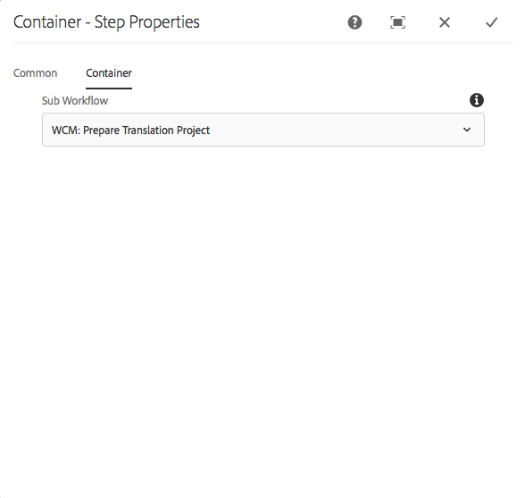

# Referentie workflowstap {#workflow-step-reference}

De modellen van het werkschema bestaan uit een reeks stappen van diverse types. Volgens het type, kunnen deze stappen met parameters en manuscripten worden gevormd en worden uitgebreid om de functionaliteit te verstrekken en de controle u vereist.

>[!NOTE]
>
>In deze sectie worden de standaardworkflowstappen beschreven.
>
>Zie ook voor modulespecifieke stappen:
>
>* [AEM Forms Workflow Step Reference](/help/forms/using/aem-forms-workflow-step-reference.md)
>* [Middelen verwerken met behulp van mediafuncties en workflows](/help/assets/media-handlers.md)
>


## Step Properties {#step-properties}

Elke stapcomponent heeft een dialoogvenster **Step Properties** waarin u de vereiste eigenschappen kunt definiëren en bewerken.

### Step Properties - Common tab {#step-properties-common-tab}

Een combinatie van de volgende eigenschappen is beschikbaar voor de meeste workflowstapcomponenten op het tabblad **Algemeen** van het dialoogvenster Eigenschappen:

* **Titel** De titel voor de stap.

* **Beschrijving** Een beschrijving van de stap.

* **Werkstroomwerkgebied**

   Een keuzelijst om een [werkgebied](/help/sites-developing/workflows.md#workflow-stages) op de stap toe te passen.

* **Time-out**

   De periode waarna de stap wordt &quot;uitgezet&quot;.
U kunt kiezen tussen: **Uit**, **onmiddellijk**, **1u**, **6u**, **12u******, 24u.

* **Timeout-handler**

   De manager die het werkschema zal controleren wanneer de staptijden uit; bijvoorbeeld:
   `Auto Advancer`

* **Handler Advance**

   Selecteer deze optie als u de workflow na de uitvoering automatisch wilt laten terugkeren naar de volgende stap. Als deze optie niet is geselecteerd, moet het implementatiescript de voortgang van de workflow afhandelen.

### Step Properties - User/Group tab {#step-properties-user-group-tab}

De volgende eigenschappen zijn beschikbaar voor veel workflowstapcomponenten op het tabblad **Gebruiker/Groep** van het dialoogvenster Eigenschappen:

* **Gebruikers via e-mail op de hoogte stellen**

   * U kunt deelnemers op de hoogte stellen door hen een e-mail te sturen wanneer de werkstroom de stap bereikt.
   * Indien ingeschakeld, wordt een e-mail verzonden naar de gebruiker die door de eigenschap **Gebruiker/Groep** is gedefinieerd of naar elk lid van de groep als een groep is gedefinieerd.

* **Gebruiker/groep**

   * In een keuzelijst kunt u navigeren en een gebruiker of groep selecteren.
   * Als u de stap toewijst aan een specifieke gebruiker, kan alleen deze gebruiker actie ondernemen voor de stap.
   * Als u de stap toewijst aan een volledige groep, dan wanneer het werkschema deze stap bereikt zullen alle gebruikers in deze groep de actie in hun Postvak van de **Werkstroom** hebben.
   * Zie [Deelnemen aan workflows](/help/sites-authoring/workflows-participating.md) voor meer informatie.

## EN splitsen {#and-split}

Met **EN splitsen** maakt u een splitsing in de workflow, waarna beide vertakkingen actief zijn. U voegt workflowstappen naar wens toe aan elke vertakking. Met deze stap kunt u meerdere verwerkingspaden in de workflow opnemen. U kunt bijvoorbeeld toestaan dat bepaalde stappen van de revisie parallel worden uitgevoerd, zodat u tijd bespaart.


### EN splitsen - Configuratie {#and-split-configuration}

De splitsing configureren:

* Bewerk de eigenschappen **EN splitsen**:

   * **Gesplitste naam**: een naam toewijzen voor verklarende doeleinden
   * Selecteer het aantal vereiste vertakkingen; 2, 3, 4 of 5.

* Voeg zo nodig workflowstappen toe aan de vertakkingen.

   

## Containerstap {#container-step}

Een containerstap start een ander workflowmodel dat wordt uitgevoerd als een onderliggende workflow.

Met deze container kunt u workflowmodellen opnieuw gebruiken om algemene stappen te implementeren. Een workflowmodel voor vertaling kan bijvoorbeeld worden gebruikt in meerdere bewerkingsworkflows.



### Containerstap - Configuratie {#container-step-configuration}

Om de stap te vormen, geef en gebruik de volgende lusjes uit:

* [Vaak](#step-properties-common-tab)
* **Container**

   * **Subworkflow**: Selecteer de workflow die u wilt starten.

## Ga naar stap {#goto-step}

Met de **Ga naar stap** kunt u de volgende stap opgeven die in het workflowmodel moet worden uitgevoerd. U kunt een regeldefinitie, extern manuscript, of een manuscript ECMA als verpletterende uitdrukking specificeren om de volgende stap voor het werkschemamodel te evalueren.

* Als de voorwaarde die u specificeert waar houdt, voltooit de **Goto Stap** en de werkschemamotor voert de gespecificeerde stap uit.
* Als de voorwaarde die u specificeert niet waar houdt, voltooit de **Goto Stap** en de normale verpletterende logica bepaalt de volgende uit te voeren stap.

De **Goto Stap** laat u toe om geavanceerde verpletterende structuren in uw werkschemamodellen uit te voeren. Bijvoorbeeld, om een lijn uit te voeren, kan de Stap **van de** Ga worden bepaald om een vroegere stap in het werkschema uit te voeren, met de verpletterende uitdrukking die een lusvoorwaarde evalueert.

### Ga naar stap - Configuratie {#goto-step-configuration}

Om de stap te vormen, geef en gebruik de volgende lusjes uit:

* [Vaak](#step-properties-common-tab)
* **Proces**

   * **Doelstap**: Selecteer de uit te voeren stap na het evalueren van de voorwaarde voor de verpletterende uitdrukking.
   * **Verpletterend Uitdrukking**: Selecteer Regeldefinitie, Extern script of een ECMA-script dat bepaalt of de **doelstap** moet worden uitgevoerd.

      * **** Regeldefinitie: Gebruik de [uitdrukkingsredacteur](/help/forms/using/variable-in-aem-workflows.md#use-expression-editor) om de regel te bepalen.
      * **** Extern script: Het pad van het externe script.
      * **ECMA-script**: Het script dat bepaalt of de **Ga naar stap** moet worden uitgevoerd.

#### Een lus voor lus simuleren {#simulating-a-for-loop}

Wanneer u een lus for simuleert, moet u een telling bijhouden van het aantal herhalingen van lus dat is opgetreden:

* De telling vertegenwoordigt typisch een index van punten die op in het werkschema worden gehandeld.
* De telling wordt geëvalueerd als uitgangscriteria van de lijn.

Als u bijvoorbeeld een workflow wilt implementeren die een handeling uitvoert op verschillende JCR-knooppunten, kunt u een lusteller gebruiken als index voor de knooppunten. Als u het aantal wilt behouden, slaat u een `integer` waarde op in de gegevenskaart van de werkstroominstantie. Gebruik het manuscript van de Stap **van de** Goto om de telling te verhogen evenals de telling met de uitgangscriteria te vergelijken.

```
function check(){
   var count=0;
   var keyname="loopcount"
   try{
      if (workflowData.getMetaDataMap().containsKey(keyname)){
        log.info("goto script: found loopcount key");
        count= parseInt(workflowData.getMetaDataMap().get(keyname))+1;
      }

     workflowData.getMetaDataMap().put(keyname,count);

     }catch(err) {
         log.info(err.message);
         return false;
    }
   if (parseInt(count) <7){
       return true;
   } else {
      return false;
   }
}
```

### Simuleren van een lus for met behulp van Regeldefinitie {#simulateforloop}

U kunt ook simuleren voor lijn gebruikend de Definitie van de Regel als verpletterende uitdrukking. [Maak een **telvariabele** van het gegevenstype](/help/forms/using/variable-in-aem-workflows.md#create-a-variable) Long. Gebruik **Expressie** als de toewijzingsmodus in de stap **[Variabele](/help/sites-developing/using-variables-in-aem-workflows.md#set-a-variable)**instellen om de waarde van de **telvariabele**in te stellen op **telling + 1**bij elke uitvoering van de stap Variabele ****instellen.


In de Stap **** Ga, gebruik **Vastgestelde Variabele** als **Stap** van het Doel en **telling &lt; 5** als verpletterende uitdrukking.


De **Vastgestelde Veranderlijke** stap voert herhaaldelijk het verhogen van de waarde van **tellingsvariabele** door 1 op elke uitvoering uit tot de waarde 5 bereikt.

## OF Splitsen {#or-split}

Met **OF splitsen** wordt een splitsing in de workflow gemaakt, waarna slechts één vertakking actief wordt. Met deze stap kunt u voorwaardelijke verwerkingspaden in uw workflow introduceren. U voegt workflowstappen naar wens toe aan elke vertakking.

>[!NOTE]
>
>Zie voor meer informatie over het maken van een OF-splitsing: [https://helpx.adobe.com/experience-manager/using/aem64_workflow_servlet.html](https://helpx.adobe.com/experience-manager/using/aem64_workflow_servlet.html)


### OF Splitsen - Configuratie {#or-split-configuration}

De splitsing configureren:

* Bewerk de eigenschappen **** OF splitsen:

   * **Vaak**

      * Geef de naam van de splitsing op.
   * **Branches (*x)***

      * **** Vertakking toevoegen: Voeg meer vertakkingen aan de stap toe.
      * **Selecteer Verpletterende Uitdrukking**: Selecteer de verpletterende uitdrukking om de actieve tak te evalueren. Mogelijke waarden zijn: Regeldefinitie, extern script en ECMA-script.
      * **Klik om uitdrukking** toe te voegen: Voeg uitdrukking toe om de actieve tak te evalueren als u de Definitie **van de** Regel als verpletterende uitdrukking selecteert.
      * **Scriptpad**: Het pad naar een bestand dat het script bevat om de actieve vertakking te evalueren als u **Extern script** selecteert als de verpletterende expressie.
      * **Script**: Voeg het manuscript in de doos toe om de actieve tak te evalueren als u **Manuscript** ECMA als verpletterende uitdrukking selecteert.
      * **Standaardroute**: De standaardvertakking wordt gevolgd in het geval van meerdere vertakkingen. U kunt slechts één vertakking als standaard opgeven.
   >[!NOTE]
   >
   >    * Één tak wordt geëvalueerd in een tijd die op de verpletterende uitdrukking wordt gebaseerd.
   >    * De vertakkingen worden van boven naar beneden geëvalueerd.
   >    * Het eerste script dat true oplevert, wordt uitgevoerd.
   >    * Als geen tak aan waar evalueert, dan gaat het werkschema niet vooruit.


   >[!NOTE]
   >
   >Zie Een regel [definiëren voor een OF-splitsing](/help/sites-developing/workflows-models.md#defineruleecmascript).

* Voeg zo nodig workflowstappen toe aan de vertakkingen.

## Stappen en keuzen van deelnemers {#participant-steps-and-choosers}

### Stap deelnemer {#participant-step}

Met een **deelnemersstap** kunt u de eigendom van een bepaalde actie toewijzen. De workflow wordt alleen uitgevoerd wanneer de gebruiker de stap handmatig heeft bevestigd. Dit wordt gebruikt wanneer u iemand een actie op het werkschema wilt nemen; bijvoorbeeld een revisiestap.

Hoewel dit niet rechtstreeks verband houdt, moet bij de toewijzing van een actie rekening worden gehouden met de autorisatie van de gebruiker; de gebruiker moet toegang hebben tot de pagina die de nuttige werkstroom is.

#### Stap van de deelnemer - Configuratie {#participant-step-configuration}

Om de stap te vormen, geef en gebruik de volgende lusjes uit:

* [Vaak](#step-properties-common-tab)
* [Gebruiker/groep](#step-properties-user-group-tab)

>[!NOTE]
>
>De aanvrager van de workflow wordt altijd op de hoogte gesteld wanneer:
>
>* De workflow is voltooid (voltooid).
>* De workflow is afgebroken (beëindigd).
>


>[!NOTE]
>
>Sommige eigenschappen moeten worden geconfigureerd om e-mailmeldingen in te schakelen. U kunt de e-mailsjabloon ook aanpassen of een e-mailsjabloon voor een nieuwe taal toevoegen. Zie E-mailmelding [configureren](/help/sites-administering/notification.md#configuringemailnotification) voor het configureren van e-mailmeldingen in AEM.

### Stap deelnemer van dialoogvenster {#dialog-participant-step}

Gebruik een Stap **van de Deelnemer van de** Dialoog om informatie van de gebruiker te verzamelen die het het werkpunt wordt toegewezen. Deze stap is nuttig om kleine hoeveelheden gegevens te verzamelen die later in het werkschema worden gebruikt.

Nadat u de stap hebt voltooid, bevat het dialoogvenster **Werkitem** voltooien de velden die u in het dialoogvenster definieert. De gegevens die in de velden worden verzameld, worden opgeslagen in knooppunten van de werkstroomlading. De volgende workflowstappen kunnen vervolgens de waarde van de repository lezen.

Om de stap te vormen, specificeert u de groep of de gebruiker om het het werkpunt aan toe te wijzen, en de weg aan de dialoog.

#### Stap van de Deelnemer van de dialoog - Configuratie {#dialog-participant-step-configuration}

Om de stap te vormen, geef en gebruik de volgende lusjes uit:

* [Vaak](#step-properties-common-tab)
* [Gebruiker/groep](#step-properties-user-group-tab)
* **Dialoog**

   * **Dialoogpad**: Het pad naar het dialoogvenster van het [dialoogvenster dat u maakt](#dialog-participant-step-creating-a-dialog).

#### Stap deelnemer van dialoogvenster - Een dialoogvenster maken {#dialog-participant-step-creating-a-dialog}

Als u een dialoogvenster wilt maken, moet u het dialoogvenster maken:

* Bepaal waar de resulterende gegevens in de lading [worden](#dialog-participant-step-storing-data-in-the-payload)opgeslagen.
* [De dialoog definiëren; dit omvat het definiëren van de velden die worden gebruikt voor het verzamelen (en opslaan) van de gegevens](#dialog-participant-step-dialog-definition).

#### Stap van de Deelnemer van de dialoog - het Opslaan van Gegevens in de Lading {#dialog-participant-step-storing-data-in-the-payload}

U kunt widgetgegevens opslaan in de werkstroomlading of in de meta-gegevens van het werkpunt. De indeling van de `name` eigenschap van het widgetknooppunt bepaalt waar de gegevens worden opgeslagen.

* **Gegevens opslaan met de Payload**

   * Als u widgetgegevens wilt opslaan als een eigenschap van de payload van de workflow, gebruikt u de volgende indeling voor de waarde van de eigenschap name van het widgetknooppunt:
      `./jcr:content/nodename`

   * De gegevens worden opgeslagen in het `nodename` bezit van de ladingsknoop. Als het knooppunt die eigenschap niet bevat, wordt de eigenschap gemaakt.
   * Wanneer opgeslagen met de lading, het verdere gebruik van de dialoog met de zelfde lading overschrijft de waarde van het bezit.

* **Gegevens opslaan met het werkitem**

   * Als u widgetgegevens wilt opslaan als een eigenschap van de metagegevens van het werkitem, gebruikt u de volgende indeling voor de waarde van de eigenschap name:
      `nodename`

   * De gegevens worden opgeslagen in het `nodename` bezit van het het werkpunt `metadata`. De gegevens blijven behouden als het dialoogvenster vervolgens wordt gebruikt met dezelfde payload.

#### Stap deelnemer van dialoogvenster - Dialoogdefinitie {#dialog-participant-step-dialog-definition}

1. **Dialoogstructuur**

   De dialoogvensters voor de Stappen van de Deelnemer van de Dialoog zijn gelijkaardig aan dialogen die u voor auteurscomponenten creeert. Zij worden opgeslagen onder:

   `/apps/myapp/workflow/dialogs`

   Dialoogvensters voor de standaardinterface met aanraakbediening hebben de volgende knooppuntstructuur:

   ```xml
   newComponent (cq:Component)
     |- cq:dialog (nt:unstructured)
       |- content
         |- layout
           |- items
             |- column
               |- items
                 |- component0
                 |- component1
                 |- ...
   ```

   >[!NOTE]
   >
   >Voor meer informatie zie het [Creëren van en het Vormen van een Dialoog](/help/sites-developing/developing-components.md#creating-and-configuring-a-dialog).

1. **Dialoogvenster Padeigenschap**

   De **Stap** van de Deelnemer van de Dialoog heeft het bezit van de Weg **van de** Dialoog (samen met de eigenschappen van een Stap [van de](#participant-step)Deelnemer). De waarde van het bezit van de Weg **van de** Dialoog is de weg aan de `dialog` knoop van uw dialoog.

   Het dialoogvenster is bijvoorbeeld opgenomen in een component met de naam `EmailWatch` die is opgeslagen in het knooppunt:

   `/apps/myapp/workflows/dialogs`

   Voor de interface met aanraakbediening wordt de volgende waarde gebruikt voor de eigenschap Pad **** dialoogvenster:

   `/apps/myapp/workflow/dialogs/EmailWatch/cq:dialog`

   

1. **Voorbeeld Dialoogdefinitie**

   Het volgende XML-codefragment vertegenwoordigt een dialoogvenster waarin een `String` waarde wordt opgeslagen in het `watchEmail` knooppunt van de ladingsinhoud. Het titelknooppunt vertegenwoordigt de [component TextField](https://helpx.adobe.com/experience-manager/6-5/sites/developing/using/reference-materials/granite-ui/api/jcr_root/libs/granite/ui/components/coral/foundation/form/textfield/index.html) :

   ```xml
   jcr:primaryType="nt:unstructured"
       jcr:title="Watcher Email Address Dialog"
       sling:resourceType="cq/gui/components/authoring/dialog">
       <content jcr:primaryType="nt:unstructured"
           sling:resourceType="granite/ui/components/foundation/container">
           <layout jcr:primaryType="nt:unstructured"
               margin="false"
               sling:resourceType="granite/ui/components/foundation/layouts/fixedcolumns"
           />
           <items jcr:primaryType="nt:unstructured">
               <column jcr:primaryType="nt:unstructured"
                   sling:resourceType="granite/ui/components/foundation/container">
                   <items jcr:primaryType="nt:unstructured">
                       <title jcr:primaryType="nt:unstructured"
                           fieldLabel="Notification Email Address"
                           name="./jcr:content/watchEmails"
                           sling:resourceType="granite/ui/components/foundation/form/textfield"
                       />
                   </items>
               </column>
           </items>
       </content>
   </cq:dialog>
   ```

   In het geval van de interface met aanraakbediening resulteert dit voorbeeld in een dialoogvenster zoals:

   

### Stap dynamische deelnemer {#dynamic-participant-step}

De **Dynamische component van de Stap** van de Deelnemer is gelijkaardig aan de Stap **[van de](#participant-step)**Deelnemer met het verschil dat de deelnemer automatisch bij runtime wordt geselecteerd.

Om de stap te vormen, selecteert u een Kiezer **van de** Deelnemer die de deelnemer identificeert om het het werkpunt aan, samen met een dialoog toe te wijzen.

#### Dynamische deelnemersstap - Configuratie {#dynamic-participant-step-configuration}

Om de stap te vormen, geef en gebruik de volgende lusjes uit:

* [Vaak](#step-properties-common-tab)
* **Deelnemerkiezer**

   * **Deelnemerkiezer**: De naam van de [deelnemerkiezer die u maakt](#developingtheparticipantchooser).
   * **Argumenten**: Alle vereiste argumenten.
   * **E-mail**: Of een e-mailbericht naar de gebruiker moet worden verzonden.

* **Dialoog**

   * **Dialoogpad**: Het pad naar het dialoogvenster van het [dialoogvenster dat u maakt (zoals bij de stap **Deelnemer** dialoogvenster)](#dialog-participant-step-creating-a-dialog).

#### De dynamische Stap van de Deelnemer - ontwikkelt de deelnemerverkiezer {#dynamic-participant-step-developing-the-participant-chooser}

U maakt de deelnemerkiezer. Daarom kunt u om het even welke selectielogica of criteria gebruiken. Uw deelnemerkiezer kan bijvoorbeeld de gebruiker (binnen een groep) selecteren die de minste werkitems heeft. U kunt om het even welk aantal deelnemerverkiessers tot stand brengen om met verschillende instanties van de **Dynamische component van de Stap** van de Deelnemer in uw werkschemamodellen te gebruiken.

Creeer de dienst OSGi of een ECMAScript die een gebruiker selecteert om het het werkpunt aan toe te wijzen.

* **ECMAscript**

   Scripts moeten een functie met de naam getParticipant bevatten die een gebruikers-id als een `String` waarde retourneert. Sla uw aangepaste scripts op in bijvoorbeeld de `/apps/myapp/workflow/scripts` map of een submap.

   Een voorbeeldscript is opgenomen in een standaard AEM-instantie:

   `/libs/workflow/scripts/initiator-participant-chooser.ecma`

   >[!CAUTION]
   >
   >U ***mag*** niets in het `/libs` pad wijzigen.
   >
   >
   >De reden hiervoor is dat de inhoud van `/libs` de volgende keer dat u een upgrade uitvoert van uw exemplaar, wordt overschreven (en dat deze kan worden overschreven wanneer u een hotfix- of functiepakket toepast).

   Met dit script wordt de aanvrager van de workflow geselecteerd als de deelnemer:

   ```
   function getParticipant() {
       return workItem.getWorkflow().getInitiator();
   }
   ```

   >[!NOTE]
   >
   >De **component Chooser** van de Deelnemer van de Aanvrager van de Werkstroom breidt de **Dynamische Stap** van de Deelnemer uit en gebruikt dit manuscript als stapimplementatie.

* **OSGi-service**

   De diensten moeten de [com.day.cq.workflow.exec.ParticipantStepChooser](https://helpx.adobe.com/experience-manager/6-5/sites/developing/using/reference-materials/javadoc/com/day/cq/workflow/exec/ParticipantStepChooser.html) interface uitvoeren. De interface definieert de volgende leden:

   * `SERVICE_PROPERTY_LABEL` veld: Gebruik dit veld om de naam van de deelnemerkiezer op te geven. De naam wordt weergegeven in een lijst met beschikbare deelnemerselecties in de eigenschappen **Dynamic Participant Step** .

   * `getParticipant` methode: Retourneert de dynamisch opgeloste Principal-id als een `String` waarde.
   >[!CAUTION]
   >
   >De `getParticipant` methode retourneert de dynamisch opgeloste Principal-id. Dit kan een groep-id of een gebruikers-id zijn.
   >
   >
   >Nochtans, kan groepsidentiteitskaart slechts voor een Stap **van de** Deelnemer worden gebruikt, wanneer een lijst van deelnemers is teruggekeerd. Voor een **Dynamische Stap** van de Deelnemer is een lege lijst teruggekeerd en dit kan niet voor delegatie worden gebruikt.

   Om uw implementatie voor de **Dynamische componenten van de Stap** van de Deelnemer beschikbaar te maken, voeg uw klasse van Java aan een bundel OSGi toe die de dienst uitvoert, en stel de bundel aan de server AEM op.

   >[!NOTE]
   >
   >**De Willekeurige Kiezer** van de Deelnemer is de steekproefdienst die een willekeurige gebruiker ( `com.day.cq.workflow.impl.process.RandomParticipantChooser`) selecteert. De **Willekeurige de** Steekproefsteekproef van de Steekproef van de Deelnemer van de Deelnemer breidt de **Dynamische Stap** uit en gebruikt deze dienst als stapimplementatie.

#### Stap voor dynamische deelnemer - Voorbeeld van Kiezerservice voor deelnemers {#dynamic-participant-step-example-participant-chooser-service}

De volgende Java-klasse implementeert de `ParticipantStepChooser` interface. De klasse retourneert de naam van de deelnemer die de workflow heeft gestart. De code gebruikt de zelfde logica die het steekproefmanuscript (`initiator-participant-chooser.ecma`) gebruikt.

De `@Property` annotatie stelt de waarde van het `SERVICE_PROPERTY_LABEL` veld in op `Workflow Initiator Participant Chooser`.

```java
package com.adobe.example;

import org.apache.felix.scr.annotations.Component;
import org.apache.felix.scr.annotations.Properties;
import org.apache.felix.scr.annotations.Property;
import org.apache.felix.scr.annotations.Service;
import org.osgi.framework.Constants;
import org.slf4j.Logger;
import org.slf4j.LoggerFactory;

import com.adobe.granite.workflow.WorkflowException;
import com.adobe.granite.workflow.WorkflowSession;
import com.adobe.granite.workflow.exec.ParticipantStepChooser;
import com.adobe.granite.workflow.exec.WorkItem;
import com.adobe.granite.workflow.metadata.MetaDataMap;

@Component
@Service
@Properties({
        @Property(name = Constants.SERVICE_DESCRIPTION, value = "An example implementation of a dynamic participant chooser."),
        @Property(name = ParticipantStepChooser.SERVICE_PROPERTY_LABEL, value = "Workflow Initiator Participant Chooser (service)") })
public class InitiatorParticipantChooser implements ParticipantStepChooser {

 private Logger logger = LoggerFactory.getLogger(this.getClass());

 public String getParticipant(WorkItem arg0, WorkflowSession arg1,
   MetaDataMap arg2) throws WorkflowException {

  String initiator = arg0.getWorkflow().getInitiator();
  logger.info("Assigning Dynamic Participant Step work item to {}",initiator);

  return initiator;
 }
}
```

In het **Dynamische de eigenschappendialoog van de Stap** van de Deelnemer, omvat de **Lijst van de Kiezer** van de Deelnemer het punt `Workflow Initiator Participant Chooser (script)`, dat deze dienst vertegenwoordigt.

Wanneer het werkschemamodel is begonnen, wijst het logboek op identiteitskaart van de gebruiker die het werkschema in werking stelde en wie het het werkpunt wordt toegewezen. In dit voorbeeld heeft de `admin` gebruiker de workflow gestart.

`13.09.2015 15:48:53.037 *INFO* [10.176.129.223 [1347565733037] POST /etc/workflow/instances HTTP/1.1] com.adobe.example.InitiatorParticipantChooser Assigning Dynamic Participant Step work item to admin`

### Stap voor deelnemer aan formulier {#form-participant-step}

De Stap **van de Deelnemer van de** Vorm stelt een vorm voor wanneer het het werkpunt wordt geopend. Wanneer de gebruiker het formulier invult en verzendt, worden de veldgegevens opgeslagen in de knooppunten van het taakvenster van de werkstroom.

Als u de stap wilt configureren, geeft u de groep of gebruiker op waaraan het werkitem moet worden toegewezen en het pad naar het formulier.

>[!CAUTION]
>
>Deze sectie gaat over de sectie [Formulieren van Foundation Components for Page Authoring](/help/sites-authoring/default-components-foundation.md#form).

#### Stap van de deelnemer van de vorm - Configuratie {#form-participant-step-configuration}

Om de stap te vormen, geef en gebruik de volgende lusjes uit:

* [Vaak](#step-properties-common-tab)
* [Gebruiker/groep](#step-properties-user-group-tab)
* **formulier**

   * **Formulierpad**: Het pad naar het [formulier dat u maakt](#form-participant-step-creating-the-form).

#### Stap deelnemer aan formulier - Het formulier maken {#form-participant-step-creating-the-form}

Maak een formulier voor gebruik met de normale stap **voor** deelnemers aan het formulier. Formulieren voor een stap Formulierdeelnemer moeten echter de volgende configuraties hebben:

* Voor de component **Start van formulier** moet de eigenschap **Action Type** zijn ingesteld op `Edit Workflow Controlled Resource(s)`.
* De **component Start van formulier** moet een waarde voor de `Form Identifier` eigenschap hebben.
* Voor de formuliercomponenten moet de eigenschap **Element Name** zijn ingesteld op het pad van het knooppunt waar de veldgegevens zijn opgeslagen. Het pad moet een knooppunt in de ladingsinhoud van de workflow vinden. De waarde gebruikt de volgende indeling:

   `./jcr:content/path_to_node`

* Het formulier moet een component Knop(en) **voor verzenden** werkstroom bevatten. U vormt geen eigenschappen van de component.

De vereisten van uw workflow bepalen waar u veldgegevens moet opslaan. U kunt bijvoorbeeld veldgegevens gebruiken om de eigenschappen van pagina-inhoud te configureren. Met de volgende waarde van een eigenschap **Element Name** worden veldgegevens opgeslagen als de waarde van de `redirectTarget` eigenschap van het `jcr:content` knooppunt:

`./jcr:content/redirectTarget`

In het volgende voorbeeld worden de veldgegevens gebruikt als de inhoud van een **component Text** op de ladingspagina:

`./jcr:content/par/text_3/text`

Het eerste voorbeeld kan worden gebruikt voor elke pagina die de `cq:Page` component weergeeft. Het tweede voorbeeld kan alleen worden gebruikt wanneer de ladingspagina een **component Text** bevat met een id van `text_3`.

Het formulier kan overal in de gegevensopslagruimte worden gevonden, maar workflowgebruikers moeten worden gemachtigd om het formulier te lezen.

### Kiezer voor willekeurige deelnemers {#random-participant-chooser}

De **Willekeurige Kiezer** van de Deelnemer is een deelnemerverkiezer die het geproduceerde het werkpunt aan een gebruiker toewijst die willekeurig uit een lijst wordt geselecteerd.


#### Kiezer voor willekeurige deelnemers - Configuratie {#random-participant-chooser-configuration}

Om de stap te vormen, geef en gebruik de volgende lusjes uit:

* [Vaak](#step-properties-common-tab)
* **Argumenten**

   * **Deelnemers**: Hier geeft u de lijst op met gebruikers die kunnen worden geselecteerd. Als u een gebruiker aan de lijst wilt toevoegen, klikt u op Item **** toevoegen en typt u het homepad van het gebruikersknooppunt of de gebruikers-id. De volgorde van de gebruikers heeft geen invloed op de waarschijnlijkheid dat een werkitem wordt toegewezen.

### Deelnemerkiezer voor workflow-initiator {#workflow-initiator-participant-chooser}

De **stap Kiezer** van de Deelnemer van de Aanvrager van de Werkstroom is een deelnemer verkiest die het geproduceerde het werkpunt aan de gebruiker toewijst die de werkschema begon. Er zijn geen eigenschappen om te vormen buiten de **Gemeenschappelijke** eigenschappen.

#### Deelnemerkiezer voor workflow-initiator - Configuratie {#workflow-initiator-participant-chooser-configuration}

Om de stap te vormen, geef het gebruiken van de volgende lusjes uit:

* [Vaak](#step-properties-common-tab)

## Processtap {#process-step}

Een Stap **van het** Proces voert ECMAScript uit of roept de dienst OSGi om automatische verwerking uit te voeren.


### Processtap - Configuratie {#process-step-configuration}

Om de stap te vormen, geef en gebruik de volgende lusjes uit:

* [Vaak](#step-properties-common-tab)
* **Proces**

   * **Proces**: De uit te voeren procesimplementatie. Gebruik het drop-down menu om de dienst te selecteren ECMAScript of OSGi. Voor informatie over:

      * De standaard ECMAScripts en OSGi diensten, zie [Ingebouwde Processen voor de Stappen](/help/sites-developing/workflows-process-ref.md)van het Proces.
      * Creërend ECMAScripts voor een stap van het Proces, zie het [Uitvoeren van een Stap van het Proces met een ECMAScript](/help/sites-developing/workflows-customizing-extending.md#using-ecmascript).
      * Creërend de diensten OSGi voor een stap van het Proces, zie het [Uitvoeren van een Stap van het Proces met een Klasse](/help/sites-developing/workflows-customizing-extending.md#implementing-a-process-step-with-a-java-class)van Java.
   * **Handler Advance**:Selecteer deze optie als u de workflow na de uitvoering automatisch wilt laten terugkeren naar de volgende stap. Als deze optie niet is geselecteerd, moet het implementatiescript de voortgang van de workflow afhandelen.
   * **Argumenten**: Argumenten die aan het proces moeten worden doorgegeven.


## Variabele instellen {#set-variable}

Met de stap Variabele instellen kunt u de waarde van een variabele instellen en de volgorde definiëren waarin de waarden worden ingesteld. De variabele wordt ingesteld in de volgorde waarin de variabeletoewijzingen worden weergegeven in de stap Variabele instellen.


### Variabele instellen - Configuratie {#setvariable}

Om de stap te vormen, geef en gebruik de volgende lusjes uit:

* [Vaak](/help/sites-developing/workflows-step-ref.md#step-properties-common-tab)
* **Toewijzing**

   * **** Variabele selecteren: Gebruik deze optie om een variabele te selecteren om de waarde ervan in te stellen.
   * **** Toewijzingsmodus selecteren: Selecteer een toewijzingsmodus om de waarde voor de variabele in te stellen. Afhankelijk van het gegevenstype van de variabele kunt u de volgende opties gebruiken om de waarde van een variabele in te stellen:

      * **** Letterlijk: Gebruik deze optie als u precies weet welke waarde u moet opgeven.
      * **** Uitdrukking: Gebruik de optie wanneer de te gebruiken waarde wordt berekend op basis van een expressie. De expressie wordt gemaakt in de beschikbare expressie-editor.
      * **** JSON-puntnotatie: Gebruik de optie om een waarde van een JSON of FDM typevariabele terug te winnen.
      * **** XPATH: Gebruik de optie om een waarde van een variabele van het type van XML terug te winnen.
      * **** Ten opzichte van lading: Gebruik de optie wanneer de waarde die u wilt opslaan in een variabele, beschikbaar is op een pad dat relatief is ten opzichte van de laadbewerking.
      * **** Absoluut pad: Gebruik de optie wanneer de waarde die u wilt opslaan in de variabele beschikbaar is in een absoluut pad.
   * **** Geef waarde op: Geef een waarde op die aan de variabele moet worden toegewezen. De waarde die u in dit veld opgeeft, is afhankelijk van de toewijzingsmodus.
   * **** Toewijzing toevoegen: Gebruik deze optie om meer toewijzingen toe te voegen om een waarde voor de variabele in te stellen.
